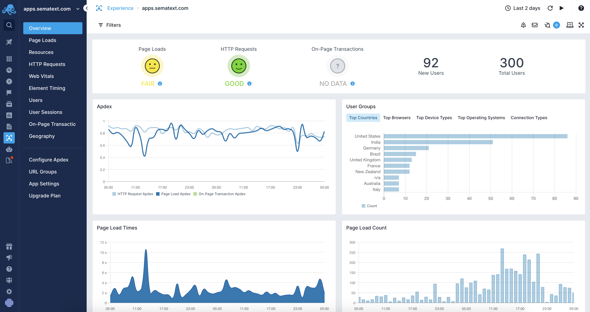

title: Browser SDK
description: Ship browser metrics to Sematext Experience.

Sematext [Browser SDK](https://github.com/sematext/browser-sdk) is an open-source framework used to ship web application metrics related to user interaction. Using [Browser SDK](https://github.com/sematext/browser-sdk) allows gathering metrics related to:
 
 - Hard page loads for traditional web applications as well as single-page applications
 - Soft page loads generated via the `routeChange` command for single-page applications
 - HTTP requests
 - [Web application resources, such as images, CSS files, etc.](/experience/resources/)
 - [Web vitals](/experience/webvitals/)
 - [Element timing](/experience/element-timing/)
 - [Long tasks](/experience/longtasks/)
 - [User sessions](/experience/user-identification/)
 - [On-page transactions](/experience/on-page-transaction/)



## Development

You can find the information about the development and script architecture in the [Browser SDK](https://github.com/sematext/browser-sdk/) Github project:

 - [Development](https://github.com/sematext/browser-sdk/#development)
 - [Experience Script Architecture](https://github.com/sematext/browser-sdk/#the-experience-script-architecture)
 - [Working on the Loader Script](https://github.com/sematext/browser-sdk/#working-on-the-loader-script)
 - [Working on the Main Experience Script](https://github.com/sematext/browser-sdk/#working-on-the-main-experience-script)

### Supported Commands

The following commands are currently supported by the Experience script:

 - `config` - Configures the script. It requires the `token` and `receiverUrl` configuration parameters. You can also provide the `ignoreBotData` Boolean parameter to ignore metrics coming from bots.
 - `identify` - Identifies the user. Requires the `name` and the `identifier` keys to be present, which are used to identify a user.  
 - `routeChange` - Informs the metrics gathering script about a route change. It accepts a single parameter that should take the value of the new route. 
 - `startTransaction` - Informs the metrics gathering script about transaction start. It accepts two parameters. The first is the transaction name. The second parameter is optional custom tags.
 - `endTransaction` - Informs the metrics gathering script about transaction end. It accepts a single parameter that should take the value of the name of the transaction that we want to end.
 - `pageLoad` - Provides metrics related to page load.
 - `ajax` - Provides metrics related to HTTP requests.
 - `longTask` - Provides metrics related to [long tasks](/experience/longtasks/).
 - `elementTiming` - Provides metrics related to [element timing](/experience/element-timing/).
 - `vitalMetric` - Provides metrics related to [web vitals](/experience/webvitals/).

### Global Constants

The Experience script uses global constants defined in the `constants.js` file. The file contains the following constants:

 - `GLOBAL_KEY` - The global key under which the script is available.
 - `DEBUG_PARAM_KEY` - When set to `true` turns on the debug level logging. 
 - `SESSION_COOKIE` - Name of the cookie related to a user session. 
 - `USER_COOKIE` - Name of the cookie related to the user.
 - `SESSION_KEEP_ALIVE_MINUTES` - The maximum time for the session to be kept alive.
 - `PAGELOAD_HARD_TIMEOUT` - Timeout after which the events are no longer considered to be part of the hard page load.
 - `PAGELOAD_SOFT_TIMEOUT` - Timeout after which the events are no longer considered to be part of the soft page load.
 - `BOT_USER_AGENT` - Regex used for bots identification.

## Installation

Installation of the Experience script contains the following steps:

### Adding the Loader Script

To add the loader script responsible for loading the main Experience script you need to add the RUM loader snippet generated via the `yarn generate-snippet` command to the header of the page before the closing `</head>` tag:

```
<script type="text/javascript">
  ...
  INSERT SCRIPT SNIPPET HERE
  ...
  (window,document,"script","/experience.js","strum");
</script>
```

The `/experience.js` should be pointing to the location of the built Experience script and the `strum` is the key under which the script will be available.

### Configuring the Experience Script

To configure the script the `config` command needs to be sent providing the URL of the receiver which accepts the data and the token, which identifies the [Sematext Experience](https://sematext.com/experience) App. For example:

```
strum('config', { token: '8763d12d-1j3t-932v-b498-544290z98k43', receiverUrl: 'https://rum-receiver.sematext.com' });
```

### Integrating the Experience Script

For some web technologies, especially those used in single-page applications additional integration may be needed. Have a look at the [Sematext Experience Integrations](/experience/integrations/) to learn more.

## Contributing

Pull requests for bug fixes, improvements and new features for the [Browser SDK](https://github.com/sematext/browser-sdk) are more than welcome. You can open a pull request on the [project Github page](https://github.com/sematext/browser-sdk). When opening a new pull request please take the time to briefly describe the changes. Make sure that the newly introduced code passes the `lint` and `flow` checks along with the integration tests.

## Learn More

Learn more about [Sematext Experience](https://sematext.com/experience). 
