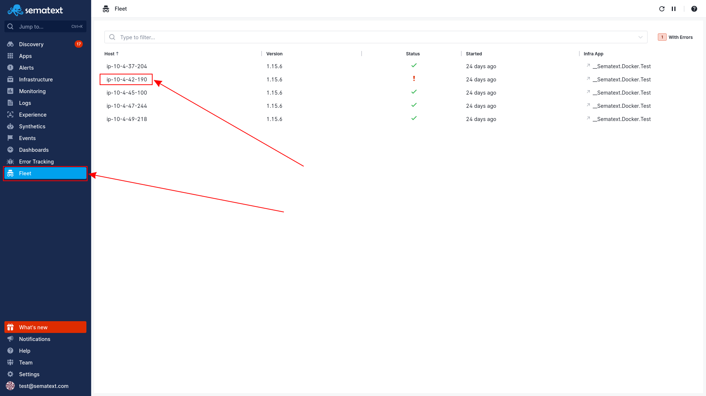

title: Agent Troubleshooting

If you are experiencing issues with the Sematext Agent, there are some things you can try.

1. Check the Sematext Agent logs and filter by errors. By default they'll be located at `/opt/spm/spm-monitor/logs/st-agent`. 
   1. If you see errors related to permission denied while accessing log files or system information, stop the agent and start it again with elevated privileges. 
   2. If you see errors like `"cloud" collector failed to complete the initial run` check out our [tags common schema docs](https://sematext.com/docs/tags/common-schema).
   

2. Try restarting the agent. Specific instructions on how to do so depending on your environment can be found [here](https://sematext.com/docs/agents/sematext-agent/starting-stopping).

3. Update the agent to the latest version. For more details on how to do that, see our [Agent Upgrade Instructions](https://sematext.com/docs/monitoring/spm-faq/#agent-updating).

4. Journal is a buffer we use to store failed events. In case of outages or internal communication issues, the Journal files may grow rapidly and produce high system load. If you are experiencing high CPU usage, do the following:
   1. Navigate to the journal directory, by default `/opt/spm/spm-monitor/st-agent/journal`.
   2. See if it contains a large number of files. If it does, it might be the cause of high CPU usage. You can disable Journal continuing to follow these steps.
   3. Open the following file in your text editor: `/opt/spm/properties/st-agent.yml`. 
   4. Comment out the `journal` section by adding the character `#` at the beginning of every line in the section.
   5. Restart the Sematext Agent.
   
5. If you are still having trouble, you can send us the diagnostics package, and we will assist you as soon as possible. To do so:
   1. Go to your Sematext Cloud dashboard.
   2. On the menu on the left, select `Fleet`.
   
   3. Find your host on the list and click on it.
   4. Navigate to the `Diagnostics` tab.
   
   5. Click on `Report a problem` and describe your issue.
   6. Once you're done, click on `Send a report` and we will reply shortly.

Remember you can always contact us via chat on the bottom right corner of [our webpage](https://sematext.com/) or via email at [support@sematext.com](mailto:support@sematext.com).
