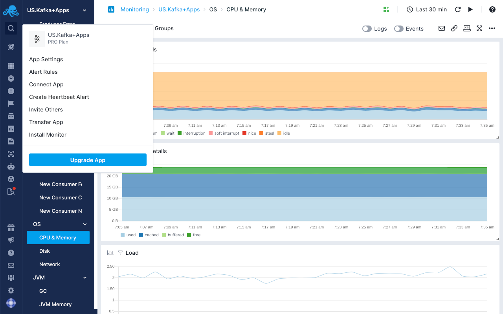

title: Creating Heartbeat Alerts
description: Step-by-step Heartbeat alert creation instructions 

Monitoring Apps have [Heartbeat Alerts](https://sematext.com/docs/alerts/#alert-types) as part of their settings. You can find them in the App dropdown menu in the top-left corner.

It is possible to create Heartbeat Alerts based on any combination of tags and thus use Heartbeat Alerts for specific services regardless of where they are running.

You can specify tags to filter and group by, then create Heartbeat Alerts for services matching your criteria. This way, even if a containerized service is moved from one host to another, it will not trigger false alerts.

To make this possible Sematext Agent sends tags from the [Sematext Common Schema](https://sematext.com/docs/tags/common-schema/) that tag-based alerts use: 

- `os.host`
- `container.id`
- `container.image.name`
- `container.image.tag`
- `container.name`

Using these tags you can do things like:

- Filtering and grouping by `container.image.name` to get alerted when all containers with the specified image name are gone.  
- Grouping by `container.id` to get alerted when that particular container dies. Yes, this could lead to a lot of alert noise, so use this sparingly and wisely.
- Grouping by `os.host` and `container.image.name` to get alerted when a host stops running all containers with some image name. The container may have been moved to another host.

The following example shows how to include two specific container images we are interested in.  We group them by `os.host` and `container.image.name` to get alerted when any one host stops running all containers with a particular image name.

Open the Heartbeat Alert creation dialog. You’ll see that we group by the `os.host` tag by default. On the preview chart you may see a number of bars. These bars represent your hosts.

In the filter section, you see the ability to include and exclude tags. Let’s include two values for the `container.image.name` tag. Alerts will now only observe containers which were built from these two images.

Then, in the group by section, add the `os.host` and `container.image.name` tags.

You can see a preview of the heartbeat bars split and grouped by the selected tags.

There are six bars because we have three `os.host` tag values and two `container.image.name` tag values. There are six combinations because two containers are running on each one of the three available hosts.

This example Heartbeat Alert rule shows `os.host`+`container.image.name` combinations. You will get notified if some container with a particular image name moves to another host or disappears from a container host altogether.
