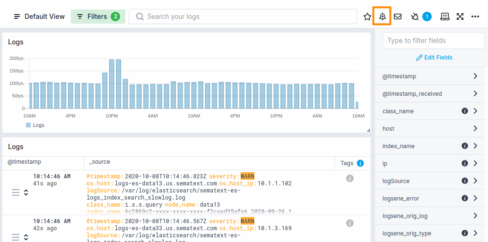
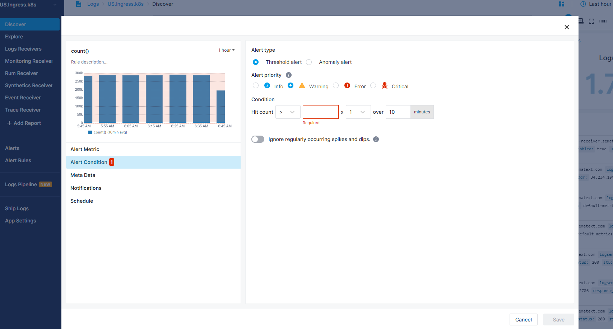
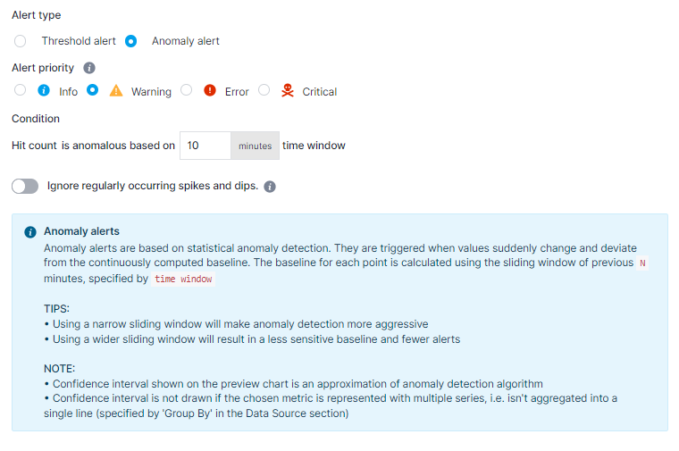
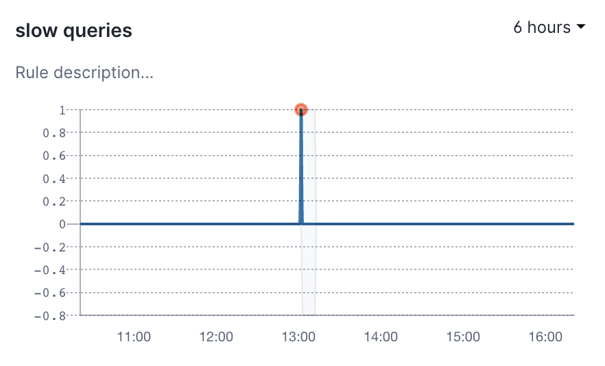

title: Creating Logs Alerts
description: Step-by-step alert creation instructions for Logs

In a Logs App you can create an Alert Rule which will trigger notifications when a condition is met.

For example, let's say you used *include/exclude filters* to search for *Elasticsearch slowlogs warnings*.



Clicking on the bell icon creates a new Alert Rule with the applied query and filters.



Let's say we want to get notified if the number of *slowlog warnings* reaches 3 in any 10 minutes. Notice that *Chart Preview* shows the threshold line to help
you visualize the threshold value in this context.


 You can assign priority and define the level of importance of an alert. Include this information in the payload of various [Notification Hooks](../alerts/alert-notifications.md).
 
 

Apart from a simple log count you can choose any numeric field in the *Alert Metric* section.


The field next to threshold value allows you to easily multiply the threshold and thus has a default value of 1, which is neutral for multiplication.  



Although less applicable in the case of our *slowlog warnings*, `Ignore regularly occurring spikes and dips` tells the algorithm to ignore regular outliers that are not really anomalies, but are caused by regular spikes/dips.

If you wanted to avoid using a specific threshold value and instead get notified when the number of *slowlog warnings* deviates from a continuously computed baseline, you'd change `Alert type` to `Anomaly alert`.



Notice that the chart changed to help you get a sense of what would constitute an anomalous value in your case (dots outside the gray *confidence interval*). 

The *confidence interval* is an approximation of Sematext Cloud's anomaly detection algorithm, so don't expect each and every red dot on the chart to have triggered the alert.

# Transformation

Transformations are used to modify metrics using mathematical expressions and functions. For example, imagine you want to get alerted when both `request.size` and `response.size` together exceed some threshold or become anomalous.  You would then transform them into a single dataseries by using an expression like this:

```
request.size + response.size
```

And then you would create an alert on this new data series.

Read about [Transformations](../dashboards/chart-builder/#transformation) to learn more about transformations, functions, and expressions used to perform transformations.
