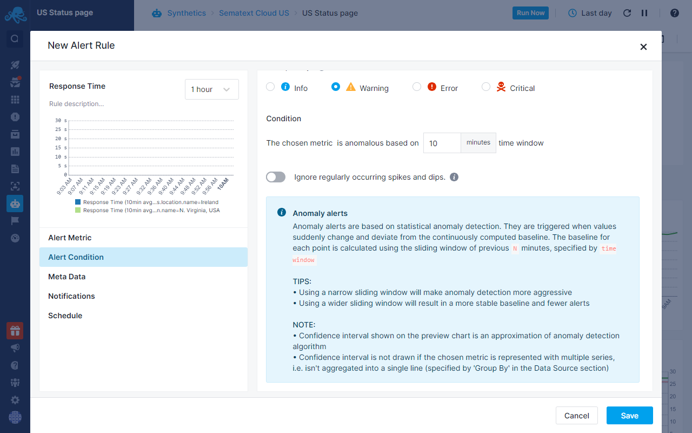

title: Alerts Overview
description: Threshold, anomaly, and heartbeat alerts for your logs, infrastructure and user-experience metrics with email notifications and various 3rd party integrations and notification hooks such as PagerDuty, Slack and more

<iframe src="https://www.youtube.com/embed/ik_L7Qk_Aug" 
frameborder="0" allow="autoplay; encrypted-media" 
allowfullscreen class="video"></iframe>

Alerts are used to notify you when one or more pre-defined conditions in your *metrics*, *logs* or *experience* data are met.  

For example, you might want to be notified when available disk space reaches a certain threshold - *metrics alert*, or when the number of logs with `severity: warning` gets too high - *logs alert*, or when your users start experiencing high response time - *experience alert*.

<!--iframe width="800" height="450" src="https://www.youtube.com/embed/WE9xAUud28o?rel=0" frameborder="0" allow="autoplay; encrypted-media" allowfullscreen></iframe-->

 

## Alert Types
[Sematext Cloud](https://sematext.com/cloud) includes multiple **types** of alerts that integrate with [PagerDuty](https://sematext.com/docs/integration/alerts-pagerduty-integration/), [Slack](https://sematext.com/docs/integration/alerts-slack-integration/), [email](https://sematext.com/docs/alerts/alert-notifications/#email-notification-hooks), and [other 3rd party services](alert-notifications).  

1. **Threshold** alerts are the classic threshold based alerts. They are triggered when a certain pre-defined threshold is met.
1. **Heartbeat** alerts are triggered when [Sematext Cloud](https://sematext.com/cloud) stops receiving data from your server, container, application, etc.  
1. **Anomaly** alerts are based on statistical anomaly detection. They are triggered when values suddenly change and deviate from the continously computed baseline.

 

## Alert Sources
Alerts can operate on three different **sources** of data:  

1. **Metrics** alerts work with infrastructure metrics
1. **Logs** alerts are based on various types of logs
1. **Experience** alerts are concerned with *real user monitoring* data - RUM

Alert type | Metrics | Logs | Experience
--- | --- | --- | ---
Threshold | yes | yes | yes
Anomaly | yes | yes | yes
Heartbeat | yes | no | no

You can manage Alert rules interactively via the UI, or you can [manage alerts via the API](../api).

## Creating an Alert Rule

### Alert Metric

#### Transformation

Transformations are used to modify metrics using mathematical expressions and functions. For example, imagine you want to get alerted when both `request.size` and `response.size` together exceed some threshold or become anomalous.  You would then transform them into a single dataseries by using an expression like this:

`request.size + response.size`

And then you would create an alert on this new data series.

Read about [Transformations](../dashboards/chart-builder/#transformation) to learn more about transformations, functions, and expressions used to perform transformations.

### Alert Condition

### Meta Data

### Notifications

### Schedule
