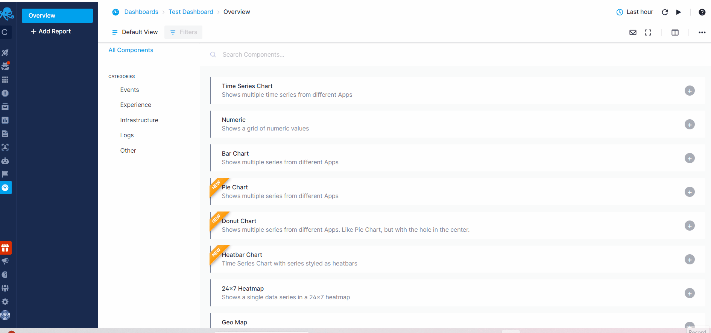

title: Sematext Dashboards Quick Start
description: Sematext Cloud Dashboards for monitoring metrics, logs, APIs, websites, etc.

Any type of component can be easily added to one or more Dashboard reports.

Once you have a dashboard created, you can start adding components to it. However, at least one or more Apps need to be created. As soon as your data is consumed and indexed by Sematext Cloud, logs, metrics, experience, events, and infrastructure components will become available to add to Dashboards. 

In the example below, we demonstrate the process of adding components from different solutions, selecting the preferred App to fetch data for each component, adding them to the Dashboard, and organizing the layout for improved visualization.

With the custom reports features you can first create specific logging, events or metric component, and add it to your Dashboard just as you can with out-of-the-box [integration](/integration/) specific components that come included when you first create an App.

The image below displays a sample of a customized Infrastructure component designed to automatically retrieve top data based on CPU, Disk, and Memory usage. To add this component, navigate to the 'Infrastructure' tab on the left and select the 'Top N Hosts' option.

## Built-in Components

We provide pre-configured built-in components with predefined metrics and styles tailored to specific purposes. These components are ready to use, requiring just a click to select and add them to your dashboard.

- Events
  - Events table: Table of events in reverse chronological order 
- Infrastructure
  - Hosts Tile Map: Colored presentation of your hosts state
  - Containers Tile Map: Colored presentation of your containers state
  - Processes Tile Map: Colored presentation of your processes state
  - Pods Tile Map: Colored presentation of your pods state
  - Jobs Tile Map: Colored presentation of your jobs state
  - Cron Jobs Tile Map: Colored presentation of your cron jobs state
  - Top N Hosts: Time series presentation of top hosts by given metric
  - Top N Containers: Time series presentation of top containers by given metric
  - Top N Processes: Time series presentation of top processes by given metric
  - Top N Pods: Time series presentation of top Kubnernetes pods by given metric
  - Top N Nodes: Time series presentation of top Kubernetes nodes by given metric
  - Servers Table Overview: Table overview of your servers state
  - Containers Table Overview: Table overview of your containers state
  - Processes Table Overview: Table overview of your processes state
  - Inventory Table Overview: Table overview of your inventory
  - Packages Table Overview: Table overview of your packages
  - Container Images Table Overview: Table overview of your container images
  - Kubernetes Pods Table Overview: Table overview of Kubernetes pods
  - Kubernetes Deployments Table Overview: Table overview of Kubernetes deployments
  - Kubernetes Nodes Table Overview: Table overview Kubernetes nodes
  - Kubernetes Stateful Sets Table Overview: Table overview of Kubernetes Stateful Sets
  - Kubernetes Daemon Sets Table Overview: Table overview of Kubernetes Daemon Sets
  - Kubernetes Jobs Table Overview: Table overview of Kubernetes Jobs
  - Kubernetes Cron Jobs Table Overview: Table overview of Kubernetes Cron Jobs
- Logs
  - Logs Count: Single number panel that shows logs count
  - Logs: Table of logs in revers chronogical order
  - Logs Count Time Series: Bar chart binned by log event creation date
  - Log Fields Top Values: Top N values of a given log event field
  - Numeric Field Time Series: Avg, min, or max value of a numeric field binned by log event creation date
- Experience
  - Apdex: Shows ApdeX scores over time
  - Resource Load Times: Shows website Resources load times over time
  - Resource Load Counts: Shows website Resources load counts over time
  - Resource Transfer Sizes: Shows website Resources load sizes over time
  - Resource Transfer Type: Shows website Resources grouped by type
  - Page Load Times: Shows website Page Load times over time
  - Paint Times: Show website paint times over time
  - Page Load Counts: Shows website Page Load counts over time
  - Page Load Histogram: Shows website Page Load times histogram
  - Memory Usage Histogram: Shows website memory usage histogram
  - Memory Ysage: Shows website memory usage
  - HTTP Requests Load Time: Shows website HTTP Requests load times over time
  - HTTP Requests Count: Shows website HTTP Requests count over time
  - HTTP Responses: Shows website HTTP Responses statistics
  - HTTP Requests Histogram: Shows website HTTP Requests load time histogram
  - Users Count: Shows website Users count over time
  - Long Task Count: Shows website Page Load long tasks count
  - Long Task Duration: Shows website Page Load long tasks duration
  - Element Timing Duration: Shows website Element Timing duration
  - Element Timing Count: Shows website Element Timing count
  - User Groups: Shows count of users grouped by different attributes
  - Time to First Byte: Identifies the time at which your servers sends a response
  - Largest Contentful Paint: Measures loading performance. To provide a good user experience, LCP should occur within 2.5 seconds of when the page first starts loading
  - First Input Delay: Measures interactivity. To provide a good user experience, pages should have a FID of less than 100 milliseconds
  - First Contentful Paint: Measures the time from when the page starts loading to when any part of the page's content is rendered on the screen
  - Cumulative Layout Shift: Measures visual stability. To provide a good user experience, pages should maintain a CLS of less than 0.1

 
## Custom Components

In the 'Other' tab within the left panel for component selection, you'll find a range of generic components. Once you select a component from this category, you'll begin by choosing the solution type from which you wish to retrieve data. Next, you'll complete the necessary and optional parameters to start building your custom component. The [Chart Builder](https://sematext.com/docs/dashboards/chart-builder/) section explains the common functionalities offered in all the components. To explore all the component types and learn how to create each one, refer to the [Components Overview](./components-overview).
