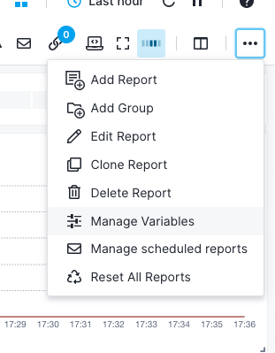
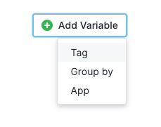
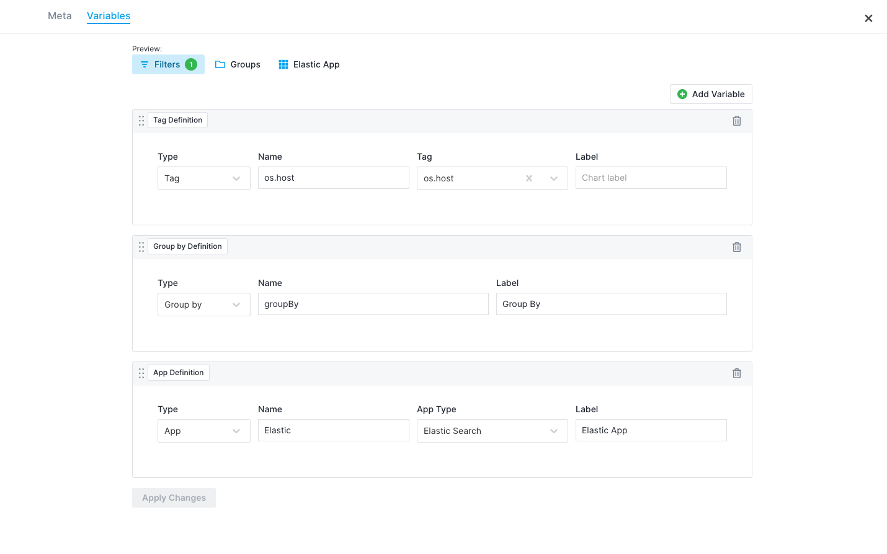
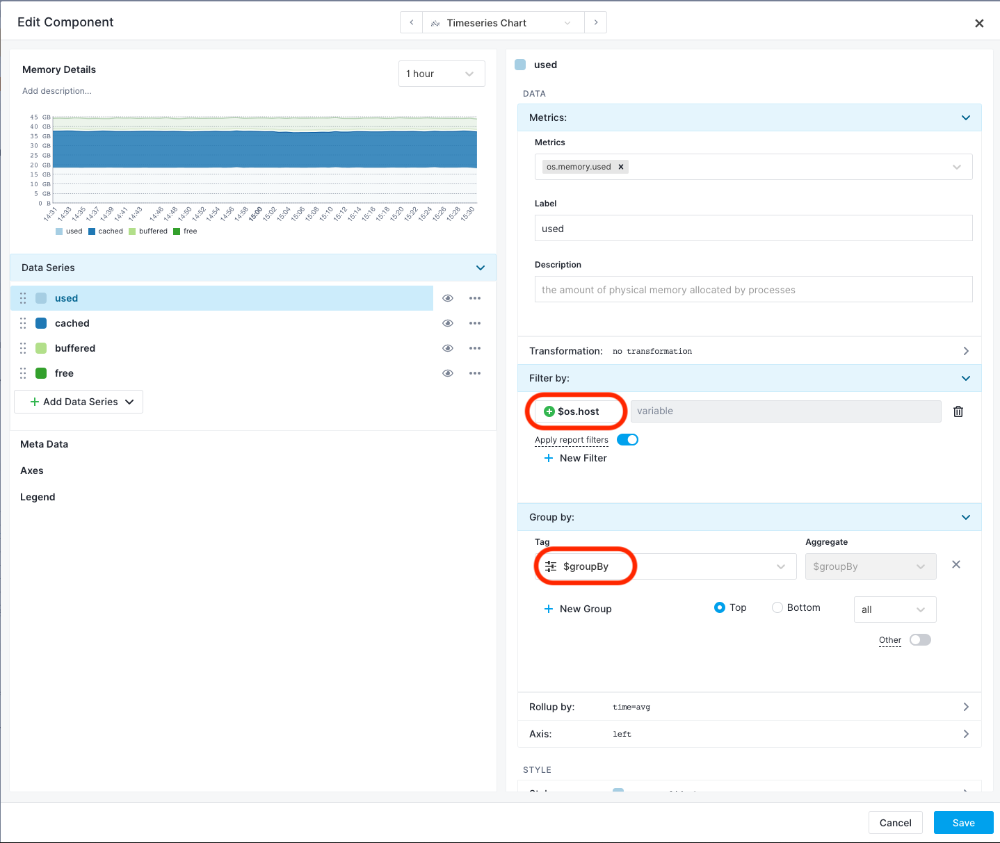
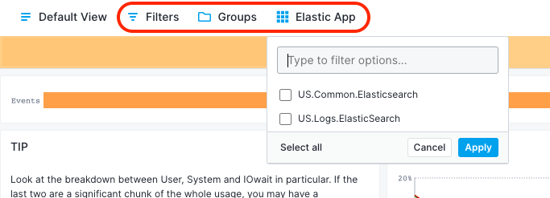
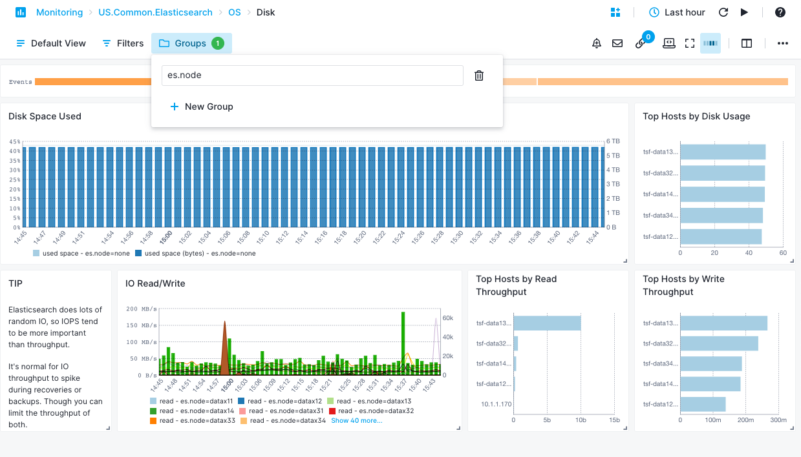
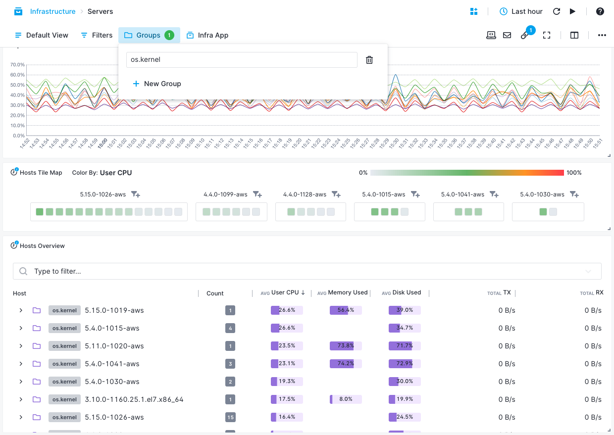

title: Report Variables
description: Report Variables are user-defined variables that are used to dynamically filter and group data in reports

## What are Report Variables

Report Variables are user-defined variables that are used to dynamically filter and group data in [reports](./reports-and-components). These variables can be used to filter data based on certain conditions, and add dynamic values to the reports. Report Variables allow users to make reports more flexible and reusable, as they can be updated and reused across multiple reports without having to manually change the data in each report.

## What you can do with Report Variables

Report Variables provide a flexible and powerful way to monitor your infrastructure in an organized and dynamic manner. This allows you to quickly investigate and troubleshoot issues by applying dynamic filters at the report level.

Let’s say you have an infrastructure with a big number of hosts, some of which are running [Apache](https://sematext.com/docs/integration/apache/), some of which are running [MySQL](https://sematext.com/docs/integration/mysql/) and the rest of which are running [Elasticsearch](https://sematext.com/docs/integration/elasticsearch/). Now suppose that you have a dashboard that displays aggregated information about all the above hosts. Assume you were notified of a potential problem with Elasticsearch hosts. Of course, you can reconfigure all the charts to show data only for the Elasticsearch hosts, or filter by them and save that, or create a new report with them. But that is not the most efficient way to handle this, since tomorrow a few more Elasticsearch hosts may be added.

Also consider the above example where you want to group the hosts per application and new applications may be added from time to time, for example, a few Nginx hosts.

These are just a few examples where Report Variables can provide fast and easy dynamic filtering and grouping.

## Types of Report Variables

There are three types of Report Variables: Tag Variables, Group by Variables and App Variables.

Tag Variables are used for easy filtering of individual metrics from one or more components using [Tags](https://sematext.com/docs/tags/). Instead of having to change each filter value on each [Data Series (DS)](https://sematext.com/docs/dashboards/chart-builder/#data-source), Tag Variables allow you to set the filters once and then change the values from the Filters menu. 

This dynamic filtering of metrics is a unique feature of Report Variables. One benefit of Tag Variables is that you can pre-configure a set of components to be filtered by that variable while leaving other components untouched.

App Variables are used for grouping components by [App](https://sematext.com/docs/guide/app-guide/) Type, for example [Infra Apps](https://sematext.com/docs/monitoring/infrastructure/), [Monitoring Apps](https://sematext.com/docs/monitoring/) or [Logs Apps](https://sematext.com/docs/logs/).

Group by Variables are used for grouping components by a number of different Tags, for example, all Linux hosts by kernel version.

## How to use Report Variables

Report Variables can be created by selecting the "Manage Variables" option under report settings.

Click on the “Add Variable” button and select the preferred variable type.

In the example below, we created three Report Variables, one of each Type: os.host, GroupBy and Elastic App.

After creating a variable, each component needs to be configured so that filtering using Report Variables can be applied. In the example below, we have configured two filters, $os.host and $groupBy. The “$” sign is used to identify the Report Variables.

Report Variables can be applied to each DS in a component.

Note that it is mandatory to configure at least one component with a Report Variable. Otherwise, the Report Variable is of no use, and it will not allow filtering values from the Filters drop-down menu. That is an important difference between ad-hoc filters and Report Variables.

All Report Variables are automatically added on the top of the dashboard.

Tag Variables appear in the report’s Filters as predefined filters.

We can now easily filter by our preferred Elasticsearch App:

We can also group the components of each Report by specific Tags, for example es.node:

Additionally we can group various tables in our reports per selected filter, for example the Linux Kernel version, that may help us identify an issue with a recent Kernel:

Overall, Report Variables provide a flexible and powerful way to customize and filter components in your reports based on specific conditions and allow you to save time during troubleshooting issues in your infrastructure.
