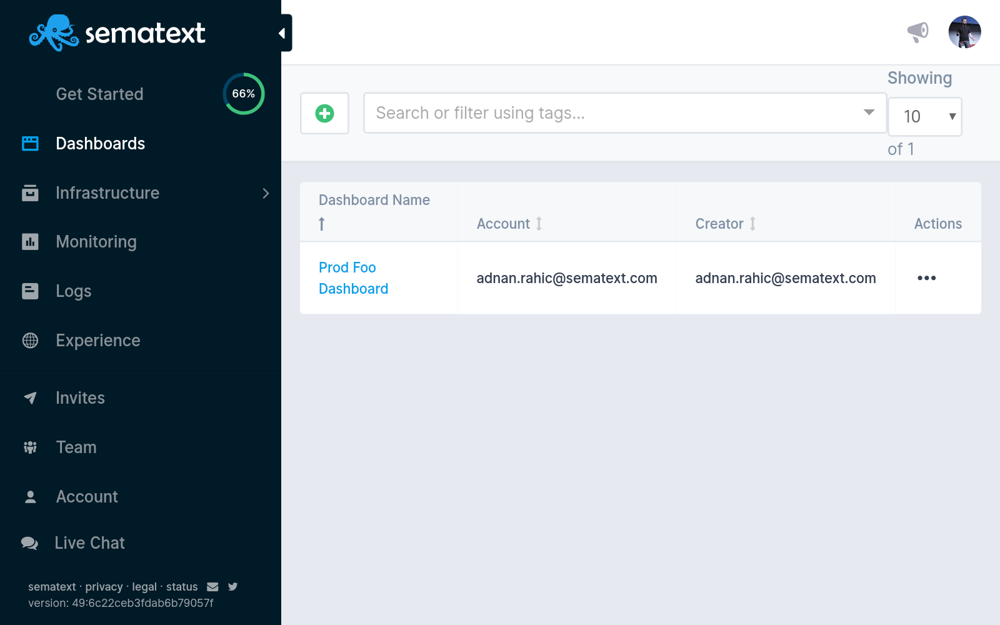
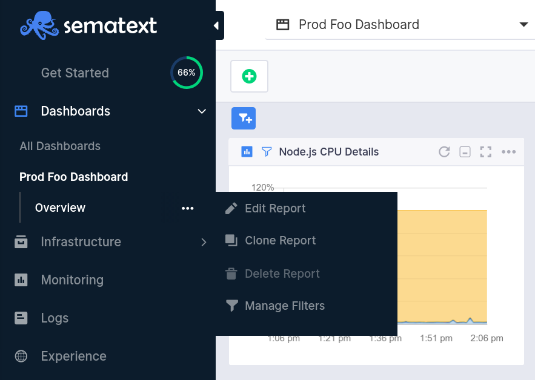

title: Sematext Dashboards Settings
description: Sematext Cloud is a modern monitoring, log management, transaction tracing, real user monitoring, and synthetic monitoring system. Dashboarding is system's powerful feature for cohesive data analysis from multiple data sources such as logs, metrics, and events. 

<!-- https://sematext.com/docs/images/guide/dashboards/sematext-dashboards-guide.png -->

Dashboard settings include:

  - Edit / Clone / Delete Dashboard
  - App & Dashboards picker
  - Time picker
  - Report settings

<video style="display:block; width:100%; height:auto;" controls autoplay loop>
  <source src="https://cdn.sematext.com/videos/dash-settings.mp4" type="video/mp4" />
</video>

## Side Navigation

The persistent region on the left that can be collapsed, is used to easily switch across monitoring, log management, transaction tracing, real user monitoring, synthetic monitoring, and other user & team features. All side navigation tabs are selectable. If they have chevrons, it indicates that the top level section is collapsible and contains additional subitems. The subitems will let you explore all your Apps, or choose a particular App.

Side navigation top level sections for infrastructure and application performance monitoring, log management, transaction tracing, real user monitoring and synthetic monitoring:

- Dashboards
- Infrastructure
- Monitoring
- Logs
- Experience
- Synthetics
- Correlations
- Alerts and Events
- Integrations

Side navigation sections for user and team features:

- Invites
- Team
- Account 

## Dashboard & App Selector

The Dashboard & App selector lets you **choose any App** as well as any **Dashboards and Reports** that you have generated from those Apps. Infrastructure views such as AppMap, NetMap, Servers, and Containers are also available for selection, and together provide seamless switching and navigation between logs, application and infrastructure monitoring, which is essential when rushing to fix production issues.

## Dashboard Actions

Right next to the App & Dashboard Selector is the **Dashboard Actions dropdown menu** and **horizontal ellipsis icon**. 

The dropdown menu allows you to **quickly switch between your Dashboards, and Apps**, while the horizontal ellipsis icon shows your options and lets you open various dashboard specific functions, like editing, cloning and deleting a Dashboard.

## Report Selector

Once you create a Dashboard, you will get a **default Report created for you named Overview**. It will have no data or components configured. You can add components and edit them. You can also edit this Report, clone it, or create new ones.

## Time Picker

The Time Picker is available whenever a Dashboard is selected. **One minute is the shortest time increment** you can select. **Thirty minutes, one and two hours, and one, two, seven, and thirty days time-span shortcuts** are exposed common observability defaults.

A **custom time range can be selected using the time picker dropdown menu**. The Dashboard will automatically refresh upon selection and update all the reports accordingly.

## Refresh and Live Tail

Refresh data and Live Tail options are located next to the time picker. The **Live Tail feature provides real-time insights as soon as your data is consumed and indexed**. It can be also stopped so the auto-refresh does not update the data, in case you need to inspect specific incidents or anomalies within a certain time segment.

## Notifications

The megaphone icon in the right section of the header is used to open the notifications. If your plan is in need of an upgrade, a new feature is announced, or similar system and service updates require your attention, they'll be shown in the notifications view.

The next page describes how to use Reports and Components. The report menu located just below the top navigation menu, and helps you discover how to add new components, correlate logs, events, and metrics between your Apps, do report-specific actions, connect Apps, and much more.

