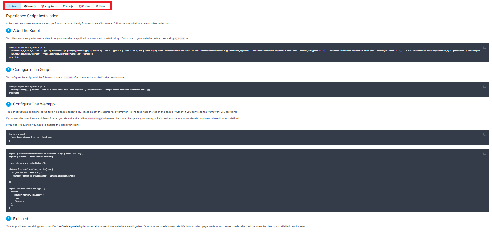
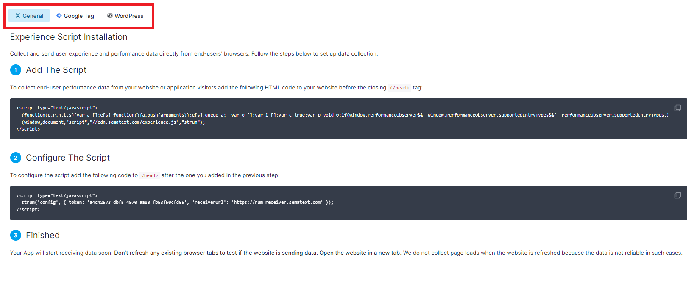

title: Getting Started with Sematext Experience
description: Getting started with Sematext Experience real user monitoring

To start monitoring your website, create an account in Sematext Cloud in either EU or US and then:

 * [Click here](https://apps.sematext.com/ui/rum-create/app/rum) to create the App in US data center
 * OR [click here](https://apps.eu.sematext.com/ui/rum-create/app/rum) to create the App in EU data center

You should see the form below:

 * Fill in the App Name, usually the domain of your website (e.g. www.sematext.com) will work great for this purpose
 * Select "Website uses Single Page Architecture" if your website uses React, Angular, Ember, Vue.js, Backbone, or any other framework for building single page web applications
 * Select “Standard website” if you have a multi-page website that works in a traditional way. Every change eg. display the data or submit data back to server requests rendering a new page from the server in the browser.
 * Follow the displayed instructions based on your selection to add snippet to your website.

## Website uses Single Page Architecture

Single-page applications require one more configuration step to register route changes. Click on the integration and follow the steps to start collecting metrics from your website.
Supported integrations are [React](https://sematext.com/docs/experience/integrations/#react), [Next.js](https://sematext.com/docs/experience/integrations/#nextjs), [Angular.js](https://sematext.com/docs/experience/integrations/#angular), [Value.js](https://sematext.com/docs/experience/integrations/#vuejs), [Ember](https://sematext.com/docs/experience/integrations/#ember), [Vercel](https://sematext.com/docs/experience/integrations/#vercel) and more.
 

## Standard website

General tab desribes the configuration steps to add JavaScript snippets to start monitoring your website. [Google Tag](https://sematext.com/docs/experience/integrations/#google-tag-manager) and [WordPress](https://sematext.com/docs/experience/integrations/#wordpress) integrations are also availble and each tab has specific configuration steps to follow and configure your website monitoring.
 

The page with the instructions will automatically update when we receive the first metrics from your website and you will be able to open the App and view the collected metrics.

See [Integrations](https://sematext.com/docs/experience/integrations/) guide for more info.
