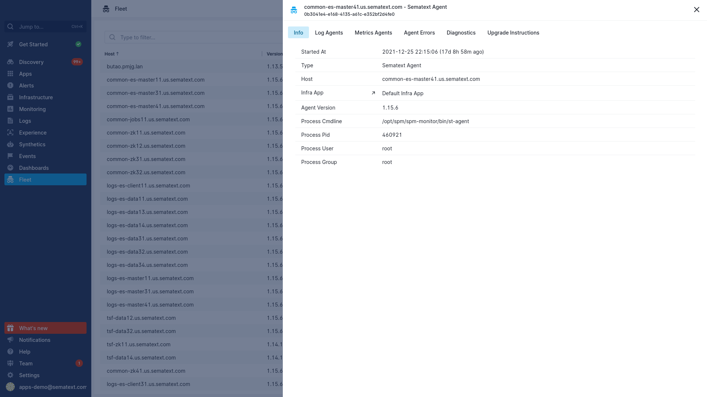
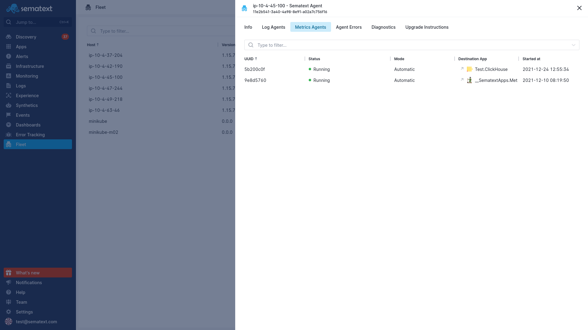
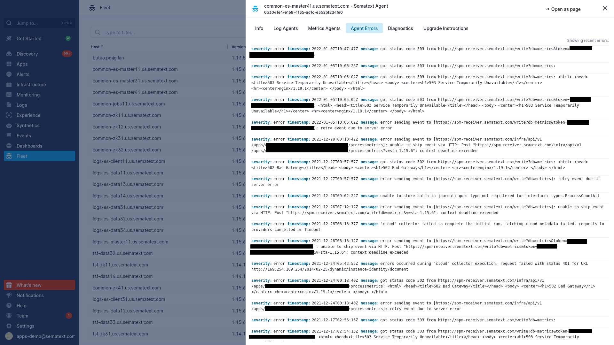
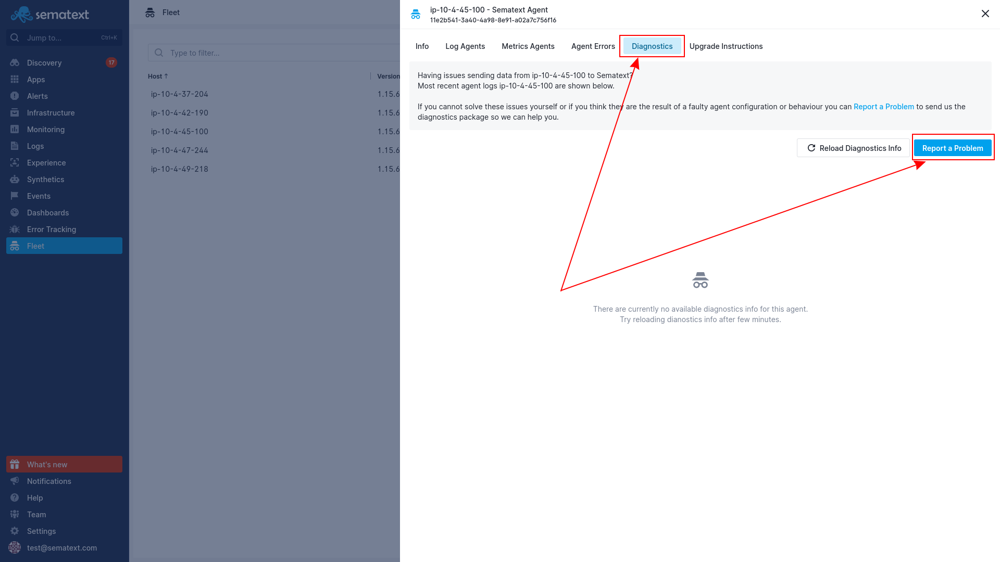
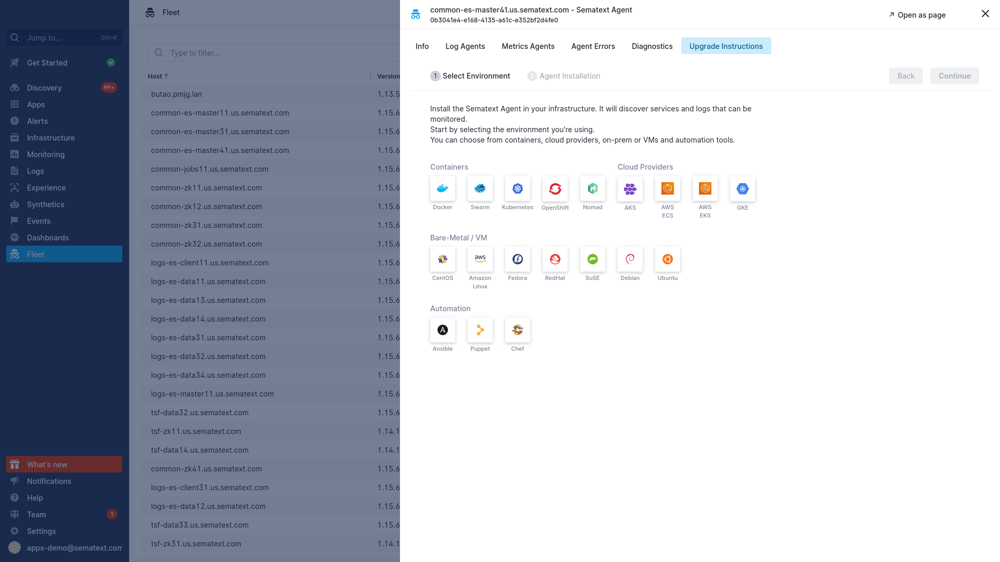

title: Fleet Overview
description: Overview of Fleet - Sematext Agent management panel

The Fleet section of Sematext Cloud gives you an overview of all the Sematext Agents that are running in your systems.

At first glance, you can see the following data in the table:
* *Host*: Name of the hosts in which the Sematext Agent is installed. Clicking on the name will open the Agent Information Panel.
* *Version*: Installed version of the Sematext Agent and whether important updates are available. If they are, you can update the agent by just clicking the link and following the instructions. You can also find those instructions [here](https://sematext.com/docs/monitoring/spm-faq/#agent-updating).
* *Status*: Indicates the status of the Sematext Agent. Possible statuses are:
  * Running: Everything is nominal.
  * Stopped: The agent has been stopped by the user. You can [manually restart](https://sematext.com/docs/agents/sematext-agent/starting-stopping) the Sematext Agent.
  * Failed: The agent is reporting errors. You can see them in the Agent Information Panel, in the Errors tab.
  * Dead: The agent has stopped due to an error. You can see the errors in the Agent Information Panel, in the Errors tab, and you can [manually restart](https://sematext.com/docs/agents/sematext-agent/starting-stopping) the Sematext Agent.
  * Pending or Unknown: the agent is not sending data to Sematext Cloud. Check if the agent is still running on your system. If it is, there may be connection issues.
* *Started*: Time elapsed since the Sematext Agent began sending data to Sematext Cloud.
* *Infra App*: the Infra App which is receiving the data from the Sematext Agent. Clicking on the App name will navigate you to the overview of the corresponding App in the [Infrastructure](https://sematext.com/docs/monitoring/infrastructure/) section of Sematext Cloud.

# Agent Information Panel

## Info
The Info panel contains information about the host system and the installed Agents. 

If the Agents are installed in a Kubernetes environment, you will see information about the Kubernetes environment, like Namespace and Node. If, however, the Agents are installed in a baremetal environment, this panel will show information related to the Agent process, like the Pid. 

You can also find a link to the Infra App the Agent is associated with.

## Log Agents

This panel contains a list of the Log Shippers installed on the host. If you click on one, it will take you to the Log Shipper panel, where you will find information about the Log Shipper version and type, the files and containers it's collecting logs from, as well as any errors. You can also see diagnostics data and report a problem from the Diagnostics tab.

The following status values are currently available for Log Shippers:

* Running: The Log Shipper is running without issues
* Not Configured: This is the initial state of Log Shipper. It means that it has not been configured yet in [Discovery](https://sematext.com/docs/logs/discovery/intro/), or another Log Shipper has been used to ship logs. Make sure to review the configuration of Log Shipper in [Discovery](https://sematext.com/docs/logs/discovery/intro/)
* Dead: The Sematext Agent started the Log Shipper but something went wrong. Usually, this means that the Log Shipper process is not available (bare metal), or the status of the Log Shipper container/pod is not running. You can [manually restart](https://sematext.com/docs/agents/sematext-agent/starting-stopping) the Sematext Agent
* Init Failure: Systemd is not available (bare metal), there is an error pulling the Log Shipper container image, or there is an issue creating/starting the Log Shipper container/pod. Ensure that your system has enough resources to run the container/pod and confirm that you don't have issues with network connectivity to pull container images
* Stopped: The Log Shipper process has been stopped by the Sematext Agent. You can [manually restart](https://sematext.com/docs/agents/sematext-agent/starting-stopping) the Sematext Agent

## Metrics Agents

This panel contains a list of the Metrics Agents installed on the host. Clicking on one will take you to the Monitoring Agents panel, where you can see the process or container being monitored, the destination Monitoring App and its corresponding Infra App, service data such as sockets, ports and the command used to start the service, as well as any errors. You can also see diagnostics data and report a problem from the last tab.

## Agent Errors 

Here you will see any errors that appear in the Sematext Agent's own logs. The severity field will always be error, and they'll include a timestamp and a message. You can find troubleshooting information [here](https://sematext.com/docs/agents/sematext-agent/agent-troubleshooting/). You can find information about diagnostics in the [Diagnostics Tab](https://sematext.com/docs/fleet/#Diagnostics).

## Diagnostics

If you are having issues sending data from your host, in this tab you can find the most recent logs from the agent, as well as some of what's inside the configuration files. You can find our Agent Troubleshooting documentation [here](https://sematext.com/docs/agents/sematext-agent/agent-troubleshooting). If you need any help troubleshooting, you can click on the `Report a Problem` button, write a short description of your issue and our support team will receive the message alongside a copy of the diagnostics data.

Remember you can always contact us via chat on the bottom right corner of [our webpage](https://sematext.com/) and the Help button on Sematext Cloud, or via email at [support@sematext.com](mailto:support@sematext.com).

## Upgrade Instructions

In this tab you'll find information on how to upgrade the Sematext Agent to the latest version for all supported environments.

