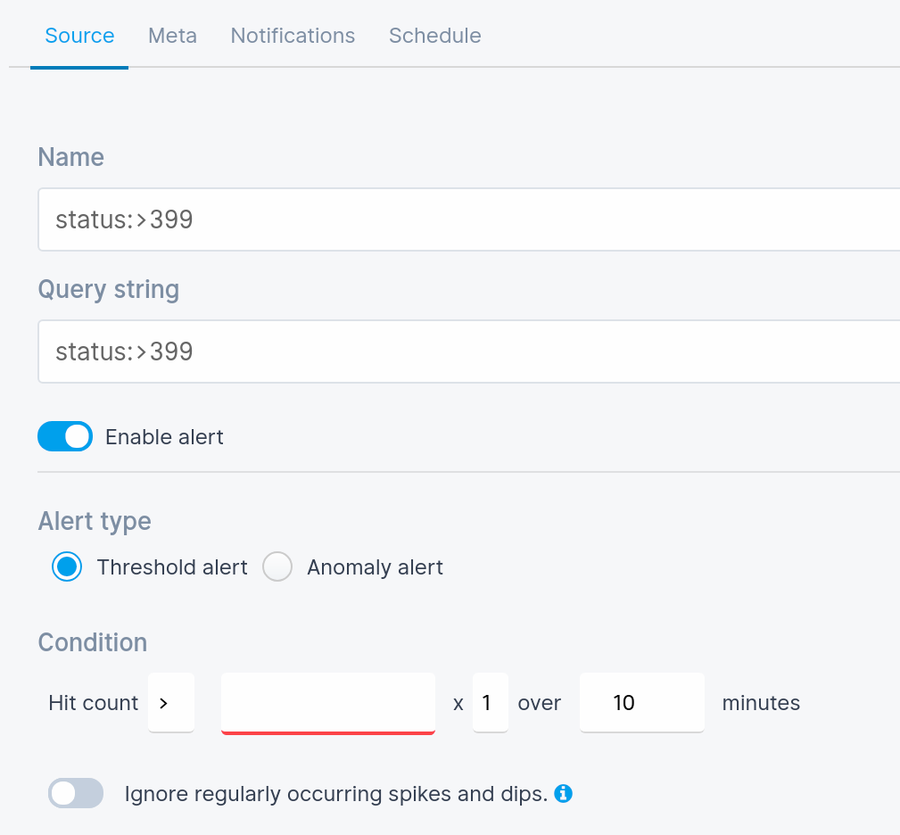

title: Sematext Alerts User Guide
description: Sematext Cloud Alerts give you a flexible centralized notification system that lets you manage Alert Rules and Alert Conditions across your whole stack. Use Events to correlate them with Metrics and/or Logs, and see what is happening with your infrastructure.  

Receiving Alerts when your software is misbehaving or underperforming is crucial for every developer. Good alerting practices include:

- **Alert Rules** that **detect Anomalies** and notify when key **performance indicators spike or drop**
- **Criteria** that trigger **Alerts for monitored resources**
- **Thresholds** defined for **Alerts** when selected **metrics reach certain severity levels**
- **Notification channels** through which the responsible team will be notified about the incident

[Sematext Alerts](../alerts) help you address underlying issues before they affect user experience. There are three types of Alerts. 

- **Threshold** - Alerts that are based on classic thresholds. They are **triggered** when something **crosses a pre-defined threshold**.
- **Anomaly** - Alerts based on statistical anomaly detection. They are **triggered** when **values** suddenly **change and deviate from the baseline**. 
- **Heartbeat** - Alerts **triggered** when **something you are monitoring**, like your servers, containers, or your applications, **stops sending data** to Sematext Cloud. 

**Threshold** and **Anomaly** Alerts can be triggered for both Monitoring and Logs Apps, while **Heartbeat** Alerts are only available for Monitoring Apps.

Sematext lets you manage Alert Rules across your whole stack. You can use various notification channels to get alerted when critical issues occur so you can take action and resolve them. Our Alerts easily integrate with notification and chat software. 

- PagerDuty
- OpsGenie
- HipChat
- Slack, and [many more](https://sematext.com/docs/integration/). 

## Default Alerts

As soon as an [App](./app-guide) is created, either for [Logs](./logs-guide) or [Monitoring](./monitoring-guide), you will see several app-specific Alerts Rules created for you by default. 

Default Alerts for a Logs App:

- **Anomaly Alerts** for **Error and Warning** search queries

Default Alerts for a Monitoring App: 

- **Metric Alert for Disk Usage**
- **Heartbeat Alert** if the **Agent stops sending data to the Monitoring App**
- **Metric Anomaly Alert** for misbehaving Nodes

In this example which is an Elasticsearch Monitoring App, the Java usage threshold and Elasticsearch Node Anomalies are integration-specific default Alerts.

You can view all the default and custom Alerts on the [Alert Rules](https://apps.sematext.com/ui/events/alerts/rules) page. This is where you can toggle, edit or delete any existing Alerts.

## Creating Alerts

Sematext Alerts can cover both complicated alerting scenarios with multiple rules for both Logs and Monitoring, as well as Events. A basic Alert Rule with an email or Slack notification is enough to cover elementary alerting needs.

### Alerting on Logs

To **create an Alert** you need to run a **search query** and press **Save Query/Alert Rule**. 

A **Save Query** window will open with the option to **Enable Alert**. When it's toggled, the **Alert Type picker** and **Condition** will expand, and the **Notifications** and **Schedule** tabs will be enabled. You'll see:

- **Alert Type**, to choose either Threshold Alerts or Anomaly Alerts. For more information on alerting capabilities check [alerts](https://sematext.com/docs/alerts/) documentation pages.
- **Condition**, to choose when the Alert will be triggered.

- **Notification hook details** with a **default email** notification hook used to send the message to your account. You can also add additional email addresses as well as other types of notification hooks.

- **Schedule**, to choose when the Alerts will notify you based on a period, schedule or time.

<video style="display:block; width:100%; height:auto;" autoplay loop="loop">
  <source src="../../images/guide/alerts-and-events/alert-scheduling.mp4" type="video/mp4" />
</video>

Press Save and you're done. Check out the [integrations](https://sematext.com/docs/integration/) documentation for more information about alert notification hooks.

### Alerting on Metrics

Monitoring Apps have **metric-based Alerting**. Metrics have both **Threshold** and **Anomaly** Alerts which can be created on a per-metric basis.

Monitoring Apps also have **Heartbeat** Alerts as part of their settings. You can find it in the App Settings dropdown menu. They are triggered when what you are monitoring, like your servers, containers, or your applications stop sending data to Sematext.

