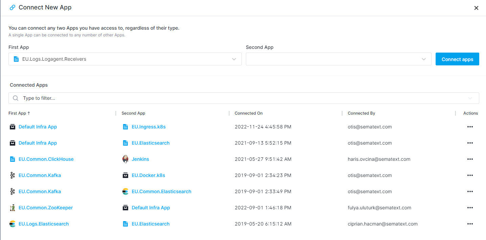

title: Connected Apps Guide
description: Connected Apps is a data pivoting feature and available in all solutions. You can connect any two Apps you have access to, regardless of their type.

Connected Apps is a data pivoting feature and available in all solutions. You can connect any two Apps you have access to, regardless of their type.  Any App can be connected to any number of other Apps.

## Benefits of Connecting Apps

Having Apps connected provides more context and enables faster troubleshooting.  Details below.

## When Connecting Apps is Handy

Here are just two examples for when connecting Apps is not only useful, but recommended.

- If you are collecting both performance metrics and logs for an Elasticsearch cluster, you might want to connect the Monitoring App and Logs App with these data so you can more easily switch from Elasticsearch metrics to logs and vice versa.
- Technologies like ClickHouse, Kafka, SolrCloud and others use ZooKeeper.  Thus, the performance and health of ZooKeeper is critical and affects the performance and health for the performance and health of these technologies.  In other words, not only do you want to monitor ZooKeeper if you are running SolrCloud, for example, but you may also want to connect any Monitoring or Logs Apps that with SolrCloud and ZooKeeper metrics or logs.

By connecting Apps you benefit from having more context and can troubleshoot faster, as described below.

### Connected Apps in Alert Notications

When Sematext emails an alert notification it captures the screen with App reports where the alert rule that generated the notification was created.  When the App whose alert was triggered is connected to another App, Sematext automatically captures the screen of all connected Apps and includes them in the notification.  Thus, you can get more context about the alert by simply looking at reports included in the alert notification before, or even without opening an alert in Sematext to investigate.

### Connected Apps on the Alert Details Screen

In addition, when you look at the individual alert incident to troubleshoot, all connected Apps and their data will be right there, as shown below, to aid with discovering the root cause.

### Connected Apps in Split Screen Correlation

When you connect two Apps, selecting Connected Apps in the UI while viewing one of those Apps will automatically select the other connected App when you decide to correlate their data via [Split Screen](https://sematext.com/docs/guide/split-screen/).

### How to Connnect Apps

To connect Apps, click on the connect Apps icon on top right from any report and click **“+ Connect New App”** button.

Select the Apps and click **“Connect Apps”** button.

### Using Split Screen to Correlate Data in Connected Apps

Once you connect Apps, you can easily navigate from one App to the other with a single click or open the second App in [Split Screen](https://sematext.com/docs/guide/split-screen/) to correlate their data.

Let’s say we are monitoring a ClickHouse database and shipping its metrics and logs to Sematext Cloud. You started seeing a significant amount of error logs and you want to investigate it further by comparing with metrics.

If the two Apps are connected, you can easily open the Monitoring App in [Split Screen](https://sematext.com/docs/guide/split-screen/) as shown below.

Once both Apps' data is shown in the Split Screen you will be able to see whether there are any significant spikes in metrics that correlate with the spike in error logs.  For example, this may help you identify that it is the insufficient resources or the unexpected query rates or connections that are the source of error logs coming from your database.

