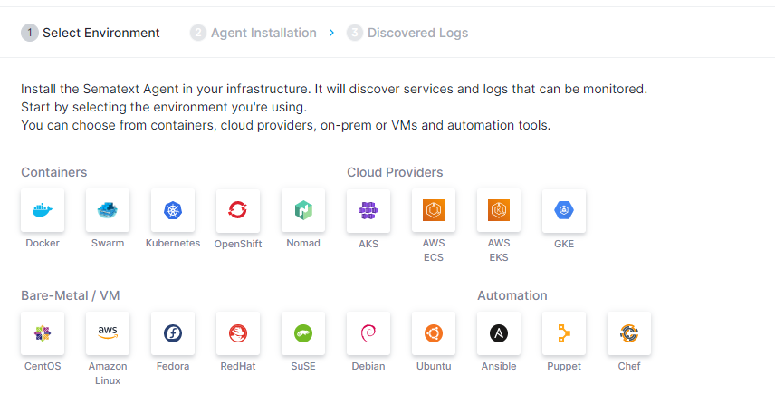
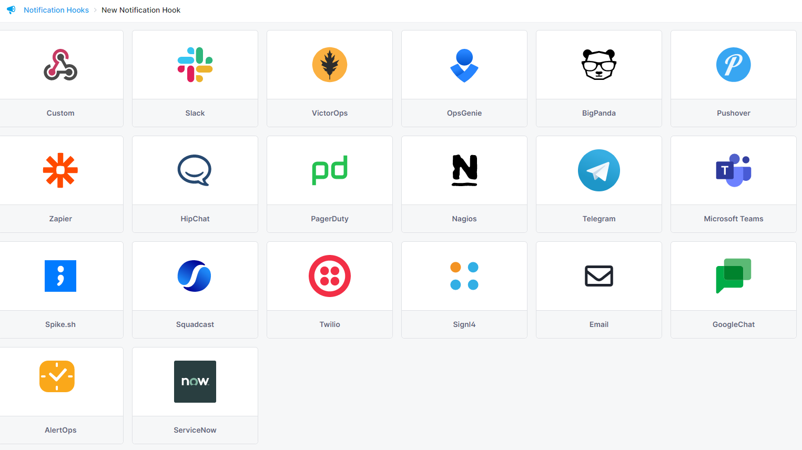
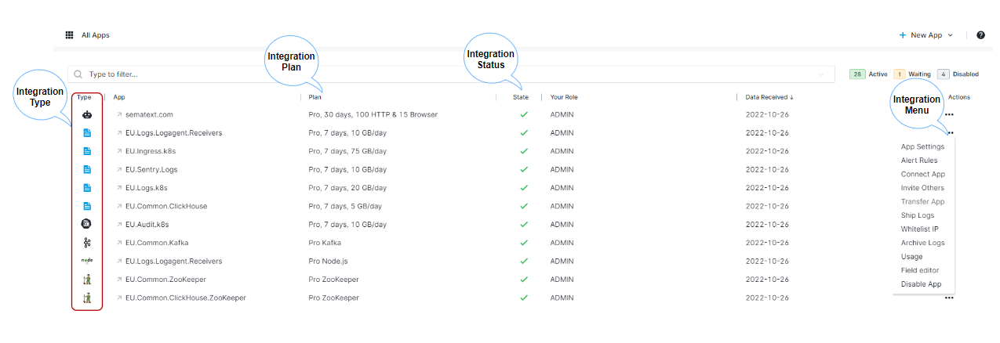

title: Sematext Integrations Guide
description: Sematext Cloud has 100+ built-in integrations for monitoring services, infrastructure, websites, APIs, etc.

Sematext Cloud provides over 100 built-in [integrations](https://sematext.com/integrations) used to monitor all your systems, apps, services, websites, etc.

You can collect data from various systems and send them to Sematext Cloud where you can then analyze and visualize them using APM and logging tools, and set alerts on the behaviour of these systems. Once the Sematext Agent is installed, integrations provide monitoring capabilities for the following types of data:

- [Metrics](../monitoring) from your infrastructure or services running on it
- [Logs](../logs) from your applications, servers, etc.
- [Events](../events) such as services starting or restarting, package installs and version updates, builds, deployments, alerts, etc. Events are graphed in timeseries charts and these charts can be correlated with metrics or logs components to enable faster troubleshooting.

To start monitoring and alerting for your infrastructure performance and logs you need to set up the [Sematext Agent](../agents/sematext-agent/).
Sematext Agent collects server, container, and Kubernetes metrics, network connections, process metrics, infrastructure inventory data, Docker and Kubernetes events, and more. It also performs [service discovery](../monitoring/autodiscovery/) and [logs discovery](../discovery/intro/), so you can easily set up monitoring for your services and logs.

Sematext Agent is not needed to monitor your website, APIs, or user experience.  [Synthetic monitoring](../synthetics) of websites and APIs requires no installation of any kind - it is all configurable in the UI.  [User Experience monitoring](../experience) provides you with a snippet of JavaScript for insertion in your web pages.

After you install and activate an integration for a service you want to monitor, you can:

- Filter and analyze the metrics and configuration data
- Query your data and create custom dashboards
- Create alert rules to detect problems with your services, infrastructure, website, etc. and get alerted via one or more [alert notification hooks](../alerts/alert-notifications).

## Available Integrations

### Logging

- [Apache](../integration/#apache-logs)
- [Android](../integration/generic-logs-integration/#android)
- [AWS EC2](../integration/generic-logs-integration/#aws-ec2)
- [AWS ECS on AWS Fargate with AWS FireLens](../integration/generic-logs-integration/#aws-ecs-on-aws-fargate-with-firelens)
- [AWS ECS on AWS Fargate with AWS Logs](../integration/generic-logs-integration/#aws-ecs-on-aws-fargate-with-aws-logs)
- [AWS ECS on AWS EC2](../integration/generic-logs-integration/#aws-ecs-on-aws-ec2)
- [AWS S3 CloudTrail](../integration/generic-logs-integration/#aws-s3-cloudtrail-flow-logs-elb-access-logs-etc)
- [AWS CloudWatch Logs](../integration/generic-logs-integration/#aws-cloudwatch-logs)
- [AWS Lambda](../integration/generic-logs-integration/#centralized-logging-for-aws-lambda)
- [Cloud IaaS / PaaS](../integration/generic-logs-integration/#cloud-iaas-paas)
- [Containers](../integration/generic-logs-integration/#containers)
- [Elasticsearch](../integration/#elasticsearch-logs)
- [GitHub Webhook Events](../integration/#github-webhook-events-integration)
- [IBM Kubernetes Logs](../integration/#ibm-cloud-kubernetes-logs)
- [iOS](../integration/generic-logs-integration/#ios)
- [JVM](../integration/#jvm-gc-logs)
- [Kubernetes Audit](../integration/#kubernetes-audit-integration)
- [Log Shippers](../integration/generic-logs-integration/#log-shippers)
- [Nginx](../integration/#nginx-logs)
- [Operating Systems](../integration/generic-logs-integration/#operating-systems)
- [PostgreSQL](../integration/#postgresql-logs)
- [Programming Languages](../integration/generic-logs-integration/#programming-languages)
- [RabbitMQ](../integration/#rabbitmq-logs)
- [Solr](../integration/solr-logs)
- [Syslog Protocols](../integration/generic-logs-integration/#syslog-protocols)
- [Vercel Logs](../integration/#vercel-logs-integration)

### Monitoring

- [Akka](../integration/akka/)
- [Apache](../integration/apache/)
- [Apache Spark](../integration/spark/)
- [Apache Storm](../integration/storm/)
- [AWS (Amazon Web Services)](../integration/aws/)
- [Cassandra](../integration/cassandra/)
- [ClickHouse](../integration/clickhouse/)
- [Docker](../integration/docker/)
- [Elasticsearch](../integration/elasticsearch)
- [Express.js](../integration/express.js)
- [Hadoop](../integration/hadoop/)
- [HAProxy](../integration/haproxy/)
- [HBase](../integration/hbase)
- [Infra](../integration/infra/)
- [Java](../integration/jvm/)
- [Jenkins](../integration/jenkins/)
- [Kafka](../integration/kafka/)
- [MySQL](../integration/mysql/)
- [MongoDB](../integration/mongodb/)
- [Nginx](../integration/nginx/)
- [Nginx+](../integration/nginxplus/)
- [Node.js](../integration/node.js)
- [PHP](../integration/php/)
- [PostgreSQL](../integration/postgresql/)
- [RabbitMQ](../integration/rabbitmq/)
- [Redis](../integration/redis/)
- [Solr](../integration/solr/)
- [Solr Cloud](../integration/solrcloud/)
- [Tomcat](../integration/tomcat/)
- [ZooKeeper](../integration/zookeeper/)

### Notification Hooks

- [AlertOps](../integration/alerts-alertops-integration/)
- [Big Panda](../integration/alerts-bigpanda-integration/)
- [Custom user defined webhooks](../integration/alerts-webhooks-integration/)
- [Email as default system webhhook](../integration/alerts-email-integration/)
- [GoogleChat](../integration/alerts-googlechat-integration/)
- [Hipchat](../integration/alerts-hipchat-integration/)
- [Microsoft Teams](../integration/alerts-microsoft-teams-integration/)
- [Nagios](../integration/alerts-nagios-integration/)
- [OpsGenie](../integration/alerts-opsgenie-integration/)
- [PagerDuty](../integration/alerts-pagerduty-integration/)
- [Pushover](../integration/alerts-pushover-integration/)
- [ServiceNow](../integration/alerts-servicenow-integration/)
- [Signl4](../integration/alerts-signl4-integration/)
- [Slack](../integration/alerts-slack-integration/)
- [Spike.sh](../integration/alerts-spikesh-integration/)
- [Squadcast](../integration/alerts-squadcast-integration/)
- [Telegram](../integration/alerts-telegram-integration/)
- [Twilio](../integration/alerts-twilio-integration/)
- [VictorOps](../integration/alerts-victorops-integration/)
- [Zapier](../integration/alerts-zapier-integration/)

## Adding a New Integration

An [App](app-guide) is core concept in Sematext.  When adding monitoring you will start by creating an App for the desired integration type.
Go to the [Apps](https://apps.sematext.com/ui/integrations/apps) page to create a new App. Pick a solution type and all the available integrations for that solution will be listed. Hover over any integration card and click to create the respective App.

Next step is to pick your environment that runs the service you want to monitor.

After you select your environment, the agent installation page will show up, which gives you step-by-step instructions on how to install [Sematext Agent](../agents/sematext-agent/).

### Connecting Apps

To help speed up troubleshooting make use of [Connected Apps](connected-apps). For example, connecting a Monitoring App to a Logs App will pre-select that Logs App when you decide to correlate metrics. When you receive an alert notification for an App, the alert notification will contain charts from
connected Apps, and thus provide more information and context for you. You can connect any two Apps you have access to, regardless of their type. A single App can be connected to any number of other Apps. 

To connect Apps go to App Table View and choose Connect App from Integration Menu. 

Or navigate to the App and click on the Connect New App button on the top right of the page.

### Notification Hooks Integrations

When an App is first created you may find that Sematext automatically created several App [default, integration-specific alerts](../alerts/default-alerts/). User account email is used as a [default notification hook](alerts/account-default-hooks/) to send those alert notifications. If you want to use any of the popular third party messaging services that you use in your operations workflow, you can do so by creating related [notification hook](/guide/integrations-guide/#webhooks) integration.

### App Table View

Once one or more Apps have been created, the [Apps Table](https://apps.sematext.com/ui/integrations/apps) will display all the created Apps and provide overview as well as App menu from where you can:

- access and edit App settings
- create alerts and define alert rules
- connect two Apps
- invite other devops team members
- transfer or disable App
- get to monitoring installation instructions

You can also add new integrations and filter and search existing App using table search functionality. The App table contains following information:

- Type illustrated using integration type logo link to provide visual clue should App naming convention not include any reference to the type
- Application Name
- Next table column describes your Integration Plan and plans can be adjusted using App settings. For more information on [infrastructure monitoring pricing](https://sematext.com/pricing#spm) or [logging pricing](https://sematext.com/pricing#logsene) check our website
- App Status indicator icons show your apps status and either green checkmark is used to indicate that App is sending data to our service, indexed and ready for IT systems monitoring
- Your role is defined in the last second column
- Last, but not the least, App Settings dropdown menu is the last item in the [apps table](https://github.com/sematext/sematable).

## Sematext Agent Installation

### Logging

Sematext stores data received through the Elasticsearch API and also through a variety of Syslog protocols. In order for the Sematext Cloud to receive data from your systems you need to install the agent on them. Logging Apps require log shipper installation on your end, and information below explains the process.

#### Elasticsearch API

Sematext exposes the Elasticsearch API which lets you:
- send log events directly from your application, using any Elasticsearch library
- send log events using a "log shipper" application such as Logstash, rsyslog, Apache Flume, Fluentd, or - anything that can output to Elasticsearch
search for logs from your own application, or by configuring/adapting existing Elasticsearch UIs, such as Kibana
- optionally define custom mappings for your log types, so you can tweak the way your logs are indexed

The basic settings for sending data using the Elasticsearch API are:

- host: logsene-receiver.sematext.com
- port: 80 (HTTP) or 443 (HTTPS)
- index: bb50181f-5fad-4639-b880-7c49e036ae02 (this is example app token and the unique one will be created for every logging app you create)

#### Syslog Protocols

We accept Syslog messages using any log shipper and any Syslog library, as long as they either contain a valid token or the source IP is authorized. The basic settings for sending data using the Syslog protocols are:

- host: logsene-syslog-receiver.sematext.com
- port: 514 (TCP and UDP), 20514 (RELP) or 10514 (TLS)
- index: bb50181f-5fad-4639-b880-7c49e036ae02 (example tokene)

#### Socket Protocols

We accept JSON messages using any log shipper and any logging library, as long as they contain a valid token. The basic settings for sending data using the Socket protocols are:

- host: logsene-syslog-receiver.sematext.com
- port: 12201 (TCP and UDP)
- index: bb50181f-5fad-4639-b880-7c49e036ae02 (example token)

### Monitoring

Two steps are required when creating a Monitoring App:

- Agent Installation
- Agent Setup

#### Agent Installation

You need to add the Sematext repository and install Sematext Agent. It is available for various Linux distributions as well as infrastructure orchestration tools like Ansible, Puppet, and Chef. Choose your distribution and install required packages. Once installed, move to the App Agent Setup step.

#### App Agent Setup

App Agent collects performance metrics of your application (Solr, Elasticsearch, HBase...). It can run in two different modes:

- [In-process as a javaagent](/agents/sematext-agent/app-agent/spm-monitor-javaagent/)
- [Standalone as a separate process](/agents/sematext-agent/app-agent/spm-monitor-standalone/)

For more information check App Agent [overview page](/agents/sematext-agent/app-agent)

You'll start seeing your performance data in Sematext in a few minutes. If you do not see performance charts in 5 minutes, have a look at [Troubleshooting page](/monitoring/spm-faq/) for tips and if nothing works give us a shout @Sematext or at support@sematext.com.

[Register](https://apps.sematext.com/ui/registration) for free or [Login](https://apps.sematext.com/ui/login/) into Sematext IT systems monitoring platform to get started and create your logs App. Upload your logs from all your servers to our centralized log management solution with Elasticsearch API and integrated Kibana, and experience the first true Hosted ELK Stack.

Recommendations for learning more about Sematext products and services:

- Infrastructure [integrations documentation](/integration/)
- Our [website](https://sematext.com/)
