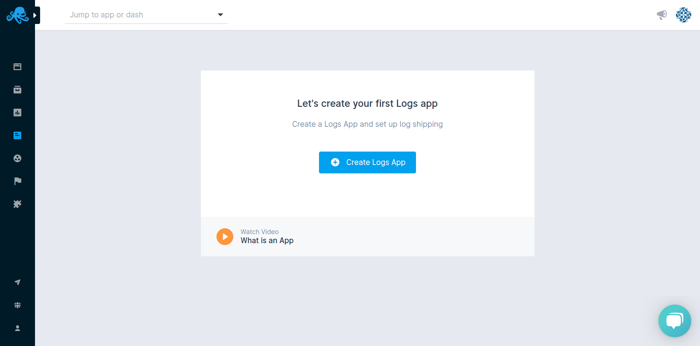
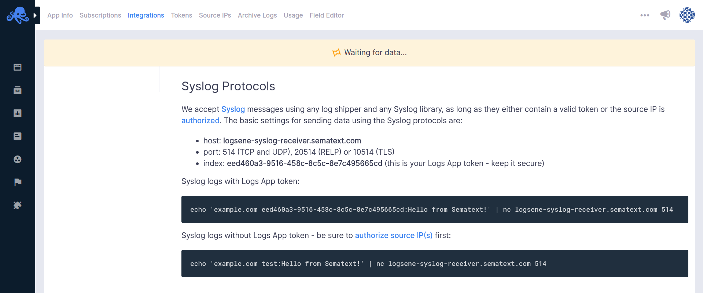
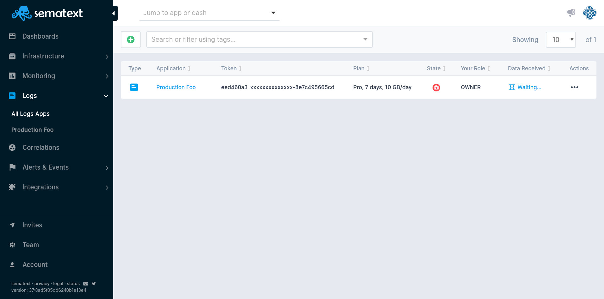
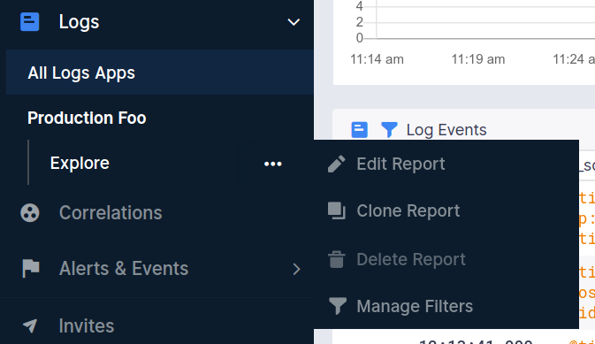
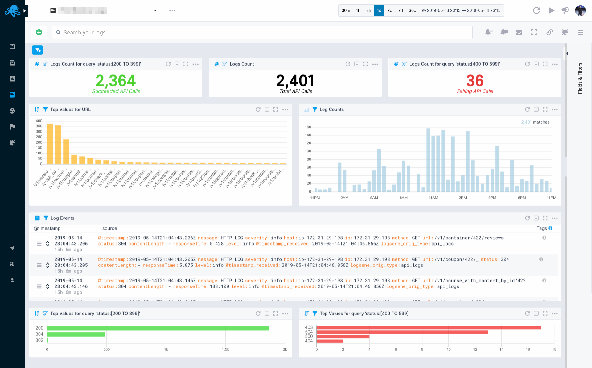

title: Sematext Logs User Guide
description: Sematext Cloud is a modern monitoring, log management, transaction tracing, and real user monitoring system that aggregates and structures your logs across various languages and platforms. It is a suite of products that combine high-quality logging experience with other monitoring and alerting devops tools helping fix production issues


Sematext Logs is a **Log Management-as-a-service**. Think of it as your own **central location for logs** in the cloud. If you want to have the same but on your own infrastructure, check out our [Enterprise](../sematext-enterprise) product.

You can collect logs from any part of your software stack. By using log shippers you centralize and index logs from all parts in one single place, [Sematext Logs](../logs).

[Sematext Logs](../logs) supports [sending logs](../logs/sending-log-events/) from infrastructure, containers, AWS, applications, custom events, and much more, all through an Elasticsearch API or Syslog.

It's a cheaper [alternative to Splunk or Logz.io](https://sematext.com/resources/industry-comparisons/). You can **use Sematext Logs as your own Hosted Elasticsearch** since it exposes an Elasticsearch API for indexing and searching. Data can be indexed from virtually any source, format or location.

You can create [custom dashboards](./dashboards-guide) with real-time data that helps you understand important trends, summarize top values and view the frequency of conditions.

[Searching logs](../logs/searching-log-events/) is easy with a Google-like query syntax. You can also turn all searches into real-time [alerts](../alerts/) and automatically trigger notifications. Sematext Logs supports sending **alerts via E-mail, Slack, PagerDuty**, and various other 3rd party integrations. Alerts can be triggered based on thresholds, trend-based conditions and other complex searches.

## Creating a Logs App
After you get logged into Sematext Cloud at <https://apps.sematext.com> (or <https://apps.eu.sematext.com> if using Sematext Cloud Europe), the first step is to create a Logs App. An App is an independent namespace for your data.

For example, if you have a development and a production environment, it might make sense to have one App for each. You can create as many Apps as you want.

You create an App by pressing the **+ Create Logs App** button in the Logs tab.



Add a name and press **Continue**.


After creating a Logs App you will see an **integrations** screen that tells you how to [send data to your new Logs App](../logs/sending-log-events). 


Once you start sending data, you can start [searching and analyzing these logs](../logs/searching-log-events) in the Logs App or [explore your data with Kibana](../logs/kibana).


### Adding Data to Your Logs App

There are two ways to send data to your Logs App: 

- [Elasticsearch API](../logs/index-events-via-elasticsearch-api)
- [Syslog](../logs/syslog)


### Elasticsearch API

The easiest way to **send logs is with** [Logagent](../logs/logagent), [Logstash](../logs/logstash), or Filebeat. Have in mind any log shipper will get the job done. You can also use **any tool that works with Elasticsearch's REST API**, for both [indexing](../logs/index-events-via-elasticsearch-api) and [searching](../logs/search-through-the-elasticsearch-api). 

If you're using a particular **programming language**, configuring your **logging framework to send data to Sematext Logs** is also an option.

The only condition is to **use the App's token as the index name**, and `https://logsene-receiver.sematext.com:443`, or `https://logsene-receiver.eu.sematext.com:443` as the Elasticsearch endpoint.

Don't forget, if you're using **Docker**, setting up [Sematext Docker Agent](../sematext-docker-agent) is incredibly simple.

Here's how to send a message from the terminal.
```bash
curl -XPOST https://logsene-receiver.sematext.com/YOUR-TOKEN-GOES-RIGHT-HERE/example/ -d '{
  "message": "Hello from Sematext!"
}'
```

[This guide](../logs/index-events-via-elasticsearch-api/) will show you more details on using the Elasticsearch REST API with Sematext.


### Syslog

You can forward syslog via **UDP** (port 514), **TCP** (port 514), **RELP** (port 20514) and **TLS** (port 10514). The host name is **logsene-syslog-receiver.sematext.com** / **logsene-syslog-receiver.eu.sematext.com**

To get started with syslog shipping quickly, you can use our configuration script and add your App token as a parameter:

``` bash
curl -O https://apps.sematext.com/logsene/configure-syslog.py
sudo python configure-syslog.py $YOUR-TOKEN-GOES-RIGHT-HERE
```

You can also use this snippet.

```bash
echo 'example.com eed460a3-9516-458c-8c5c-8e7c495665cd:Hello from Sematext!' | nc logsene-syslog-receiver.sematext.com 514
```



For more details, take a look at the [Syslog](../logs/syslog) page, and the pages that are linked from it.

## Troubleshooting With Logs

Quality Log Management tools have several main requirements for analyzing logs:

- A way to ship, ingest, and reliably index logs data
- Tools to search, correlate and investigate logs data
- Drill-down analysis functionality to reveal trends, spikes, and anomalies
- Monitoring and alerting features with 3rd party webhooks and integrations 
- Building custom reports and dashboards from your data

These are key features Sematext Logs offers. The rest of this guide will help you get started with using it to its full potential. But first, check out this short video about troubleshooting with logs.

<div class="video_container">
<iframe src="https://www.youtube.com/embed/glwZ8OCV0kc"
frameborder="0" allow="autoplay; encrypted-media" 
allowfullscreen class="video"></iframe>
</div>

Moving on, let's see how to make the best out of a Logs App.

## Logs App Layout

The image below shows the default logs view and marked are the main application and system UI elements. 


## Logs App Settings

The settings include:

  - inviting new users to your application
  - [authorizing public IPs to send data to your app via syslog](../logs/authorizing-ips-for-syslog)
  - adjusting data retention time, daily volume, and limits
  - [changing your app's plan](../logs/faq/#plans-prices)
  - checking how much data is, or has been shipped to your App

  


### Side Navigation

The persistent region on the left that can be collapsed, is used to easily switch across monitoring, log management, transaction tracing, real user monitoring, and other user & team features. All side navigation tabs are selectable. If they have chevrons, it indicates that the top level section is collapsible and contains additional subitems. The subitems will let you explore all your Apps, or choose a particular App.

Side navigation top level sections for infrastructure and application performance monitoring, log management, transaction tracing, and real user monitoring:

- Dashboards
- Infrastructure
- Monitoring
- Logs
- Correlations
- Alerts and Events
- Integrations

Side navigation sections for user and team features:

- Invites
- Team
- Account 



### App Selector

The App dropdown selector lets you **choose any Logs or Monitoring App** as well as any **Dashboards and Reports** that you have generated from those Apps. Infrastructure views such as AppMap, NetMap, Servers, and Containers are also available for selection, and together provide seamless switching and navigation between logs, application and infrastructure monitoring, which is essential when rushing to fix production issues.

### App Actions

Right next to the App Selector is the **App Actions dropdown menu** and **horizontal elipsis icon**. 

The App Actions dropdown menu allows you to **quickly switch between your Dashboards, Logs and Monitoring Apps**. While the horizontal elipsis icon shows your App options and lets you open various app specific functions, like instructions to **install monitors and start sending metrics, app settings, alert rules, heartbeat alerts, as well as ability to connect two different apps, invite team members, and transfer app ownership**.

All App Actions open in a modal dialogue window as temporary UI regions and let you adjust and edit settings or create various alerts. The Logs App view remains unchanged and allows for easy interaction between various system settings and reports views.

### Report Selector

Once you create a Logs App, and start shipping data, you will get a **default Report created for you named Explore**. It will have the default data and default [component](#components) configuration. You can edit this Report, clone it, or create new ones. 




### Time Picker

The Time Picker is available whenever a Logs or Monitoring App is selected as well as when any custom dashboards are being used. **One minute is the shortest time increment** you can select. **Thirty minutes, one and two hours, and one, two, seven, and thirty days time-span shortcuts** are exposed common observability defaults.

A **custom time range can be selected using the time picker dropdown menu**. The Logs App will automatically refresh upon selection and update all the reports accordingly.

### Refresh and Live Tail

Refresh data and Live Tail options are located next to the time picker. The **Live Tail feature provides real-time insights as soon as your data is consumed and indexed**. It can be also stopped so the auto-refresh does not update the data, in case you need to inspect specific incidents or anomalies within a certain time segment.

### Notifications

The megaphone icon in the right section of the header is used to open the notifications. If your plan is in need of an upgrade, a new feature is announced, or similar system and service updates require your attention, they'll be shown in the notifications view.

### User Settings

The User Settings is the last right aligned item in the header. **Switching accounts, Inviting team members, Billing, Help, Subscriptions**, and other user related system functionalities are located in the user settings dropdown menu. They are also top level items easily accessible from the left sidebar. 

Here you can see the main navigation sections:

- Side navigation 
- App & Dash Selector dropdown menu
- App Actions dropdown menu
- User Settings dropdown menu
- Time Picker component 


The next section describes the monitoring report menu located just below the top navigation menu, and help you discover how to add new components, correlate your logs and events with your monitoring app, do report specific actions, connect your apps, and more.

## Logs Search and Report Menu

Events, Alerts, and Logs are integrated into a single reports pane, and used to search logs, create alerts for anomalies, view events, and much more. 

Our [log management platform](https://sematext.com/logsene/) gives you the ability to create your own queries through its [Elasticsearch API](https://sematext.com/docs/logs/search-through-the-elasticsearch-api/) as well as using simple query syntax very much like the [query syntax](https://sematext.com/docs/logs/search-syntax/) used by Google.

You can also create and integrate [alerts](https://sematext.com/docs/alerts/) with commonly used collaboration and messaging software such as [Hipchat](https://sematext.com/docs/integration/alerts-hipchat-integration/), [Slack](https://sematext.com/docs/integration/alerts-slack-integration/), [Big Panda](https://sematext.com/docs/integration/alerts-bigpanda-integration/), [PagerDuty](https://sematext.com/docs/integration/alerts-pagerduty-integration/), [VictorOps](https://sematext.com/docs/integration/alerts-victorops-integration/), [OpsGenie](https://sematext.com/docs/integration/alerts-opsgenie-integration/) or simply by using your email address(es). Use these services to continuously monitor large volume of data and logs, and ensure that you are alerted in time.

 

### App State

When your Logs App is loaded the **Save and Reset buttons will be hidden** since you see the App's default state. If a **new component is added** or any existing **component is edited, alert created, and report component removed**, the **Save and Reset buttons will appear** in the report menu and allow for changes to be saved or reset to the initial state. If your browser is suddenly closed, and no changes were saved or reset, the App will preserve its initial state.

### Report Actions 

The set of icons in the logs search and report menu let you:

- **Save Query / Add Alert** - Every query can be sa**ved for later use, and used to send alerts**. The ability to save queries and alerts is part of the essential tools for searching, correlating and investigating logs data. Each saved query becomes part of the saved queries section.

- **Saved Queries / Alert Rules** - Right next to the save query / alert icon you can see the saved queries and alert rules, this will open a modal dialogue window with **all your saved queries and alert rules** displayed in a [Sematable](https://github.com/sematext/sematable), a table component that displays

	- _Tag Color_ that can be assigned to any logs query while it is being saved by user using colour picker componenet 
	- _Query Name_ to further identify and describe logs query
	- _Query String_ will be string you use in logs search input field
	- _Owner_	
	- _10m, 1h, 12h, and 1d_ shortcuts with histogram for fast observability of query patterns across common time intervals
	- Saved _query actions_ dropdown menu used to add new, edit, clone, reset, and delete saved logs report

- **Email Report** - There are E-mail and Subscription types available with time, frequency, and time range defined so your team can get automatated reports about your logs and system health.

- **Full Screen Mode** - Entering full screen mode brings only the component you choose into view. It's useful for presentations and viewing detailed info of a single component. All charts have zoom, hairline, and time navigation tools with tooltips available for effective chart interaction and data analysis.

- **Connected Applications** - Connecting a Logs App to a Monitoring App will **pre-select that Logs App when you decide to correlate metrics from the connected Monitoring App**. When you receive an alert notification for an app, the **alert notification will automatically include information and charts from connected apps**, and thus provide more information and context for you. You can connect any two apps you have access to, regardless of their type. **Any App can be connected to any number of other Apps**.

- **Integrations** - This section will guide you through installing Agents and Monitors. You will need to install **Sematext Agents so metrics or logs** data can be shipped to your Logs or Monitoring App. 
		
	Please refer to the [Integrations](https://sematext.com/docs/integration/) documentation pages for particular tech you wish to monitor. Learn more about how to monitor various programming languages, operating systems, containers (Docker, Kubernetes, Mesos), Cloud IaaS / PaaS services, iOS, Android, AWS EC2, AWS s3, and how to integrate log management with log shippers. You'll find detailed information on how to install and configure different agents required to start sending your logs and metrics data to Sematext Cloud there.

### Report Settings

- **Report Actions** - Your customized logs report can be better described using **meta name and description**, and you can assign a **unique URL Alias** to identify that report.

- **Legends Position and Extended Charts features** - Except in the default overview mode, each **report can have legends** for each metric name, arranged below, to the left, or hidden entirely for better chart interaction. Extended charts are also displayed below and provide a comparative view into a longer time span relative to the time frame displayed in the main chart. Just like report legends, the extended view can be hidden and only the chart with X and Y values will be displayed.

## Components

Using custom components you can **add metrics time series, events count time series, events, markdown notes, and create custom reports** with rich data visualizations and chart tools to analyze data.

Some components are common for both Logs and Monitoring, while other are specific for either one. They will be contextually available depending on whether you're adding them to a Monitoring or Logs App. Each **component can be also added to custom dashboards** you create.

### Logs Components

The Logs and Logs Count Time Series components are added by default to your Logs App. Additional Logs components that can be added to your App are Metric Panels, Logs Count, Top Values and Numeric Field Time Series.

These can be configured by whichever search query you want in any way you want. Making it easy to set up your Logs Report just the way you want.

 

Use them together with out-of-the-box metrics, from a Monitoring App, and you will go from metric spikes to Logs in seconds, and get to the root cause in minutes. Forget about ssh-ing to servers and grepping logs and find similar metric patterns with built-in metric correlations.



### Logs Component Settings

Each Component can be added to a custom Dashboard, and you can organize reports from one or several applications, both Logs Apps as well as Monitoring Apps. Creating rich data and visualization reports based on various metrics and logs data has never been easier.

Here's an image of the **Log Events Component** dropdown menu with log specific export and field editor features and the ability to add the component to a custom dashboard.


## Next step

[Sign up](https://apps.sematext.com/ui/registration) to Sematext Cloud for free to get started, and create your first Logs App. Upload logs from all your servers to our centralized log management solution through our Elasticsearch API, and experience a proper hosted Elasticsearch Stack.

If you already have an account, [sign in](https://apps.sematext.com/ui/login/) and start shipping logs!

Check this out to learn more about Sematext:

- [Logs documentation](/logs/)
- Our [website](https://sematext.com/) and [Logs](https://sematext.com/logsene/) products 
- For Sematext Logagent and other Sematext contribution to the open-source community, check our [GitHub](https://github.com/sematext/) repositories.
- or just use chat in the right bottom corner of the app or website and one of our engineers will help you navigate Sematext waters.
