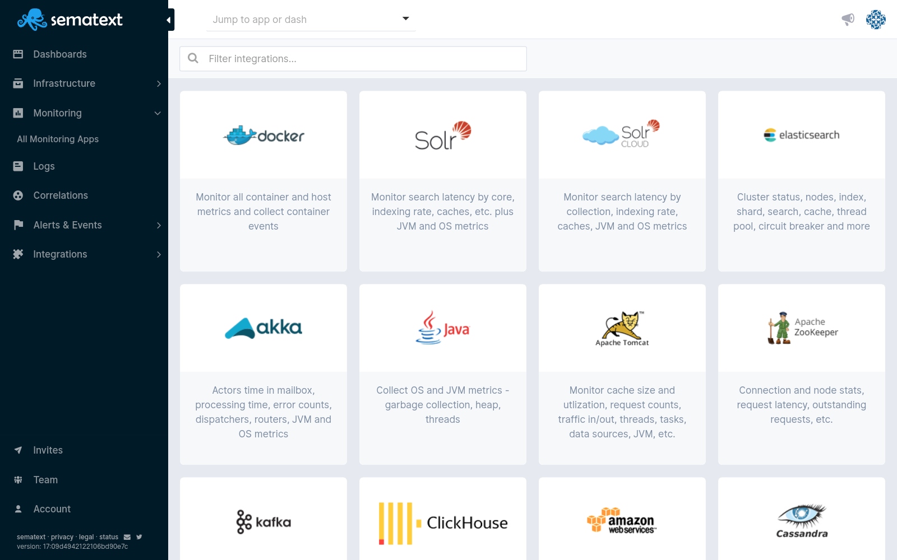
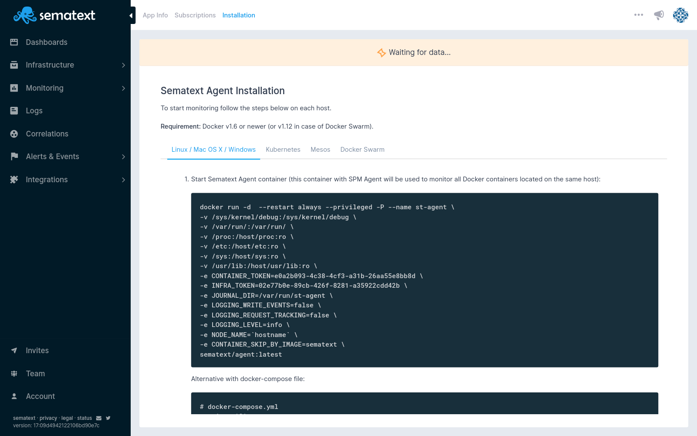
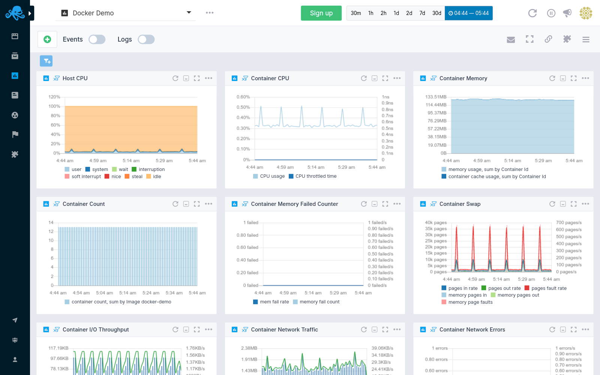
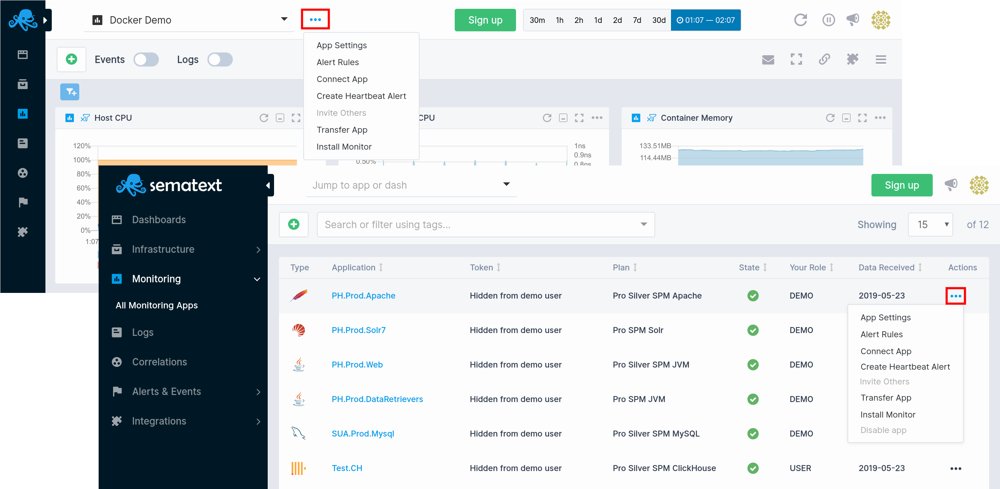
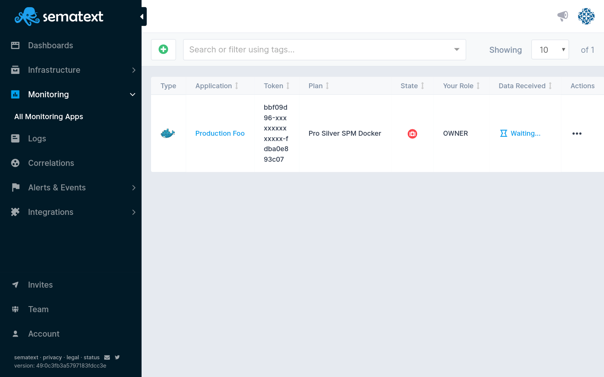

title: Sematext Monitoring User Guide
description: Sematext Cloud is a modern monitoring, log management, transaction tracing, and real user monitoring system that includes over 40 monitoring integrations. It is a suite of products that combine high-quality logging experience with other monitoring and alerting devops tools helping fix IT production issues

Sematext **Application** and **Infrastructure Monitoring** lets you **collect metrics** and **events** across your whole stack with over [40 integrations](https://sematext.com/integrations/). 

Get started in minutes with **out-of-the-box dashboards**, [**alerts**](https://sematext.com/alerts/) and [**anomaly detection**](https://sematext.com/alerts/) rules, and ability to **analyze metrics** by a number of context-aware filters.

The integrations cover several key features. You have [**Server Monitoring**](../monitoring/#setting-up-monitoring-agents) giving you complete insight about the utilization of your servers and cloud instances. [**Monitor Containers**](../monitoring/containers) with [**Sematext Agent**](../agents/sematext-agent/), which is deployed seamlessly with Docker or Kubernetes.

Our SaaS/on-premises monitoring product goes beyond just collecting metrics. 

Use [**Database Monitoring**](https://sematext.com/database-monitoring/) to get a complete overview of your database health whether you are running it on your own infrastructure or using AWS RDS. 

[**Transaction Tracing**](https://sematext.com/tracing/) will show slow database operations, full SQL statements, end-to-end HTTP transaction context, top 10 operations by throughput, latency, or time consumed, filter database operations, and much more...

**Inventory Monitoring** will track all your infrastructure configurations, collect data about machines and group it into sets for easy access and identification.

You can create [**custom dashboards**](./dashboards-guide) with real-time data that helps you understand important trends, summarize top values and view the frequency of conditions.

If you haven't [signed up for free](https://apps.sematext.com/ui/registration) yet, check it out or [sign in](https://apps.sematext.com/ui/login/) to get started by creating a Sematext Monitoring App with over 40 integrations to choose from.

## Creating a Monitoring App
After you get logged into Sematext Cloud at <https://apps.sematext.com> (or <https://apps.eu.sematext.com> if using Sematext Cloud Europe), the first step is to create a Monitoring App. An App is an independent namespace for your data.

For example, if you have a development and a production environment, it might make sense to have one App for each. You can create as many Apps as you want.

You create an App by pressing the **+ Create Monitoring App** button in the Monitoring tab.

Choose one of the 40 integrations.

Once clicking on your desired integration, add a name, and press **Continue**.

A sample of creating a Docker Monitoring App

This will immediately open up the Agent installation instructions. Follow the steps and data will start flowing in!

Every type of Integration has a dedicated Agent Installation Guide

Once you have data flowing you can **analyze metrics** by a number of context-aware filters, add **alerts** and **anomaly detection**, and **correlate metrics** with events and logs.

### Setting up Monitoring Agents

Metrics are shipped to Sematext Monitoring using Agents. To monitor your infrastructure you need to set up a **Sematext Monitoring Agent**. You can choose from:

  - [Sematext Agent](../agents/sematext-agent/), a lightweight, blazing 
    fast Go-based Monitoring Agent with a tiny footprint for both 
    infrastructure and containers.

  - [Sematext Infra & App Agent](spm-client) (aka SPM Client or SPM
    Monitor). The Infra Agent collects OS & Network metrics.
    The App Agent collects application metrics. The App Agent
    can run in [embedded](spm-monitor-javaagent)
    (aka Java agent-based, aka in-process) or
    [standalone](spm-monitor-standalone) mode.  This agent can also
    instrument JVM-based apps to collect transaction traces and
    perform [on demand profiling](on-demand-profiling).

  - [Node.js-based App Agent](node-agent), which can [monitor
    Apache](../integration/apache) and [Nginx](../integration/nginx)
    (including [Nginx Plus](../integration/nginxplus)).

  - Sematext Docker Agent (Deprecated), which can collect not
    only container and host metrics, but also container events and
    also logs, it can parse and structure out of the box.

The setup instructions for each of the agents are shown in the UI and you can also see them under individual [integrations](../integration).

Once the agent is set up metrics will start coming to Sematext
instantly. If you do not see performance charts 5 minutes after setting up the agent, have a
look at the <a href="http://sematext.com/docs/monitoring/spm-faq/">troubleshooting</a> page.

## Monitoring App Layout

This guide will help you get started with our Monitoring App and discover reporting, monitoring, and other features and functionalities. Here's the default monitoring view and shown are the main application and system elements.

## Monitoring App Settings

App settings and actions include, but are not limited to:

  - inviting others to your App
  - [alert rules](../alerts)
  - changing your App's plan
  - connecting Apps
  - heartbeat alert cration
  - App ownership transfer
  - scheduled report emails (aka Subscriptions)
  
<!--  -->

<!--  -->

### Side Navigation

The persistent region on the left that can be collapsed, is used to easily switch across monitoring, log management, transaction tracing, real user monitoring, and other user & team features. All side navigation tabs are selectable. If they have chevrons, it indicates that the top level section is collapsible and contains additional subitems. The subitems will let you explore all your Apps, or choose a particular App.

Side navigation top level sections for infrastructure and application performance monitoring, log management, transaction tracing, and real user monitoring:

- Dashboards
- Infrastructure
- Monitoring
- Logs
- Correlations
- Alerts and Events
- Integrations

Side navigation sections for user and team features:

- Invites
- Team
- Account 

### App Selector

The App dropdown selector lets you **choose any Logs or Monitoring App** as well as any **Dashboards and Reports** that you have generated from those Apps. Infrastructure views such as AppMap, NetMap, Servers, and Containers are also available for selection, and together provide seamless switching and navigation between logs, application and infrastructure monitoring, which is essential when rushing to fix production issues.

### App Actions

Right next to the App Selector is the **App Actions dropdown menu** and **horizontal ellipsis icon**. 

The App Actions dropdown menu allows you to **quickly switch between your Dashboards, Logs and Monitoring Apps**. While the horizontal ellipsis icon shows your App options and lets you open various app specific functions, like instructions to **install monitors and start sending metrics, app settings, alert rules, heartbeat alerts, as well as ability to connect two different apps, invite team members, and transfer app ownership**.

All App Actions open in a modal dialogue window as temporary UI regions and let you adjust and edit settings or create various alerts. The Monitoring App view remains unchanged and allows for easy interaction between various system settings and reports views.

### Report Selector

Once you create a Monitoring App, and start your Agent, you will get a **default Report created for you named Overview**. It will have the default data and default [component](#components) configuration. You can edit this Report, clone it, or create new ones. 

Based on what type of Monitoring Integration you chose, more Reports get created by default. In this Docker sample you can see three more Reports are created by default.

### Time Picker

The Time Picker is available whenever a Logs or Monitoring App is selected as well as when any custom dashboards are being used. **One minute is the shortest time increment** you can select. **Thirty minutes, one and two hours, and one, two, seven, and thirty days time-span shortcuts** are exposed common observability defaults.

A **custom time range can be selected using the time picker dropdown menu**. The Logs App will automatically refresh upon selection and update all the reports accordingly.

### Refresh and Live Tail

Refresh data and Live Tail options are located next to the time picker. The **Live Tail feature provides real-time insights as soon as your data is consumed and indexed**. It can be also stopped so the auto-refresh does not update the data, in case you need to inspect specific incidents or anomalies within a certain time segment.

### Notifications

The megaphone icon in the right section of the header is used to open the notifications. If your plan is in need of an upgrade, a new feature is announced, or similar system and service updates require your attention, they'll be shown in the notifications view.

### User Settings

The User Settings is the last right aligned item in the header. **Switching accounts, Inviting team members, Billing, Help, Subscriptions**, and other user related system functionalities are located in the user settings dropdown menu. They are also top level items easily accessible from the left sidebar. 

Here you can see the main navigation sections:

- Side navigation 
- App & Dash Selector dropdown menu
- App Actions dropdown menu
- User Settings dropdown menu
- Time Picker component 

The next section describes the monitoring report menu located just below the top navigation menu, and help you discover how to add new components, correlate your logs and events with your monitoring app, do report specific actions, connect your apps, and more.

## Monitoring Report Menu

The **Monitoring Report Menu** is where the true power of Sematext Performance and Infrastructure Monitoring lies. This is where Observability comes to life. **Events and Logs** are **integrated** in a **single Monitoring Reports pane**, and used to **correlate metrics** with **application and server logs, events, alerts, anomalies**, and much more! 

Here's how you can **correlate Metrics with Events and Logs**, and view it all in a single view.

 

### App State

When your Monitoring App is loaded the **Save and Reset buttons will be hidden** since you see the App's default state. If a **new component is added** or any existing **component is edited, alert created, and report component removed**, the **Save and Reset buttons will appear** in the report menu and allow for changes to be saved or reset to the initial state. If your browser is suddenly closed, and no changes were saved or reset, the App will preserve its initial state.

### Correlations

Correlations give you a single view for Metrics, Logs, and Events. This is a huge time saver to let you move from **Metrics spikes** to **drill down to Logs and Events** that caused them. 

With Alerts and the new Real User Monitoring feature we want to create a set of tools that provide instant feedback to help monitor and troubleshoot your infrastructure and software.

#### Events

Here you can see the Events toggle switched on, showing you an Events Histogram which follows the same timeline as the Metrics. 

 

When the Events toggle is on in the report menu, the **Events Search component** is loaded. It has a **search box**, an **App Selector** to select what data you want to load and correlate, and an **Events Histogram** displaying bar chart across the time frame selected in the time picker.

Contextual menu items are located as a series of icons next to the App Selector. The first one opens the **Event Stream component** below the **Event Search component** and provides the **list view of every event**. This includes timestamp, details, event type tag(s), and event description.

Combined with the **Metric Reports** below, and with the help of a **charting hairline**, zoom and chart navigation tools, it is easy to see how using our **Monitoring and Logging tools in a single page** is a must-have for any DevOps team! 

#### Logs

<!-- Image below shows correlations and Events toggle selected for Apache Logs app in the same view together with Apache Monitoring app used to analyze various server metrics data using build in reports and data visualizations tools. Two apps were initially created, one for Apache sever logs and the other as Apache Monitoring Integration, and combined provide a full insight into server anomalies or incidents. -->

Just like with the Events toggle, turning on the **Logs toggle** in the Reports Menu will display a **Logs Search component** with a search box, an App Selector, and a series of icons used to expand the log table, open the Logs Search component contextual menu, and other related settings and features as shown in the image below.

Clicking on the **Logs icon** will open **Logs Table component** below the Logs Search component. A list view of log entries will be displayed with `@timestamp`, `_source`, and `Tags` as default columns, but all available log fields will be available in the **Logs Table component dropdown menu**, and easily selected or deselected and displayed in data table view. Column width can be also resized to better organize Log Table when multiple fields are selected at once.

Every Log entry in the table has two left aligned icons, one that opens **panel with all log details**, and the other that opens **Log context**. Contextual logging is an approach that encourages not just adding additional useful data to log events, but also sharing that data across related events. Check out the [Logs Guide](../logs) for more info. 

### Report Actions 

The icons to the right in the report menu provide:

- **Email Report** - There are Email and Subscription types available with time, frequency, and time range defined to send automated reports.

- **Full Screen Mode** - Entering full screen mode brings only that component into full-page view and removes all other. All charts have zoom, hairline, and time navigation tools with tooltips available for effective chart interaction and data analysis.

- **Connected Applications** - Connecting a Monitoring App to a Logs App will pre-select that Logs App when you decide to correlate metrics. When you receive an alert notification for an app, the alert notification will automatically include information and charts from connected apps providing more information and context for you. You can connect any two apps you have access to, regardless of their type. A single app can be connected to any number of other apps.

- **Monitor Installation** - You will need to install Sematext Agent so metrics are sent to your Monitoring App. Please refer to [Integrations](https://sematext.com/docs/integration/) to configure what you wish to monitor. 

By checking out the [Integrations documentation](https://sematext.com/docs/integration/) you can learn more about how to monitor various programming languages, operating systems, containers (Docker, Kubernetes, Mesos), Cloud IaaS / PaaS services, iOS, Android, AWS EC2, AWS S3, Log Management, and log shippers. There you will find detailed information on how to install and configure different agents required to start sending your logs and metrics data to Sematext Cloud.

### Report Settings

- **Report Actions** - Your customized monitoring report can be better described using meta name and description, and you can assign unique URL Alias to identify that report.

- **Legends Position** and **Extended Charts** features - Except in the **default Overview Report**, each report can have legends for better chart interaction. Extended charts are also displayed below and provide a comparative view about the longer time span relative to the time frame displayed in the main chart. Just like report legends, the extended view can be hidden and only the chart with X and Y values displayed.

## Components

Using custom components you can add **monitoring metrics time series**, **metric panel**, **markdown notes**, and create custom reports with rich data visualizations and chart tools to analyze your data.

Each component can also be added to a custom dashboard you define.

### Monitoring Components

Line, Area, Bar charts binned by metric creation date, bar chart binned by event creation date, table of events in reverse chronological order are available for your Monitoring App.

 

Use them together with out-of-the-box metrics reports and visualizations, generated when your Monitoring App is created, and you will go from metric spikes to your apps’ and servers’ logs in seconds and get to the root cause in minutes. 

### Monitoring Component Settings

Each Component can be added to a custom Dashboard, and you can organize reports from one or several applications, both Monitoring Apps as well as Logs Apps. Creating rich data and visualization reports based on various metrics and logs data has never been easier.

Here's an image of **Metrics Component** dropdown menu. You can edit the component metrics, add it to a custom Dashboard, create alerts, and much more.

## Next step

[Sign up](https://apps.sematext.com/ui/registration) to Sematext Cloud for free to get started, and create your first Monitoring App. Get metrics from your infrastructure in a single place for easy access, overview and troubleshooting.

If you already have an account, [sign in](https://apps.sematext.com/ui/login/) and start monitoring your software now!

Check this out to learn more about Sematext:

- [Monitoring documentation](../monitoring/)
- Our [website](https://sematext.com/) and [Monitoring](https://sematext.com/spm/) products 
- or just use chat in the right bottom corner of the app or website and one of our engineers will help you navigate Sematext waters.
