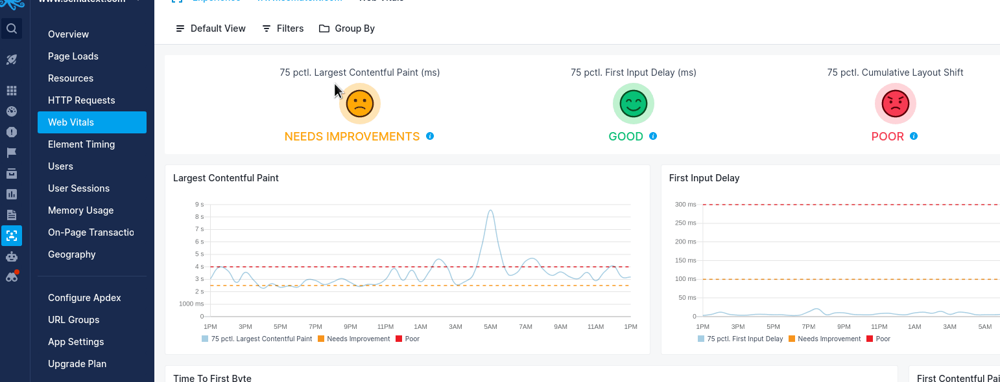

title: Saved Views Guide
description: What are Saved Views and how to use them in Sematext for faster access later

Filtering and grouping data is a central part of the Sematext Cloud user interface. With Saved Views you can save your filters and groups for faster access later. If you find yourself often applying the same filters on your data then this feature can be a time saver.

Saved Views feauture is available in Monitoring, Logs, Synthetics, and Experience Apps as well as on any dashboards you've created -- on all screens where the Saved Views button is visible.  This button displays "Default View" when no saved view is selected as shown in the animations below.

## When are Saved Views Useful

Sematext has a contept of [Apps](../guide/app-guide/), which act as distinct buckets of data and additionally allow you to:
- apply different plans or different data retentions to different Apps and thus have flexibility around costs
- invite others to individual Apps and thus control who can see which data

Having multiple, distinct Apps is great when you have:
- multiple, independent environments - if you have two production environemnts you would likely want to create two separate Infra Apps
- multiple, independent clusters - if, for example, you have two Elasticsearch clusters serving two different applications you would likely create two separate Elasticsearch Monitoring Apps
- ...

However, nothing stops you from having data from multiple environments or clusters in the same App.  If you choose to do that you might still want the ability to see performance charts, log events, etc. for one specific environment or one specific cluster.  This is where Saved Views are handy. 

## Saved Views and Tags

The above few examples are not exhaustive.  For example, even in a single environment there will be nodes that serve a different purpose, have a different role.  You may have database servers, web servers, Elasticsearch nodes, application nodes, etc. and you may want to view their each of their performance, logs, etc. separately.  So even if you have a single environment or cluster the Saved Views functionality is helpful.

Saved Views let you save your filters and groups for faster access later.  Values you see in filters and groups in Sematext are tags.  But where do these tags come from?  They come from the Sematext Agent.  The Sematext Agent supports configuring custom tags. They can be specified in the Agent's configuration files.  Once configured, tags are sent by the Sematext Agent as part of every data point or log event and they are shown in UI as filters.

Read [tags docs](../tags/) to undertand why tags are useful, their benefits beyond filtering, [common ways to use tags](../tags/#common-ways-to-use-tags), and [how to define your own tags](../tags/#defining-you-own-tags) that make sense for your monitoring.

## Saving Views

To save a view for later, follow the steps below:

1. Change the filters according to which data you want to see
2. Click on the highlighted Saved Views button
3. Click on "Save As" and enter a descriptive name for the filter

## Using Saved Views

Later, when you come back to this screen:

1. Click the Saved Views button
2. Select the previously saved view

