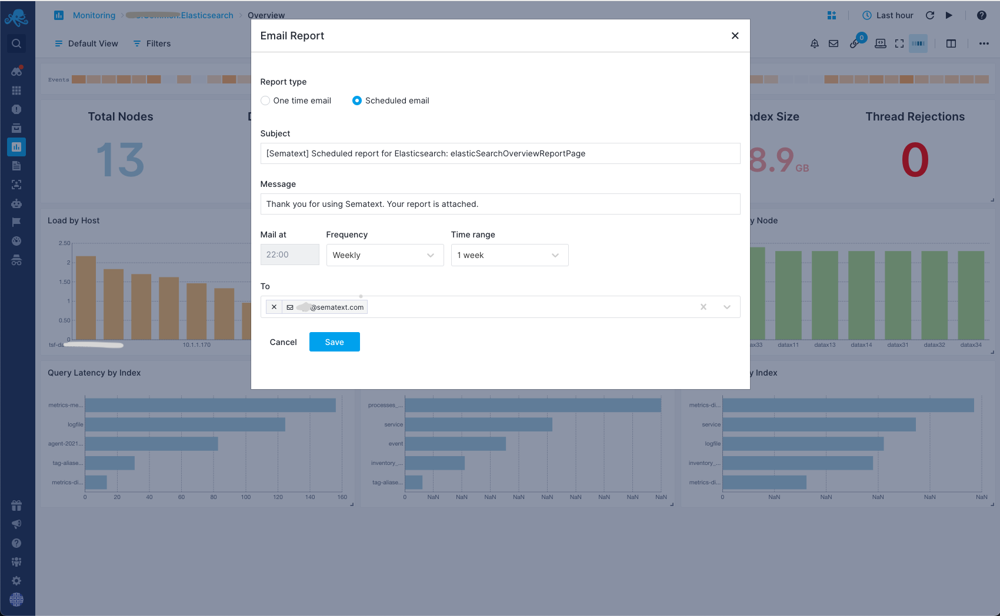
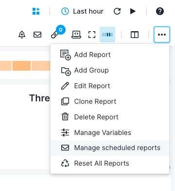
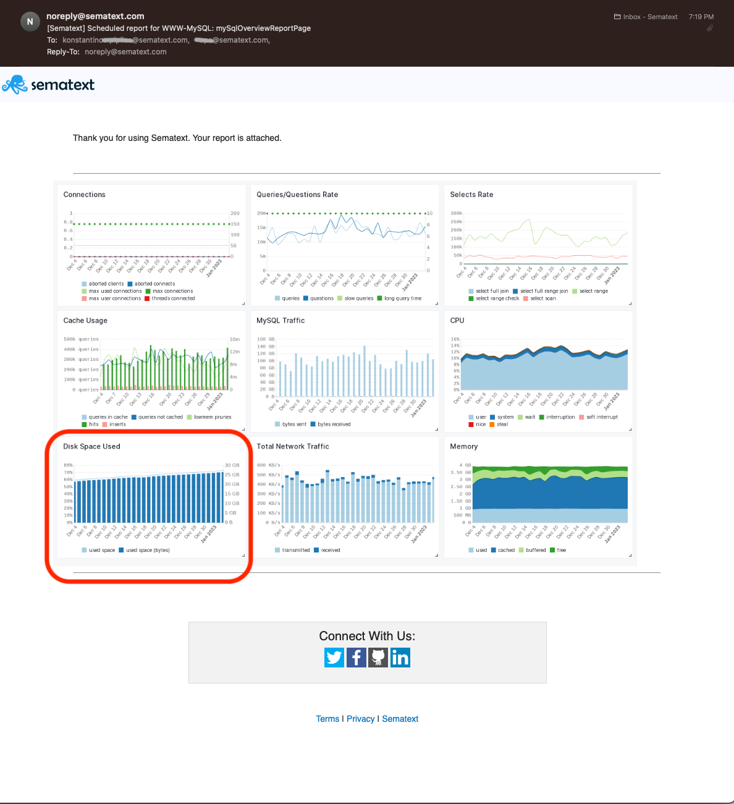

title: Scheduled Reports Guide description: Sematext Scheduled Reports let you receive emails with dashboards or reports embedded in them at a specified frequency.

## What are Scheduled Reports

Scheduled Reports let you receive emails with [dashboards](https://sematext.com/docs/dashboards/) or [reports](https://sematext.com/docs/dashboards/reports-and-components/) embedded in them at a specified frequency (one time, daily, weekly, monthly, etc.). They can include information on system performance, application logs, and more. The reports are delivered via email, providing a convenient and automated way for teams to stay informed about their applications and infrastructure health and performance.

## What you can do with Scheduled Reports

With Scheduled Reports you can:

1. Monitor your application's performance: Automatically receive reports on key metrics such as response time, errors, and traffic, allowing you to quickly identify and resolve any performance issues.
2. Analyze logs: Get automated reports on logs generated by your application, making it easier to identify and troubleshoot errors and issues.
3. Share information: Share the reports with stakeholders, team members, or customers, keeping everyone informed on the health and performance of the application without having them log into Sematext Cloud.
4. Save time: Automated report delivery saves time and eliminates manual reporting processes. Moreover, the reports are embedded into emails, so one doesn't have to download and view reports with any external viewers.
5. Customize reports: Customize reports to meet your specific needs, including selecting the metrics and logs to include, defining the frequency and the date range of reports, and choosing the delivery method.
6. Spot slower changes happening over an extended period of time: For example, configuring a Scheduled Report to show data for the last 7 or 30 days, you can identify trends and changes in behavior over a longer period of time that might not be immediately apparent from checking real-time metrics or alerts that are triggered by looking at very recent, real-time data. This can help you detect issues early on, before they become critical, and take proactive steps needed to address them, for example decisions about tuning, scaling,and capacity planning.

Overall, Scheduled Reports provide a convenient and efficient way to stay informed on the performance of your application, making it easier to identify and resolve any issues.

## How to use Scheduled Reports

To use Scheduled Reports in Sematext, follow these steps:

1. Navigate to any available Report in Sematext Cloud or create a new report by selecting the metrics and logs you want to include in the report.
2. Select “Email Report” from the Report’s menu.  

3. Select whether you need to send a one time email or a scheduled email.
4. Choose a message that will appear on top of your delivered Scheduled Report email.
5. Select the frequency for the Scheduled Report (every 5 minutes, daily, weekly, monthly, quarterly).
6. Select the preferred time range.
7. Set the list of email recipients.
8. Save the report and it will be automatically generated and delivered at the specified frequency.  

9. You can view, edit, or delete existing reports by selecting “Manage scheduled reports” in the Report Settings.  

The generated Report will look like the one below. In this example you can spot the disk usage that is slowly creeping up and that may not trigger alerts for low available disk space until later.  By seeing this trend in Scheduled Reports you can take action early, such as adding capacity, or troubleshooting the root cause.

That's it! With Scheduled Reports, you can have the performance and log information you need, when you need it, without having to manually generate reports.

    
    

