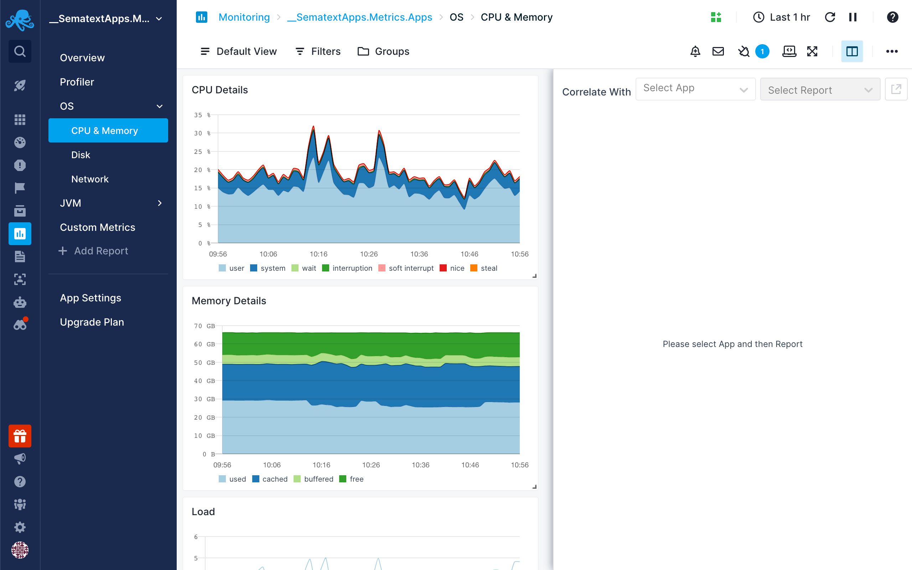

Split Screen is product-wide correlation and data-pivoting feature. With Split Screen you can compare any two reports or dashboards, even the same report or dashboard but with different filters and groups in the two different screens.

The Split Screen is available across the whole product and you can open any dashboard or report with events, logs, or metrics within the Split Screen. 

### Using Split Screen

When initially opened, Split Screen panel will be empty.

You can show events, or any app or dashboard report. Select an events, app, dashboard or monitor and default report will be automatically selected. You can select any other report as well.

Once you select a report you want to correlate with, it’ll be remembered so you can quickly toggle it.

### Filtering Split Screen

Split screen will use the same time interval as the main screen, but other than time, it will have its own set of filters. It allows showing unrelated reports without interfering. It also alows you to compare the same report filtered differently.

Filters will also be stored in browser so you can safely toggle or refresh page.
