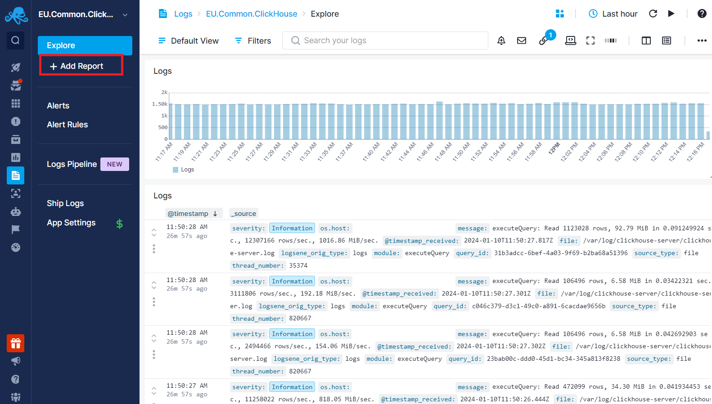
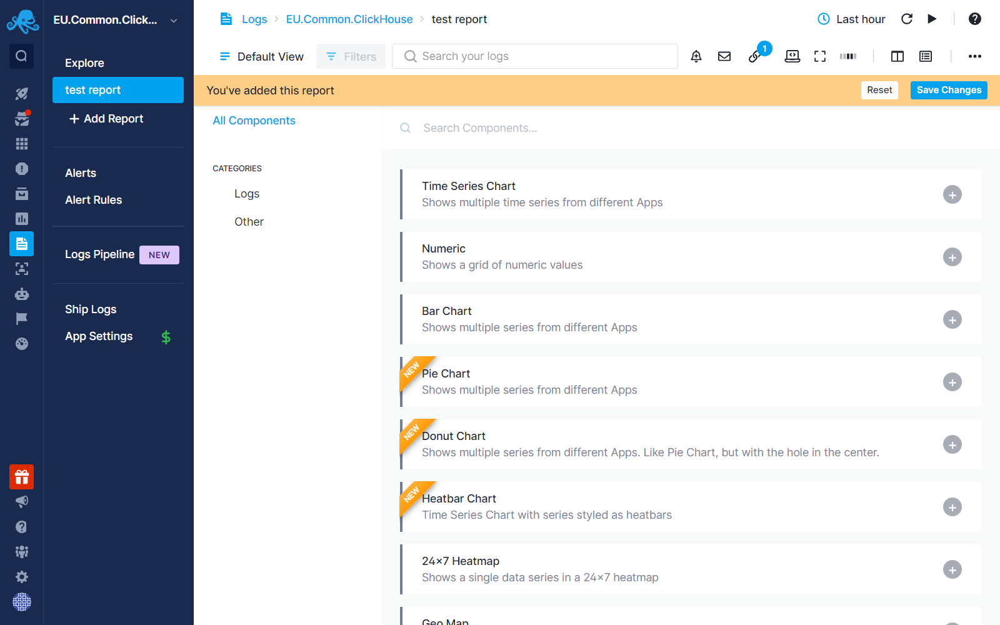
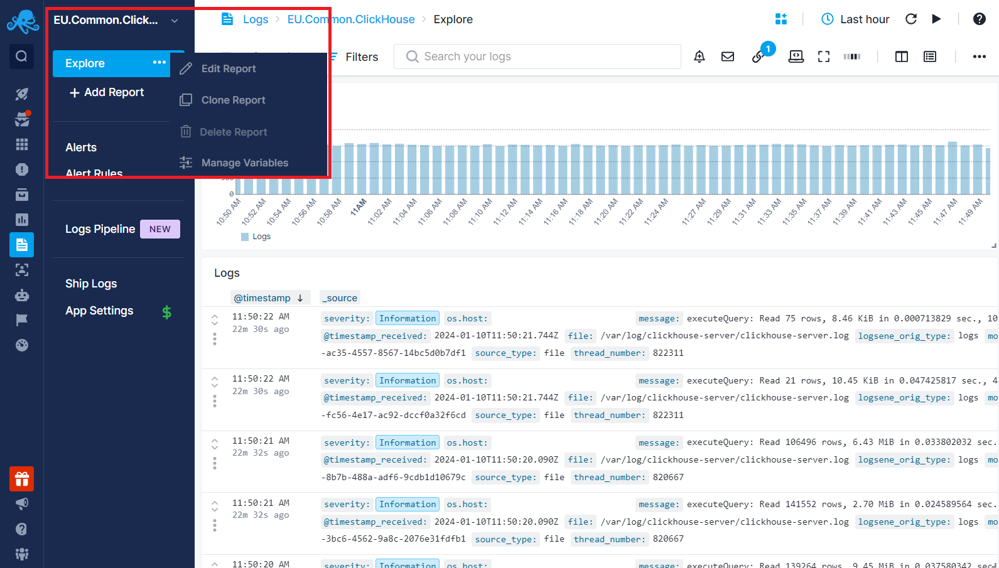
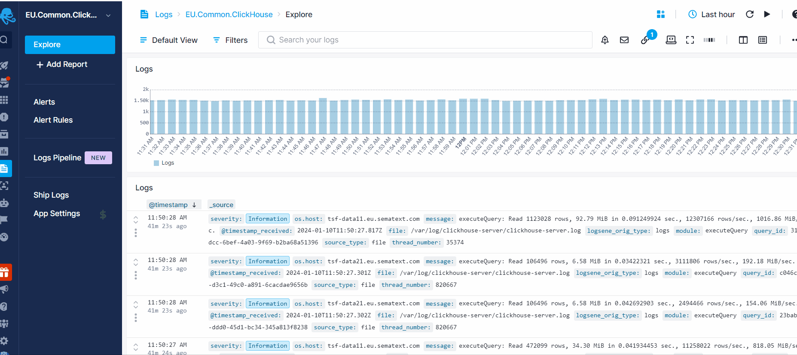
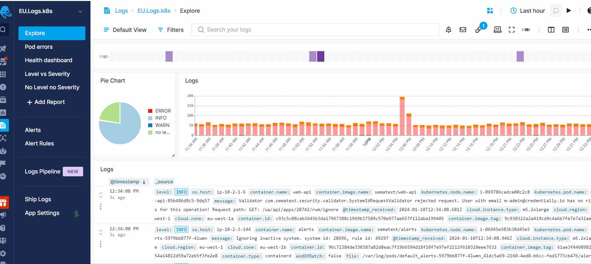

title: Generic Logs Integration
description: Sematext Logs supports dozens of different integrations.

You can use Generic Logs Apps if the services from which you want to ship logs are not supported out-of-the-box with [Logs Integrations](https://sematext.com/docs/integration/). Generic Logs Apps can contain logs from various sources and can be structured to fit your needs.

To learn how to ship logs to the Generic Logs App, refer to the [Sending Log Events](https://sematext.com/docs/logs/sending-log-events/#generic-logs-app) section.

If you choose a specific integration App, we will structure the logs and provide out-of-the-box dashboards and [alert rules](https://sematext.com/docs/alerts/) for you within the App. However, for Generic Logs, you will see the logs as they are received by Sematext. Once you start receiving logs via automatic discovery or custom log shippers, you can view all your logs from the default Explore report.

To structure your logs according to your needs, such as extracting metrics or fields from text fields, you can use [Logs Pipelines](https://sematext.com/docs/logs/pipelines/). All the details about how to structure your logs are explained thoroughly in the pipelines documentation. If you have any questions, we're here to help. Don't hesitate to contact us at support@sematext.com.

[Logs Pipelines](https://sematext.com/docs/logs/pipelines/) can also be used to drop unwanted data and fields. Eliminating noise and unwanted logs can result in reducing your costs since we charge based on the daily log volume shipped to Sematext and retention. Refer to [Reducing Log Monitoring Costs](https://sematext.com/docs/logs/reduce-costs-with-pipelines/) and [Plan Recommendations](https://sematext.com/docs/logs/plan-recommendations/) for further information.

You can also navigate to [Logs Usage Screen](https://sematext.com/docs/logs/logs-usage-screen/) from the left menu panel within your App to get insights into historical data concerning daily log volumes received and stored.

## Creating Custom Reports

Once you have structured your data, you can add custom reports to your Logs App. To create a custom report, click on the "+ Add Report" button in the left menu panel, name the report, and then click "Apply Changes".

After creating the report, you will see a blank page with various chart type options. Selecting a chart type will open the [Chart Builder](https://sematext.com/docs/dashboards/chart-builder/) where you can set the metric and critieria to be shown in the chart.

To add more components to the report, click on the "Add Component" icon on the top banner.

All reports share common components available in the top banner. To learn more about report components, refer to the [Logs Search and Report Menu](https://sematext.com/docs/logs/reports-and-components/#logs-search-and-report-menu)  section.

Hovering over a report name and clicking on the three dots allows you to clone, edit, delete the report, or manage [Report Variables](https://sematext.com/docs/dashboards/report-variables/).

Note that reports specific to an App differ from Dashboards. [Dashboards](https://sematext.com/docs/dashboards/) serve as your central location for consolidating everything. You can create reports within Dashboards that are not tied to a specific App. Dashboards can fetch data from [Logs](https://sematext.com/docs/logs/), [Monitoring](https://sematext.com/docs/monitoring/), [Experience](https://sematext.com/docs/experience/) and [Synthetics](https://sematext.com/docs/synthetics/) Apps and show everything in a single dashboard.

## Creating Alert Rules

You can create alert rules by clicking on the **Alert** icon in the top banner of your App report or by hovering over a chart and clicking on the alert icon in the top right corner. Anomaly or threshold alerts can be created if you have [extracted metrics with Logs Pipelines](https://sematext.com/docs/logs/field-extractor-processor/) or by the log count in your App.

To view or edit all the alert rules created for the App, click on **Alert Rules** in the left menu panel. Additionally, to review all the alerts triggered for that App, click on **Alerts** in the left menu panel. This action will direct you to the Alerts page where you can view all the alerts and their details by clicking on an individual alert.

For more information about available alert types, refer to the [Alerts Guide](https://sematext.com/docs/guide/alerts-guide/).
