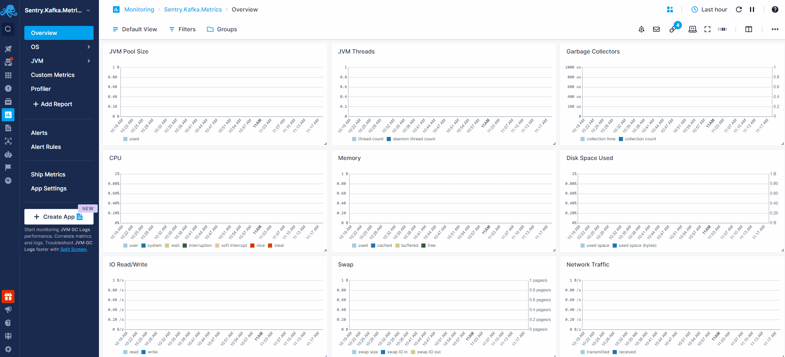
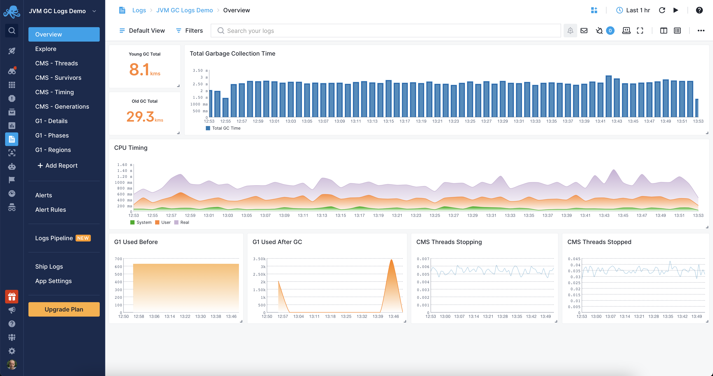
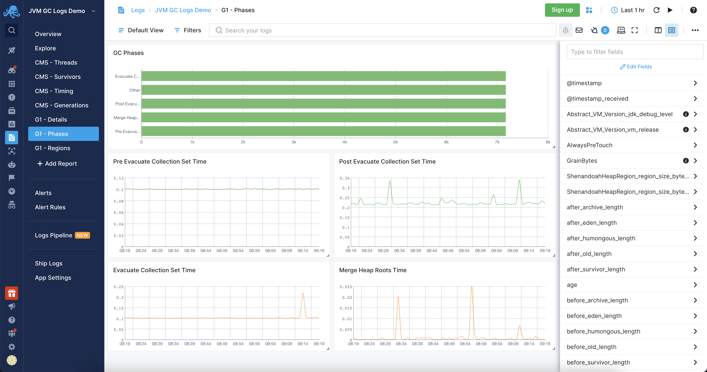
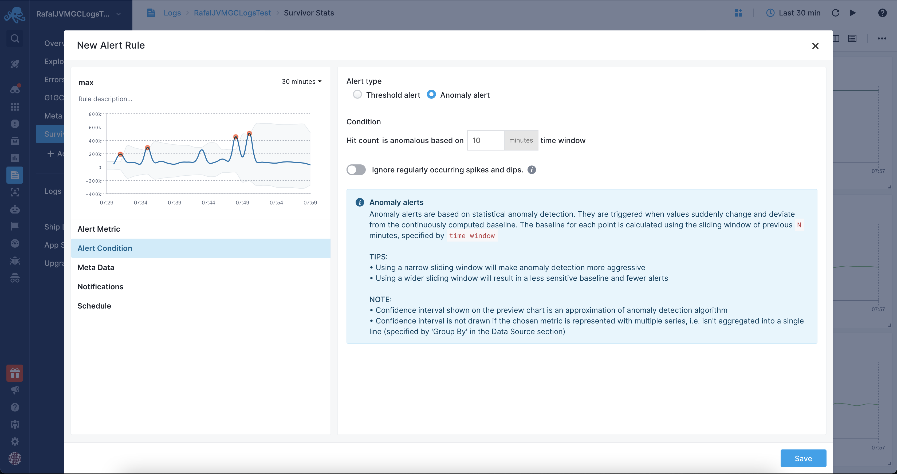

title: JVM
description: Sematext Java application performance monitoring provides real time reports on JVM pool size, utilization and threads, garbage collectors, JVM open files, memory and resource usage, and more. Correlate them with other infrastructure metrics (server, virtualization, logs, etc.), and use proactive alerts and intuitive dashboards for rapid problem diagnosis at JVM level. Sematext JVM Garbage Collector Logs integration allows you to check garbage collector logs, times the application's threads were stopped, memory regions size, and much more.

JVM is an abstract computing machine enabling Java bytecode execution and providing a runtime environment for Java applications. The [Sematext Agent](https://sematext.com/docs/agents/sematext-agent/) collects JVM metrics (heap, threads,garbage collection counts, times, etc.) and JVM garbage collection logs, transmits them to Sematext Cloud, where everything is visualized and alerted on with pre-built dashboards and alerts, both of which you can customize. Installing the agent takes less than 5 minutes.

## Install Sematext Agent

2. Create a JVM Logs or Monitoring [App](https://sematext.com/docs/guide/app-guide/). This will let you install the agent and control access to your monitoring and logs data.
3. Install the Sematext Agent according to the [https://apps.sematext.com/ui/howto/JVM/overview](https://apps.sematext.com/ui/howto/JVM/overview) displayed in the UI.
4. After installing the agent, the Discovery tab shows all the JVMs identified on the host and you will start receiving metrics or garbage collection logs from JVM services.
5. If you've created a JVM Monitoring App and want to collect JVM garbage collection logs as well, or vice versa, click on the **Create Logs App** button from the left menu panel. This will navigate you to the 'Create Logs App' (or Monitoring App) page, where you'll find all the discovered log sources from JVM services and manage log and metric shipping effortlessly.

Having both JVM Logs and Monitoring Apps lets you correlate performance metrics and logs, and accelerate troubleshooting using [Split Screen](https://sematext.com/docs/guide/split-screen/) for faster resolution. For example, correlating JVM memory metrics (heap usage, garbage collection frequency) with garbage collection logs (types of garbage collections, pause times), you can identify memory allocation patterns, potential memory leaks, or inefficient memory utilization. This correlation helps optimize memory settings, tune garbage collection strategies, and prevent memory-related performance issues.

To [explore logs and services](https://sematext.com/docs/monitoring/autodiscovery/) across multiple hosts, navigate to [Fleet & Discovery > Discovery > Services](https://apps.sematext.com/ui/fleet-and-discovery/discovery/services) (or [Sematext Cloud Europe](https://apps.eu.sematext.com/ui/fleet-and-discovery/discovery/services)). From there, you can create additional [Apps](https://sematext.com/docs/guide/app-guide/) or stream data to existing ones without requiring any additional installations. 

## Metrics

Metric Name  Key *(Type)* *(Unit)*                                          |  Description
-------------------------------------------------------------------------------|---------------------------------
gc collection count **jvm.gc.collection.count**  *(long counter)*        |  count of GC collections
gc collection time **jvm.gc.collection.time**  *(long counter)* *(ms)*   |  duration of GC collections
open files **jvm.files.open**  *(long gauge)*                            |  jvm currently open files
max open files **jvm.files.max**  *(long gauge)*                         |  jvm max open files limit
jvm heap used **jvm.heap.used**  *(long gauge)* *(bytes)*                |  jvm heap used memory
jvm non-heap used **jvm.nonheap.used**  *(long gauge)* *(bytes)*         |  jvm non-heap used memory
jvm pool used **jvm.pool.used**  *(long gauge)* *(bytes)*                |  jvm pool used memory
jvm pool used max **jvm.pool.max**  *(long gauge)* *(bytes)*             |  jvm pool max memory
jvm threads **jvm.threads**  *(long gauge)*                              |  current jvm thread count
jvm peak threads **jvm.threads.peak**  *(long gauge)*                    |  peak jvm thread count
jvm daemon threads **jvm.threads.deamon**  *(long gauge)*                |  current jvm daemon thread count
jvm total started threads **jvm.threads.started.total**  *(long gauge)*  |  total started jvm thread count

## Logs

Once data is in, you can explore it via the built-in reports: 

Sematext can also collect JVM performance metrics in addition to extracting valuable data about garbage collection from the JVM logs. For monitoring JVM performance check out the [JVM Monitoring integration](./jvm.md).  These two integrations will give you a complete insight about your JVM-based applications. 

## Exploring Logs

You can explore garbage collection performance using the built-in reports or create your own. For example, you can use the G1GC report to see the top reasons the garbage collection was triggered, heap used before garbage collection, total heap after garbage collection or the number of G1 garbage collector workers:

Other built-in reports include:

- **CMS**: several dedicated reports for threads stopping and stopped, survivors, timing and generations.
- **G1**: details, phases and regions related to G1GC, each in a dedicated report.

## Alerts 

With the built-in support for [alerting](https://sematext.com/docs/alerts/) you can be notified on any garbage collector metric derivated from your logs, such as the number of full garbage collections, an increasing number of workers, and many, many more. Use the threshold-based alerts or fully rely on anomaly detection to detect the unusual patterns in the metrics coming from your JVM services and garbage collector logs.

## Troubleshooting

If you have trouble sending logs, try out the latest version of [Sematext Agent](../agents/sematext-agent/installation/). Also, make sure Sematext Agent is configured to send logs to your JVM Garbage Collector Logs App. Last, check the [Log Agents panel](https://sematext.com/docs/fleet/#log-agents) for any errors, and refer to our [Sematext Logs FAQ](https://sematext.com/docs/logs/faq/) for useful tips.
