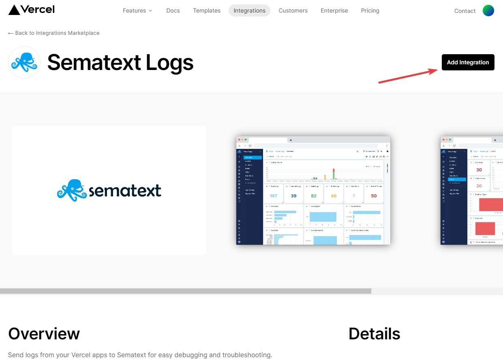
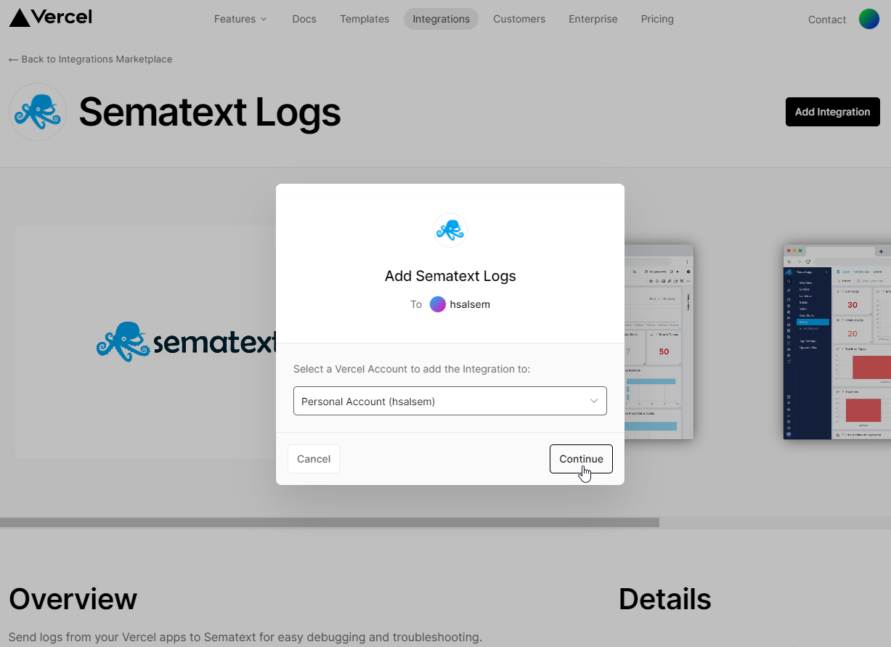
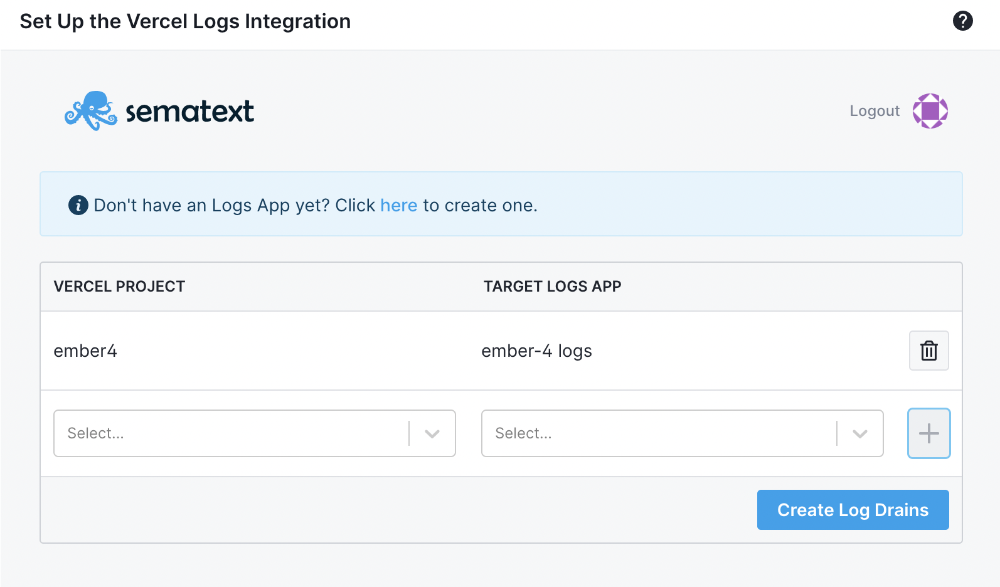
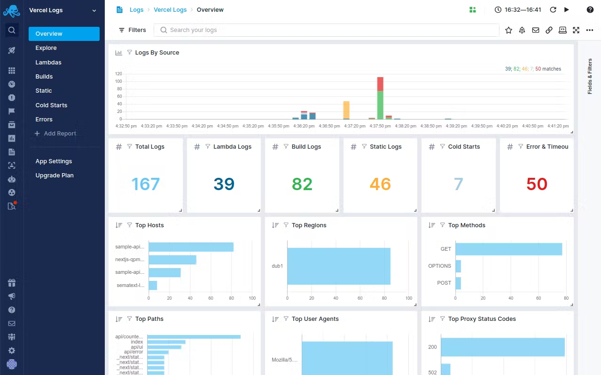
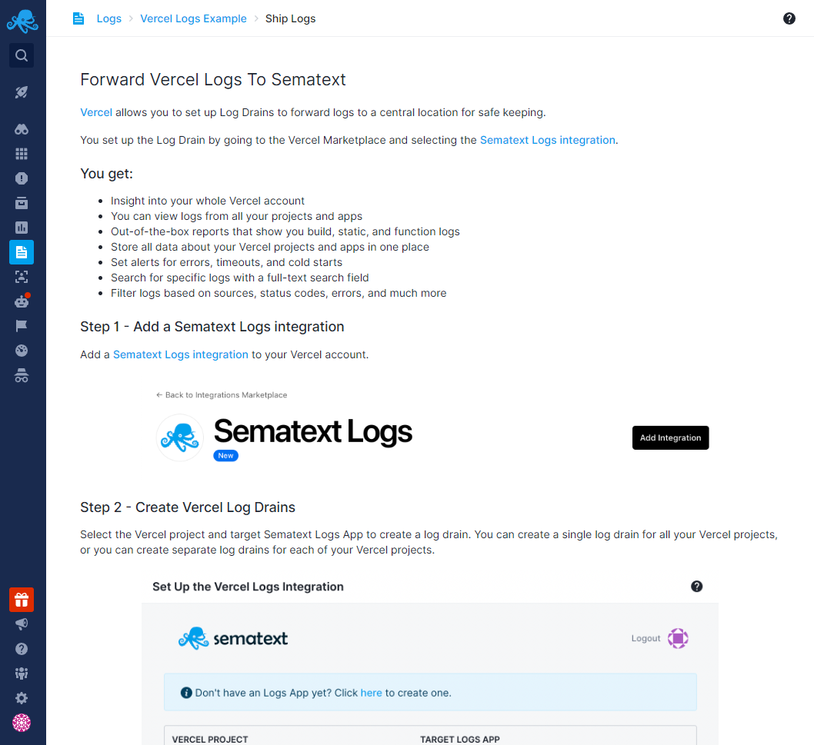

title: Vercel Logs Integration
description: With our new Vercel Logs Integration you get insight into your whole Vercel account. View logs from all your projects, serverless functions, static and Jamstack websites, including build logs and errors!

By configuring a Sematext Log Drain Integration to point to Sematext Logs you can get insight into your whole Vercel account in one place!

## Vercel Logs Quick Start

The Sematext Vercel Logs Integration collects logs from the following:

- All Builds
- All Errors
- Static Websites
- Jamstack Websites
- Serverless Functions that succeed
- Serverless Functions that fail, crash, or cause an error
- Serverless Functions that are cold starts

We give you 7 reports out-of-the-box. You can add as many additional custom reports and charts as you want! Additionally, you can also use the [Sematext Synthetics](https://vercel.com/integrations/sematext-synthetics-monitoring) Vercel integration to monitor your Vercel projects' frontends and APIs.

## Install the Sematext Logs Vercel Integration

Installing the Sematext Logs Vercel integration can be done in just a few steps:
- Go to the [Sematext Logs integration on the Vercel Integrations Marketplace](https://vercel.com/integrations/sematext-logs) to add it to your Vercel account by clicking the **Add Integration** button near the top right corner.

- Select the account or team your deployed project belongs to. You will then be redirected to Sematext Logs.

- In case you don't already have an existing Logs App in Sematext Cloud, you can create a new one during the installation process.

- Select the Vercel project and target Sematext Logs App to create a log drain. You can create a single log drain for all your Vercel projects, or you can create separate log drains for each of your Vercel projects.

By default, you get a set of reports out of the box, with default alert rules to notify you for common errors and timeouts. You can modify, disable, or delete them, and add your own custom alert rules, of course.

All of these steps are also displayed in Sematext Cloud if you [create a Vercel App](https://apps.sematext.com/ui/logs-create) ([click here for our EU region](https://apps.eu.sematext.com/ui/logs-create)) and then follow the on-screen instructions.

## Next Steps

- [Set up custom alerts](../alerts/creating-logs-alerts/)
- [Set up custom reports and components](../logs/reports-and-components/)
- [Tagging best practices](../tags/)
- [Monitor your Vercel projects with our Synthetics Monitoring integration](./vercel-synthetics-integration/)