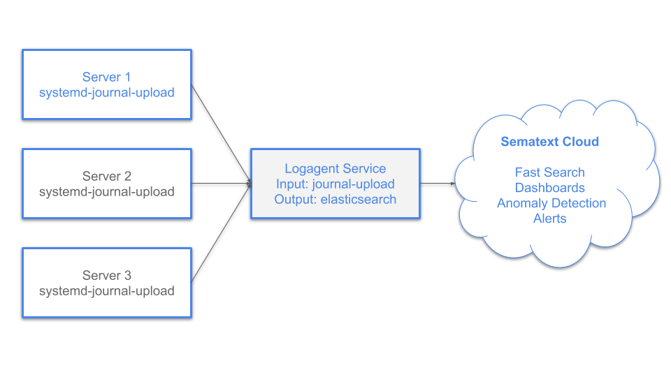

title: Logagent input plugin for systemd-journal-upload.service  
description: Logagent features modular logging architecture framework where each input or output module is implemented as a plugin. Journald input plugin is used to receive documents via HTTP. 

## Receive data from systemd-journal-upload.service

Plugin to receive events via HTTP from systemd-journal-upload.service. You can scale the HTTP service to multiple processes by setting 'worker' property > 0. 

Use cases: 

- Use the powerful Logagent features with lightweight `systemd` integration service `systemd-journal-upload.service` 
- Filter by SYSTEMD_UNIT, remove fields, and add tags to each log
- Receive system journal events via HTTP and fan out processed data to multiple outputs like Elasticsearch, Sematext Cloud, InfluxDB, Kafka, or MQTT



### Configuration


```yaml
# Global options
options:
  includeOriginalLine: true

input:
   journal-upload:
    module: input-journald-upload
    port: 9090
    worker: 0
    systemdUnitFilter: 
      include: !!js/regexp /.*/i
    #  exclude: !!js/regexp /docker|containerd/i
    # add static tags to every log event 
    tags:
     # _index is special tag for log routing with elasticsearch output-plugin
     _index: MY_INDEX_FOR_ELASTICSEARCH_OUTPUT
     # you can add any other static tag 
     node_role: kubernetes_worker
     log_shipper: logagent
    # journald might provide many fields, 
    # to reduce storage usage you can remove 
    # non-relevant fields
    removeFields:
      - __CURSOR
      - __REALTIME_TIMESTAMP
      - _SOURCE_REALTIME_TIMESTAMP
      - __MONOTONIC_TIMESTAMP
      - _TRANSPORT
      - JOURNAL_NAME
      - JOURNAL_PATH
      - CURRENT_USE
      - CURRENT_USE_PRETTY
      - MAX_USE
      - MAX_USE_PRETTY
      - DISK_KEEP_FREE
      - DISK_KEEP_FREE_PRETTY
      - DISK_AVAILABLE_PRETTY
      - DISK_AVAILABLE
      - LIMIT
      - LIMIT_PRETTY
      - AVAILABLE
      - AVAILABLE_PRETTY
      - _CAP_EFFECTIVE
      - _SYSTEMD_SLICE

output: 
  # output data for debugging on stdout in YAML format
  # stdout: yaml
  sematext-cloud:
    module: elasticsearch
    url: https://logsene-receiver.sematext.com
    # url: https://logsene-receiver.eu.sematext.com
    index: YOUR_SEMATEXT_LOGS_TOKEN_HERE

```

_Start Logagent_

```sh
logagent --config myconfig.yml
```

_Test the processing with curl, simulating systemd-journal-upload.service_

```sh
curl -vvv -X POST http://127.0.0.1:9090/upload -d '
__CURSOR=s=d5c6de465016430b8b47552b08d35c07;i=36893d;b=671303be039c460f898b637b5bca7697;m=4f8ec78ad23;t=58635495306a8;x=f88836c4f568bc1f
__REALTIME_TIMESTAMP=1554938305119912
__MONOTONIC_TIMESTAMP=5467165732131
_BOOT_ID=671303be039c460f898b637b5bca7697
_TRANSPORT=syslog
PRIORITY=6
SYSLOG_FACILITY=4
SYSLOG_IDENTIFIER=sshd
_UID=0
_GID=0
_COMM=sshd
_EXE=/usr/sbin/sshd
_CMDLINE=sshd: root [priv]   
_CAP_EFFECTIVE=3fffffffff
_SYSTEMD_CGROUP=/system.slice/ssh.service
_SYSTEMD_UNIT=ssh.service
_SYSTEMD_SLICE=system.slice
_BOOT_ID=671303be039c460f898b637b5bca7697
_MACHINE_ID=400518d7368b56325877a28f6f43d32c
_HOSTNAME=docker-demo
SYSLOG_PID=4196
_PID=4196
MESSAGE=Disconnected from 218.92.0.208 port 47994 [preauth]
_SOURCE_REALTIME_TIMESTAMP=1554938305119518

__CURSOR=s=d5c6de465016430b8b47552b08d35c07;i=36893e;b=671303be039c460f898b637b5bca7697;m=4f8ec78af45;t=58635495308ca;x=efef7cd6e15b4416
__REALTIME_TIMESTAMP=1554938305120458
__MONOTONIC_TIMESTAMP=5467165732677
_BOOT_ID=671303be039c460f898b637b5bca7697
_TRANSPORT=syslog
SYSLOG_IDENTIFIER=sshd
_UID=0
_GID=0
_COMM=sshd
_EXE=/usr/sbin/sshd
'
```

_Setup systemd-journal-upload.service_

Use the following command to install systemd-journal-remote

```
sudo apt-get install systemd-journal-remote
```

Edit `/etc/systemd/journal-upload.conf`.

```
[Upload]
URL=http://127.0.0.1:9090
# ServerKeyFile=/etc/ssl/private/journal-upload.pem
# ServerCertificateFile=/etc/ssl/certs/journal-upload.pem
# TrustedCertificateFile=/etc/ssl/ca/trusted.pem
```

To make sure journal-upload auto-starts on boot. 

Note that upload service might stop if creating the HTTP connection doesn't work. 
Should that happen the service stores the current cursor position in the journal. 
Therefore, you should set useful restart options in the service definition. 
Edit `/etc/systemd/system/multi-user.target.wants/systemd-journal-upload.service ` to change restart options. 

```
[Unit]
Description=Journal Remote Upload Service
Documentation=man:systemd-journal-upload(8)
After=network.target

[Service]
ExecStart=/lib/systemd/systemd-journal-upload \
          --save-state
User=systemd-journal-upload
SupplementaryGroups=systemd-journal
PrivateTmp=yes
PrivateDevices=yes
#WatchdogSec=3min
Restart=always
TimeoutStartSec=1
TimeoutStopSec=1
StartLimitBurst=1000
StartLimitIntervalSec=5
# If there are many split up journal files we need a lot of fds to
# access them all and combine
LimitNOFILE=16384
[Install]
WantedBy=multi-user.target
```

Apply changes and restart journal-upload after configuration:

```
systemctl daemon-reload
sudo systemctl enable systemd-journal-upload.service
```
