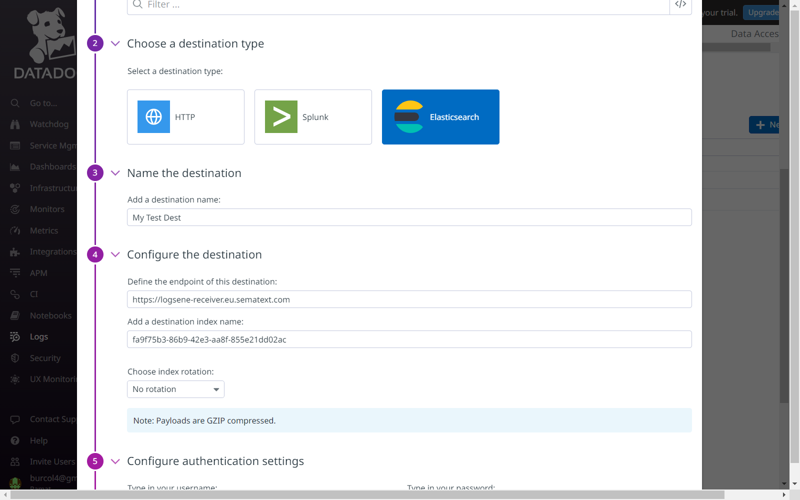
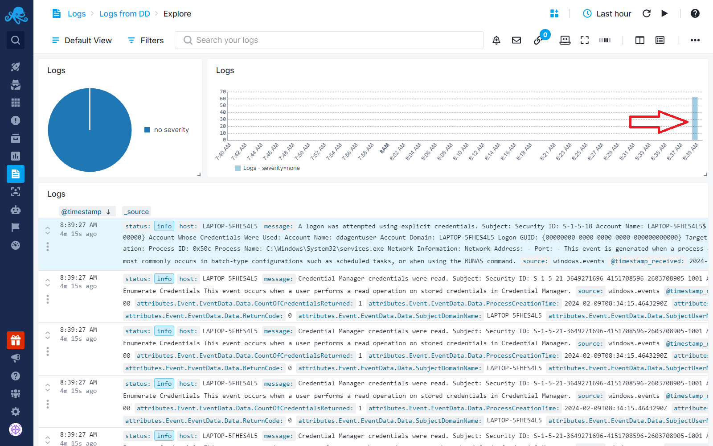

title: How to Forward Logs from Datadog to Sematext
description: Send log events to Sematext from Datadog using Datadog's Log Forwarder feature

If you're currently using Datadog to monitor your logs but are exploring alternatives, you can forward your logs to Sematext using [Datadog’s Log Forwarder](https://docs.datadoghq.com/logs/guide/forwarder/?tab=cloudformation) feature.

At Sematext, we offer a 14-day free trial with no requirement for credit card information. 

Transitioning your logs from Datadog to Sematext requires no installation, and is a simple process.

**Here's how you can do it:**

- Log in to your Sematext account and create a new [Logs App](https://sematext.com/docs/logs/).
- While creating Logs App, you can select [service-specific integrations](https://sematext.com/docs/integration/) for out-of-the-box dashboards and alerts. If you don't see the integration type that matches the source of your logs in the list, select a [generic Logs App](https://sematext.com/docs/integration/generic-logs-integration/). You can later create customized reports and alert rules within your generic Logs App.
- Login to your Datadog account and access the Logs Configuration section.
- Switch to the Log Forwarding tab and designate Elasticsearch as your destination. This works because Sematext’s log ingestion API is compatible with Elasticsearch.

- Configure the destination by entering Sematext's logs receiver endpoint:
    - For US: [https://logsene-receiver.sematext.com](https://logsene-receiver.sematext.com) 
    - For EU: [https://logsene-receiver.eu.sematext.com]( https://logsene-receiver.eu.sematext.com) 
    
  Make sure to include your Sematext Logs App token as  the index name. Your Logs App token can be found on the Ship Logs → Custom Integrations screen.

Save your changes and within a few minutes you will see the logs coming into your Sematext Logs App.

## Configuring your Logs and Reports

Once you've successfully forwarded your logs from Datadog to Sematext, you can take advantage of additional features:

- **Custom Reports:** Navigate to the left menu panel within your Logs App to create customized reports. Use the [Chart Builder](https://sematext.com/docs/dashboards/chart-builder/) to add visualizations that provide insights into your log data.
- **Alerts:** Get alerted about errors, anomalies, and more. See [Creating Logs Alerts](https://sematext.com/docs/alerts/creating-logs-alerts/).
  Refer to [Reports & Components](https://sematext.com/docs/logs/reports-and-components/) and [Logs Table Quick Actions](https://sematext.com/docs/logs/logs-table-quick-actions/) for more information.
- **Logs Pipelines for Data Optimization:** [Logs Pipelines](https://sematext.com/docs/logs/pipelines/) help structure your logs. Remove redundant fields, filter out unwanted logs based on conditions, or extract valuable data from text fields. 
  See [Pipeline Processors](https://sematext.com/docs/logs/processors-overview/) for more information.

These optimizations can enhance your log monitoring and potentially [reduce costs](https://sematext.com/docs/logs/reduce-costs-with-pipelines/), after the trial period ends.
