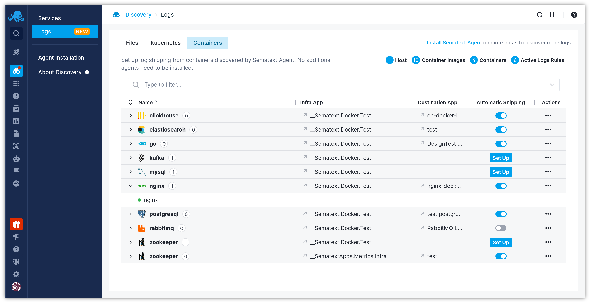
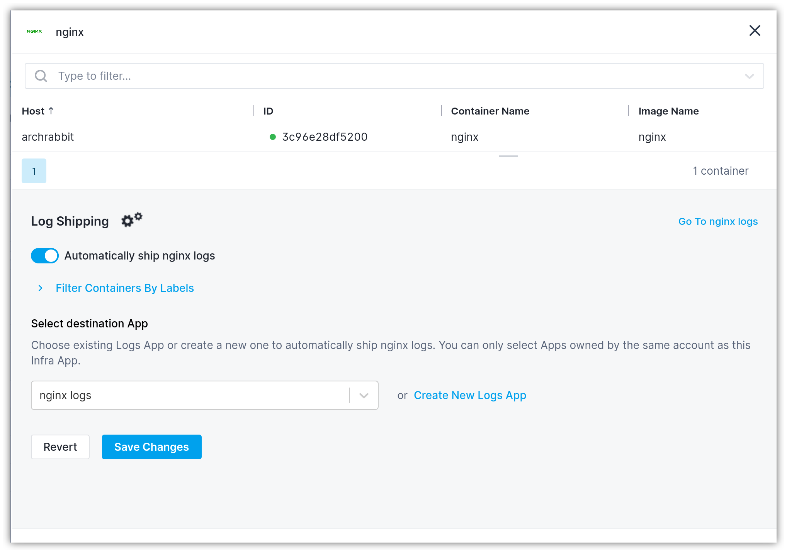
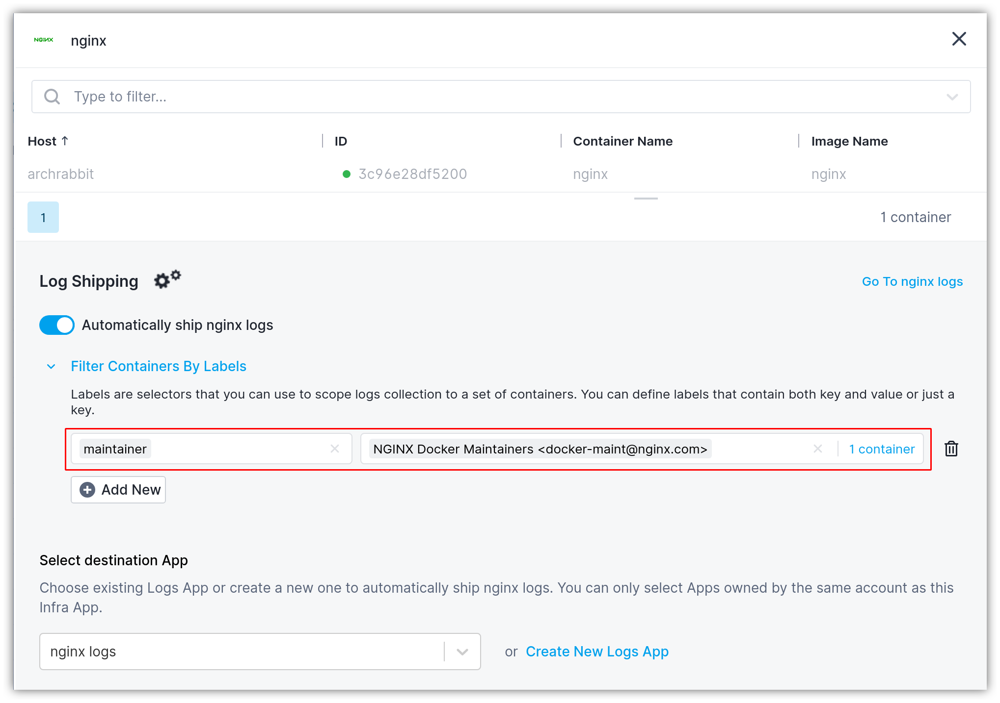

title: Shipping Container Logs
description: Shipping Container Log Sources

Container Logs Discovery groups the containers by the type of service running inside the container. When the service type isn't recognized, the process name is shown instead. 

To enable automatic container logs shipping head to the [Logs Discovery UI](https://apps.sematext.com/ui/discovery/) (or [EU Discovery](https://apps.eu.sematext.com/ui/discovery/) if you use Sematext EU), and start by clicking on the `Set Up` button for the service whose container logs you would like to ship.

This will open the following flyout panel where you can configure container log shipping:

1. Enable the "Automatically ship <group-name> logs" toggle
2. Select the destination Logs App. If the Logs App doesn't exist, you'll be able to create one from the same screen
3. Click the `Save Changes` button

Log shipping is configured on a service/process basis. This implies that any freshly created containers that match the service type or process name will automatically have their logs shipped to Sematext Cloud.

## Filtering container logs by labels

If you want to restrict the scope of log collection, it is possible to filter the container logs by labels. You can either select a label from the list of already defined labels in this container or write a custom label. Labels can contain a key/value pair, or just a key.

Observability should not be an afterthought. You can prepare container-based log filtering and routing rules even if you are not using those labels with your containers yet.  For example, if you label different jobs with different labels, you can ensure their logs will go to the appropriate destination from the very beginning without being lost or getting mixed up with other logs.
