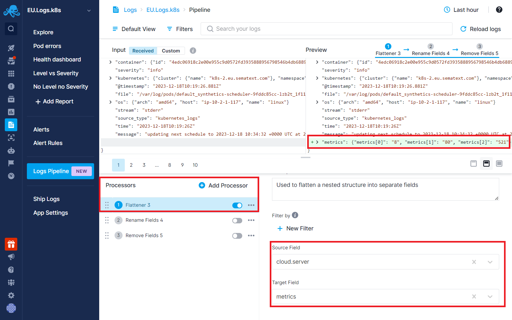

title: Flattener Processor
description: Used to flatten a nested structure into separate fields

This processor enables the transformation of nested JSON array objects into individual fields. Once segregated, these fields can be renamed and utilized as metrics, enabling the creation of charts and data visualization.

Consider a scenario where a nested JSON array field contains performance metrics from cloud instances:

`
"cloud": {
  "server": {
    "metrics": ["8", "80", "521"]
  }
}
`

In its original format, these metrics are challenging to visualize. However, the Flattener Processor allows you to extract these metrics into separate fields.

The process involves:

**Selecting the Source Field:** Choose the field you wish to flatten and designate the target field name.

**Renaming Flattened Objects:** Assign meaningful names to the flattened objects for easy access later

This transformation enables you to utilize these fields effectively for data visualization.

If the extracted field values contain both text and numerical information, such as units, you can use [Field Extractor](../logs/field-extractor-processor) processor and trim the accompanying text, keeping only the numerical value.

Once the numerical fields are obtained, you can navigate to the [Field Editor](https://sematext.com/docs/logs/fields/#field-editor) to set the type of the newly created fields as `float` or `integer`, enabling their use in visualizing data using the [Chart Builder](https://sematext.com/docs/dashboards/chart-builder/).
