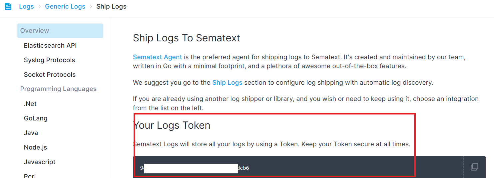

title: Sematext Fluent Bit Integration
description: Fluent Bit can be used to send logs to Sematext Logs. It can parse logs with grok filter, tag specific events, aggregate and index data and metrics from different sources and much more.

In order to make [Fluent Bit](https://fluentbit.io/) send logs to your Sematext App, you
need to configure it with the [Elasticsearch plugin](https://docs.fluentbit.io/manual/pipeline/outputs/elasticsearch) and the correct Sematext endpoint by specifying:

  - **Host:** logsene-receiver.sematext.com / logsene-receiver.eu.sematext.com

  - **Port:** 80 / 443

  - **Index:**  Your Logs App token which can be seen under Custom Integrations page
    
    

    Note: **this token should be kept secret** (n.b. you can have N Logs Apps, each with its own token)

  - **tls:** On / Off

*\*TLS should be set to **On** for SSL/HTTPS, for HTTP this should be set to **Off**.

### Tailing a File

To send the contents of the file **/tmp/logfile.log**, you would edit your configuration file to include the following:

```
[INPUT]
    Name        tail
    Tag         sematext
    Path        /tmp/logfile.log

[OUTPUT]
    Name        es
    Match       sematext
    Host        logsene-receiver.sematext.com
    Port        443
    tls         On
    Index       LOGSENE_APP_TOKEN
    Type        _doc
```

To get started quickly, you can simply [download Fluent Bit](https://docs.fluentbit.io/manual/installation/getting-started-with-fluent-bit) and install it.
Then you would edit the default configuration file **/etc/fluent-bit/fluent-bit.conf** adding in the sections above, before starting Fluent Bit as follows:

    /opt/fluent-bit/bin/fluent-bit -c /etc/fluent-bit/fluent-bit.conf

After it starts, log entries from the specified file will be shipped to your Sematext Logs App and you can then start [searching them](./searching-log-events) within Sematext.
