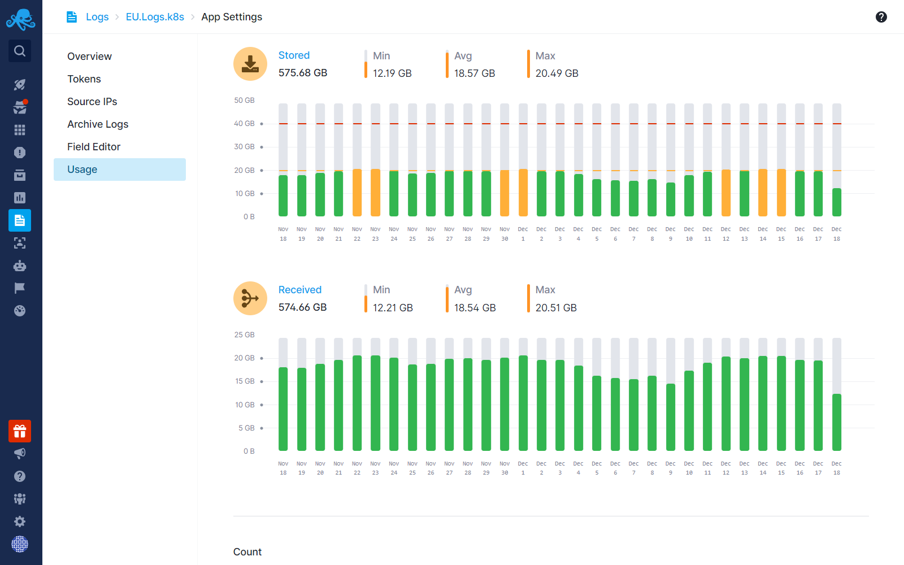
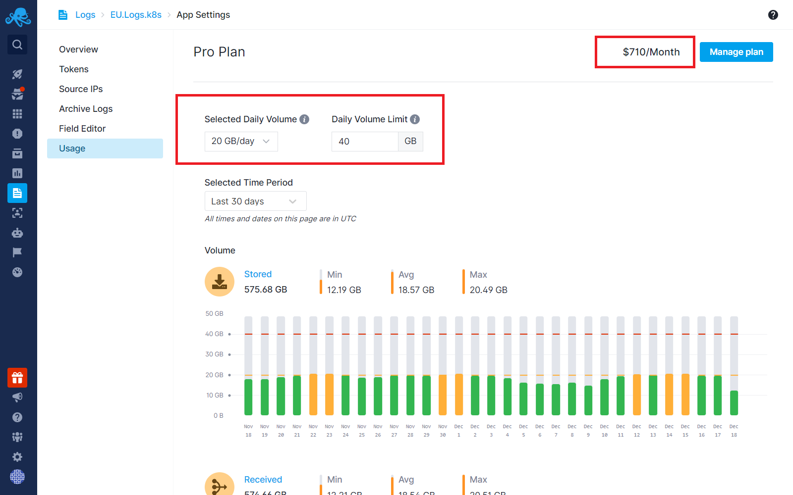
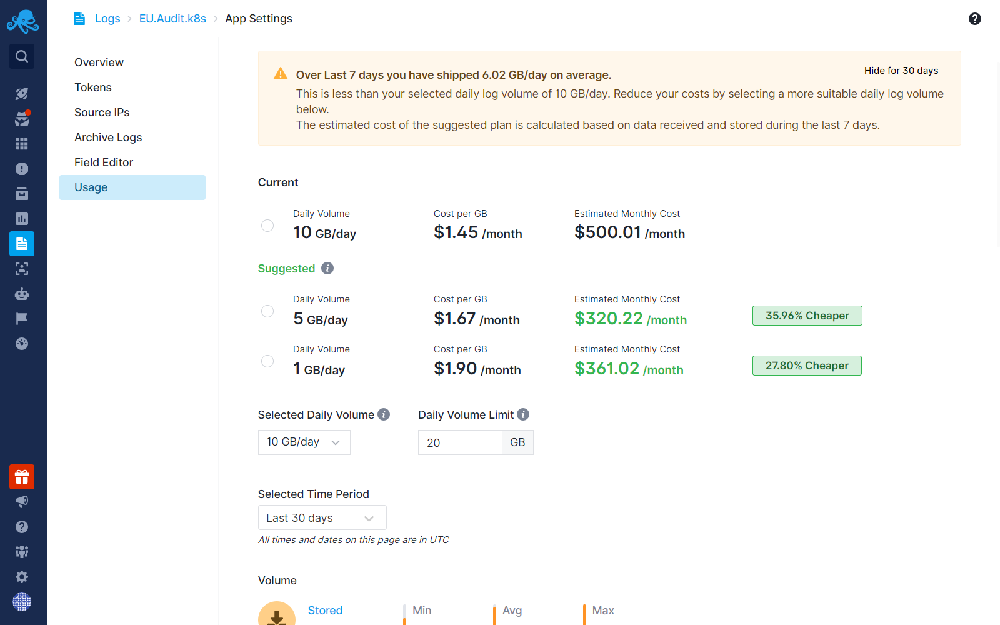

title: Logs Usage Screen
description: Learn about Daily Log Volume, its impact on pricing, and how Sematext provides transparent cost structures, empowering informed decisions for optimized log storage.

The Logs Usage screen provides insights into historical data concerning daily log volumes received and stored for Admins and Owners of the Logs Apps. It's important to note that there are no predefined limits to the number of logs you can store within your Logs App. However, selecting an optimal Daily Volume plan is crucial, as it directly impacts the $/GB price, ensuring cost-effectiveness.

## Daily Log Volume and Cost Optimization
Selecting the appropriate Daily Volume plan is pivotal for achieving an **optimal $/GB** price. If the chosen Daily Volume is consistently exceeded, it can result in a higher $/GB price compared to selecting the next higher Daily Volume tier.

## Going Over the Selected Daily Log Volume

It's imperative to understand that the GB/day volume serves as a benchmark for the cost per GB and is not a strict limit. Exceeding the selected Daily Volume doesn't lead to data rejection.
Instead, any data over the chosen daily volume is tracked and added to the monthly cost using the $/GB rate corresponding to the selected Daily Volume. For added protection, consider using the **Max Daily Volume** feature, which enables the rejection of logs if the daily log volume exceeds a specified limit in GB.

The **Daily Volume Limit** and **Max Daily Volume Limit** can be easily set and modified from the Usage screen at any time. Additionally, the estimated monthly amount is displayed on the top right of the screen.

## Optimizing Daily Volume Selection

The selection of the Daily Volume tier significantly impacts the per GB price. For instance, if consistently shipping close to 5 GB/day, opting for a 5 GB/day volume selection results in a lower $/GB rate than persisting with a 1 GB/day selection. Therefore, aligning the Daily Volume with your actual log shipping volume ensures a more cost-effective pricing model. 

Transparency in cost structures is a core value for us, we analyze the average daily log volume shipped to a Logs App over the last 7 days. Based on this analysis, we recommend more suitable and cost-effective plans whenever available. 

Once a better plan is detected, it will be visibly suggested in the Usage Screen, App Settings, and Manage Plan sections.

See [Plan Recommendations](../logs/plan-recommendations) for more information.
