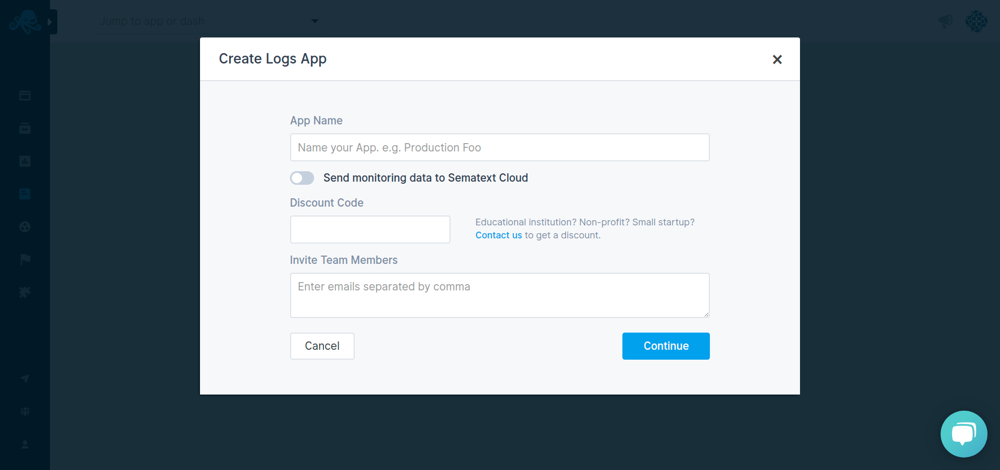

title: Sematext Logs Quick Start
description: Get up-and-running quickly with Sematext Logs. Here's how to start shipping and searching logs in no-time!

After you get logged into Sematext Cloud at <https://apps.sematext.com> (or <https://apps.eu.sematext.com> if using Sematext Cloud Europe), the first step is to create a Logs App. An [App](../guide/app-guide) is an independent namespace for your data.

For example, if you have a development and a production environment, it might make sense to have one App for each. You can create as many Apps as you want.

## Creating a Logs App

You create an App by pressing the **+ Create Logs App** button in the Logs tab.


Add a name and press **Continue**.



After creating a Logs App you will see an **integrations** screen that tells you how to [send data to your new Logs App](../logs/sending-log-events). 


Once you start sending data, you can start [searching and analyzing these logs](../logs/searching-log-events) in the Logs App or [explore your data with Kibana](../logs/kibana).


### Adding Data to Your Logs App

There are two ingestion endpoints to which you can send data to your Logs App:

- [Elasticsearch API](../logs/index-events-via-elasticsearch-api)
- [Syslog](../logs/syslog)


### Elasticsearch API

The easiest way to **send logs is with** [Logagent](../logs/logagent), [Logstash](../logs/logstash), or Filebeat. Have in mind any log shipper will get the job done. You can also use **any tool that works with Elasticsearch's REST API**, for both [indexing](../logs/index-events-via-elasticsearch-api) and [searching](../logs/search-through-the-elasticsearch-api). 

If you're using a particular **programming language**, configuring your **logging framework to send data to Sematext Logs** is also an option.

The only condition is to **use the App's token as the index name**, and `https://logsene-receiver.sematext.com:443`, or `https://logsene-receiver.eu.sematext.com:443` as the Elasticsearch endpoint.

Don't forget, if you're using **Docker**, setting up [Logagent](../logagent/installation-docker/) is incredibly simple.

Here's how to send a message from the terminal.
```bash
curl -XPOST https://logsene-receiver.sematext.com/YOUR-TOKEN-GOES-RIGHT-HERE/example/ -d '{
  "message": "Hello from Sematext!"
}'
```

Here `example` represents the desired type. It can be anything from `log`, `event`, `host`, `node`, and anything in between, giving freedom to create custom types for logs. This value gets stored in the `logsene_type` field allowing for easy filtering on types when needed.

[This guide](../logs/index-events-via-elasticsearch-api/) will show you more details on using the Elasticsearch REST API with Sematext.


### Syslog

You can forward syslog via **UDP** (port 514), **TCP** (port 514), **RELP** (port 20514) and **TLS** (port 10514). The host name is **logsene-syslog-receiver.sematext.com** / **logsene-syslog-receiver.eu.sematext.com**

To get started with syslog shipping quickly, you can use our configuration script and add your App token as a parameter:

``` bash
curl -O https://apps.sematext.com/logsene/configure-syslog.py
sudo python configure-syslog.py $YOUR-TOKEN-GOES-RIGHT-HERE
```

You can also use this snippet:

```bash
echo 'example.com eed460a3-9516-458c-8c5c-8e7c495665cd:Hello from Sematext!' | nc logsene-syslog-receiver.sematext.com 514
```


For more details, take a look at the [Syslog](../logs/syslog) page, and the pages that are linked from it.

## Troubleshooting With Logs

Quality Log Management tools have several main requirements for analyzing logs:

- A way to ship, ingest, and reliably index logs data
- Tools to search, correlate and investigate logs data
- Drill-down analysis functionality to reveal trends, spikes, and anomalies
- Monitoring and alerting features with 3rd party webhooks and integrations 
- Building custom reports and dashboards from your data

These are key features Sematext Logs offers. The rest of this guide will help you get started with using it to its full potential. But first, check out this short video about troubleshooting with logs.

<div class="video_container">
<iframe src="https://www.youtube.com/embed/glwZ8OCV0kc"
frameborder="0" allow="autoplay; encrypted-media" 
allowfullscreen class="video"></iframe>
</div>

Moving on, let's see how to make the best out of a Logs App.

## Logs App Layout

The image below shows the default logs view and marked are the main application and system UI elements. 


You can create custom dashboards that can integrate multiple charts and views of your real-time data that help you understand important trends, summarize top values and view the frequency of conditions.  Sematext log management system lets your devops and business teams analyze your data further with advanced visualizations, chart overlay and pan and zoom controls and more.