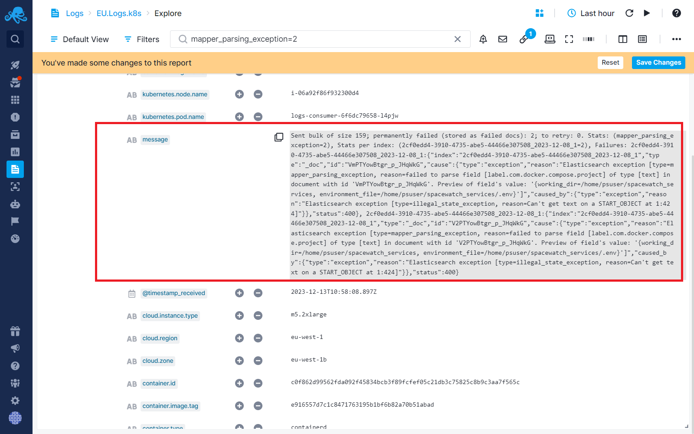
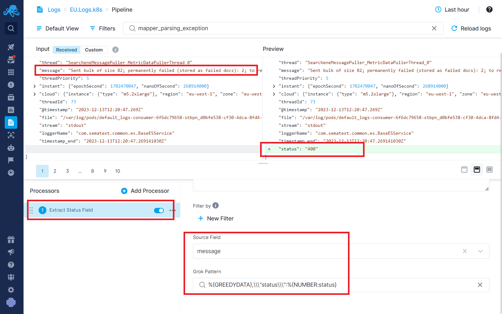
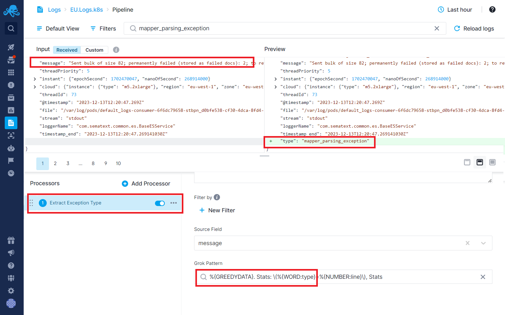
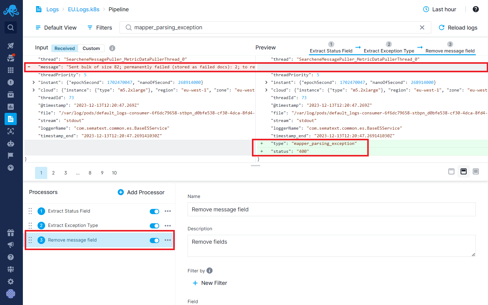
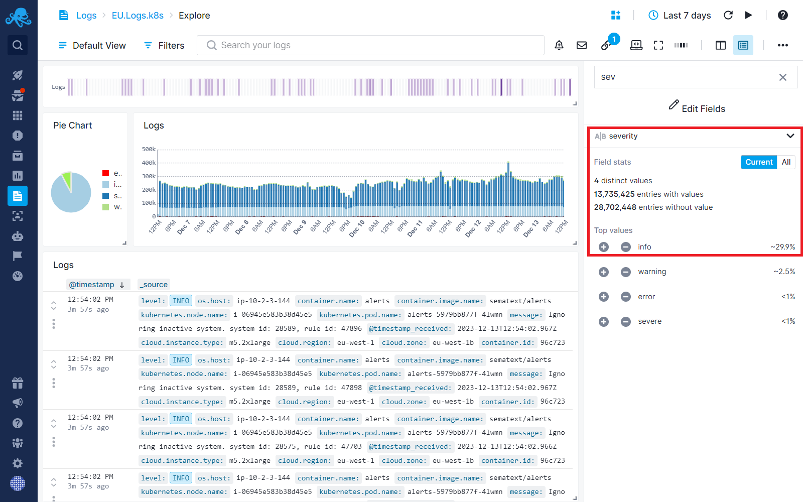
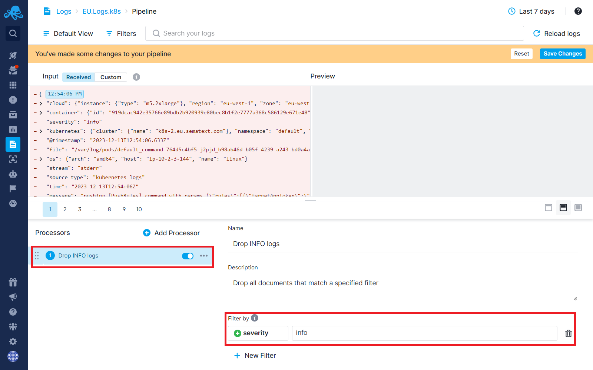

title: How Logs Pipelines Can Reduce Your Log Monitoring Costs
description: Use Logs Pipeline processor to drop noise events and extract vital information from long text fields to reduce your costs.

Log [pipelines](../logs/pipelines) offer a range of [processors](../logs/processors-overview) designed to improve signal to noise ratio in your logs, help you derive more value from logs both business and IT. Decreasing daily log volume subsequently leads to lower costs. Below are several strategies for using log pipelines effectively for cost-saving purposes.

**Note:** Be sure to check out [Plan Recommendations](../logs/plan-recommendations) to ensure you’re using the most cost-effective plan for your logs in Sematext.

Let's consider a scenario where we have a Logs App that is receiving query response logs from a database, resulting in a lengthy message field.

**Message field content:**

`Sent bulk of size 159; permanently failed (stored as failed docs): 2; to retry: 0. Stats: (**mapper_parsing_exception**=2), Stats per index: (xxxxxx-xx-xx-abe5-xxxxxxx-12-08_1=2), Failures: xxxxxxxxxxx-3910-4735-abe5-xxxxxx-12-08_1:{"index":"xxxxxxxxxxxxxxxxx-3910-4735-abe5-xxxxxxxxxxxx-12-08_1","type":"_doc","id":"xxxxxxxxxxxxxxxxx","cause":{"type":"exception","reason":"Elasticsearch exception [type=mapper_parsing_exception, reason=failed to parse field [label.com.docker.compose.project] of type [text] in document with id 'VmPTYowBtgr_p_JHqWkG'. Preview of field's value: '{working_dir=/home/psuser/spacewatch_services, environment_file=/home/psuser/spacewatch_services/.env}']","caused_by":{"type":"exception","reason":"Elasticsearch exception [type=illegal_state_exception, reason=Can't get text on a START_OBJECT at 1:424]"}},"status":400}, xxxxxxxxxxx-3910-4735-abe5-xxxxxxxxxx-12-08_1:{"index":"xxxxxxxxxx-3910-4735-abe5-xxxxxxxxxxx-12-08_1","type":"_doc","id":"xxxxxxxxxxx","cause":{"type":"exception","reason":"Elasticsearch exception [type=mapper_parsing_exception, reason=failed to parse field [label.com.docker.compose.project] of type [text] in document with id 'xxxxxxxxxxxxxxxxxx'. Preview of field's value: '{working_dir=/home/psuser/spacewatch_services, environment_file=/home/psuser/spacewatch_services/.env}']","caused_by":{"type":"exception","reason":"Elasticsearch exception [type=illegal_state_exception, reason=Can't get text on a START_OBJECT at 1:424]"}},**"status":400**}`

Because your log monitoring cost depends on the volume of stored logs (side note: it does not depend on the volume of logs you shipped to Sematext because any data you eliminate during the ingestion is virtually free - see XXXXX) anything you can remove from chunky log events like this will reduce your costs.

In this example, we will aim to remove redundant and duplicated information. We’ll extract the essential details, specifically focusing on isolating the **response status**, which serves as a crucial metric, along with specifying the **type of exception**. Besides reducing the cost, this extraction has another positive side effect - it  enhances data clarity and facilitates a more precise analysis of the log information, this making it possible for you to get more insights and value from these logs.

Instructions on achieving this goal with various pipeline processors, are detailed in the steps below.

## Field Extractor Processor - Extract Metrics

[Field Extractor processor](field-extractor-processor) enables you to extract metrics and numerical data from logs. This extraction ensures that essential information is retained while reducing log sizes, leading to cost savings.

**Step 1:** Use the Field Extractor processor to extract response status as a metric from the message field above into a separate field.

Once you have this new `status` field you will be able to create status reports using the [Chart Builder](https://sematext.com/docs/dashboards/chart-builder/).  This is a simple example of being able to get more value/insights from your logs.

## Field Extractor Processor - Trimming Verbose Text

Verbose log messages that contain pertinent information often contain a lot of text that we simply don’t need.  They increase the costs and make it harder to spot the information that is actually valuable.. With log pipelines, users can extract necessary data while discarding verbose content, effectively minimizing log sizes and optimizing storage.

**Step 2:** Use the [Field Extractor processor](field-extractor-processor) to extract the type of exception from the message field above.

## Remove Fields Processor - Dropping Redundant Fields

Log pipelines enable complete removal of unwanted fields within log data. By eliminating duplicate or unnecessary information, you can significantly reduce daily log volume without compromising critical insights.  You can also use this to remove fields with {sensitive data](../logs/handle-sensitive-data-with-pipeline).

**Step 3:**  Now that we’ve extracted all the vital information we need from the message field, we can completely remove the message field from our logs and dramatically reduce the log size.

We have extracted all the information that is vital to us from the message field. Let’s dive into the second step where we want to drop some unwanted events.

**Note:** At this point, if you have made similar changes in your own Logs Apps, give it 24-48 hours and you should be able to see a drop in your daily log volume on the [Logs Usage Screen](../logs/logs-usage-screen).  And in a few days, if you’ve trimmed aggressively enough, you may be able to select a cheaper daily log volume tier.  Sematext will suggest that automatically for you - see [Plan Recommendations](../logs/plan-recommendations).

Everything above was aimed at eventually removing a field after extracting valuable bits worth keeping.  You can, of course, do that with multiple fields in your logs, not just one field like in our example.  But there is an even more radical thing you can do – you can drop complete log events.  See below.

## Drop Processor - Identifying and Removing Noisy Events

Noise events or irrelevant log entries contribute to inflated log volumes. Through pipeline processors, users can match and eliminate these noise events, ensuring that only meaningful data is stored, resulting in leaner logs.

Why and when might you want to remove complete log events?

* Imagine you mistakenly ended up shipping your DEBUG logs.  Ooops!  But instead of changing all your logging configs, redeploying them to all your production hosts or redeploying or restarting applications so they pick up this change, you could simply drop such logs with Pipelines without any changes on your side.
* Or, imagine that shipping DEBUG or INFO logs is not actually a mistake, but something that you want, so that when you actually do need to have DEBUG and INFO logs to troubleshoot you can turn them on with a flip of a switch using Pipelines.
* Or, perhaps your application has a dependency that emits its own logs, and you don’t want them needlessly creating noise and increasing your costs.
* Or, maybe you have a bot - rogue or even a well known one like Googlebot - crawling your website endlessly and you don’t want to ship all logs generated by such bots creating noise and increasing costs.  You can drop all of their logs with Pipelines.  And as you discover new bots you simply add conditions to match their requests and drop logs they caused.

Let's consider a real-life Log App. In this App, INFO severity logs make up approximately 30% of the logs, as shown below. These INFO logs are not really valuable most of the time.  In fact, they just make WARN and ERROR logs harder to see in addition to making things more expensive.

**Step 4:** Using Drop processor, you can discard INFO severity logs.

This should reduce your costs considerably!  And if you need to see those INFO logs again, say because you are troubleshooting, all you have to do is come back to the above Pipelines screen and disable the Processor.

# Conclusion

Let’s assess the impact of log pipelines by comparing their before-and-after outcomes. In the scenarios outlined earlier, we encountered a log with a lengthy message field. While it held essential information, it also contained redundant data and noise. 1.5 KB of storage was needed to store the message field with its original value. After extracting key metrics and relocating essential data into new fields, which will take 6 bytes to store, we removed the original field from the log message, effectively eliminating the additional 1.5 KB to store that field. 

Now, let’s consider the overall log size, initially at 4 KBs for this case. By extracting vital information and removing the redundant field, each log's size was reduced to 2.5 KBs. This demonstrates a notable 38% reduction in size. Envision these types of logs flowing into your application, each passing through pipeline processors. This optimized process results in an overall 38% daily log volume reduction, resulting in significant cost savings.

On top of that, we’ve effectively filtered out all noise events based on specific conditions, leading to an additional 30% decrease in daily log volume.

See [Logs Usage Screen](../logs/logs-usage-screen) and [Plan Recommendations](../logs/plan-recommendations) for more information.

## How Our Team Can Support You

Our Customer Success Managers and support team are available to assist in implementing these strategies. We can analyze your log structures with you, recommend suitable pipeline processors, and provide guidance to tailor them according to your specific needs—all free of charge.

Reach out to us from support@sematext.com if you need further assistance.

