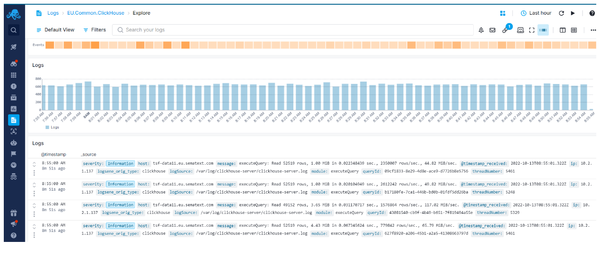

title: Sematext Logs Reports and Components
description: Sematext Logs has a default report that is generetated once you create an App. Check out how to use it with default components, but also how to create custom reports and components.

Each Logs App has one default Report called **Explore**. You can create as many reports as you want with custom Components.

## Logs Search and Report Menu

 

### App State

When your Logs App is loaded the **Save and Reset buttons will be hidden** since you see the App's default state. If a **new component is added** or any existing **component is edited, alert created, and report component removed**, the **Save and Reset buttons will appear** in the report menu and allow for changes to be saved or reset to the initial state. If your browser is suddenly closed, and no changes were saved or reset, the App will preserve its initial state.

### Report Actions 

The set of icons in the logs search and report menu let you:

- **Save as View** - Filtering and grouping data is a central part of the Sematext Cloud user interface. With Saved Views you can save your filters and groups for faster access later. If you find yourself often applying the same filters on your data then this feature can be a time saver.
- **Add Alert** - Every query can be use as an **alert query**. The ability to save alerts is part of the essential tools for searching, correlating and investigating logs data..
Each alert query is visible in the Alert Rules list.

- **Email Report** - There are E-mail and Subscription types available with time, frequency, and time range defined so your team can get automatated reports about your logs and system health.

- **Full Screen Mode** - Entering full screen mode brings only the component you choose into view. It's useful for presentations and viewing detailed info of a single component. All charts have zoom, crosshair, and time navigation tools with tooltips available for effective chart interaction and data analysis.

- **Connected Apps** - Connecting a Logs App to a Monitoring App will **pre-select that Logs App when you decide to correlate metrics from the connected Monitoring App**. When you receive an alert notification for an App, the **alert notification will automatically include information and charts from connected Apps**, and thus provide more information and context for you. You can connect any two Apps you have access to, regardless of their type. **Any App can be connected to any number of other Apps**.

 

- **Split View** - Split Screen is a product-wide correlation and data-pivoting feature. With Split Screen you can compare any two reports or dashboards, even the same report or dashboard but with different filters and groups in the two different screens.

- **Time Picker** - The Time Picker is available whenever an App is selected as well as when any custom dashboards are being used. **One minute is the shortest time increment** you can select. **Thirty minutes, one and two hours, and one, two, seven, and thirty days time-span shortcuts** are exposed as well.
**A custom time range can be selected using the time picker dropdown menu.** The Logs App will automatically refresh upon selection and update all the reports accordingly.

- **Live Tail** - Refresh data and Live Tail options are located next to the time picker. The **Live Tail feature provides real-time insights as soon as your data is consumed and indexed.** It can also be stopped so the auto-refresh does not update the data, in case you need to inspect specific incidents or anomalies within a certain time segment.

## Components

Using custom components you can **add metrics time series, events count time series, events, markdown notes, and create custom reports** with rich data visualizations and chart tools to analyze data.

Some components are common for both Logs and Monitoring, while other are specific for either one. They will be contextually available depending on whether you're adding them to a Monitoring or Logs App. Each **component can be also added to custom dashboards** you create.

### Logs Components

The Logs and Logs Count Time Series components are added by default to your Logs App. Additional Logs components that can be added to your App are Metric Panels, Logs Count, Top Values and Numeric Field Time Series.

These can be configured by whichever search query you want in any way you want. Making it easy to set up your Logs Report just the way you want.

 

Use them together with out-of-the-box metrics, from a Monitoring App, and you will go from metric spikes to Logs in seconds, and get to the root cause in minutes. Forget about ssh-ing to servers and grepping logs and find similar metric patterns with built-in metric correlations.

### Logs Component Settings

Each Component can be added to a custom Dashboard, and you can organize reports from one or several applications, both Logs Apps as well as Monitoring Apps. Creating rich data and visualization reports based on various metrics and logs data has never been easier.

Here's an image of the **Log Events Component** dropdown menu with log specific export and field editor features and the ability to add the component to a custom dashboard.

