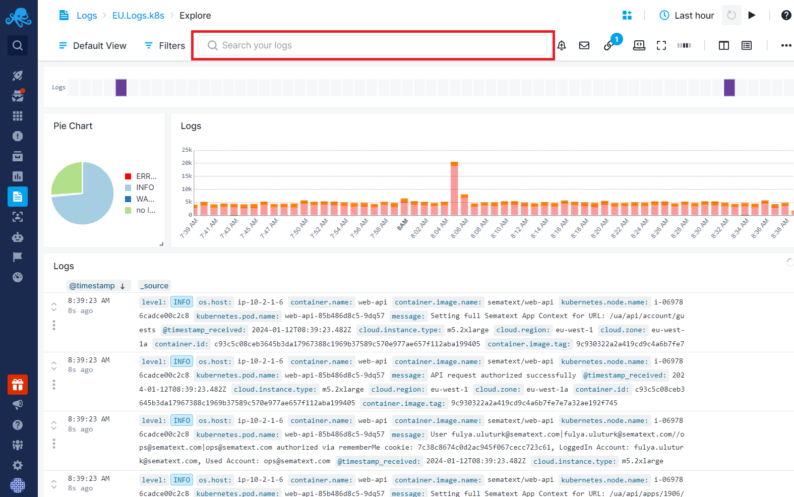
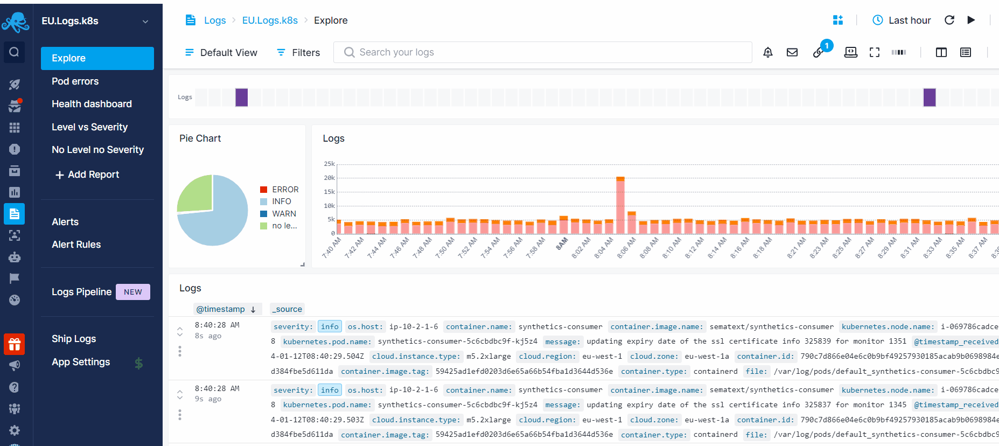
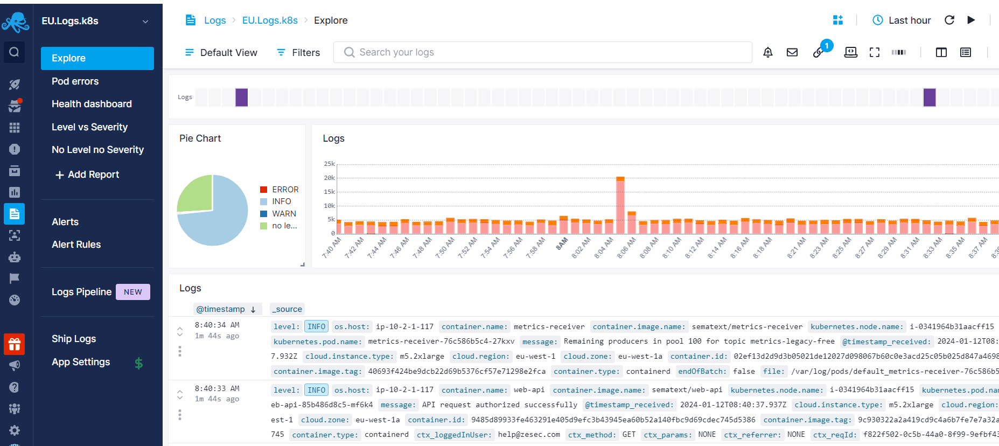
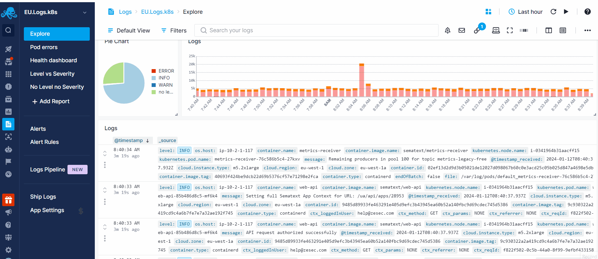

title: Searching Log Events
description: Search through your data using Elasticsearch API or Logsene CLI, a command line interface for searching through logs with the ability to pipe the output to `awk`, `sed`, `cut`, `sort` and other useful shell commands

<iframe width="800" height="450" src="https://www.youtube.com/embed/TSlp3ru1BNA" frameborder="0" allow="autoplay; encrypted-media" allowfullscreen></iframe>

By connecting to port **80** (or 443, if you want HTTPS) on **logsene-receiver.sematext.com** / **logsene-syslog-receiver.eu.sematext.com** (if using Sematext Cloud Europe), you can use the Elasticsearch API to search through your data, in the same way [you can send it](sending-log-events).

[Logs Apps](https://sematext.com/docs/logs/) comes with its own UI, which integrates nicely with other Sematext Apps, such as [Monitoring](https://sematext.com/spm/) (see the [Monitoring Documentation](../monitoring)). You can correlate data in any Logs App with any other Logs, [Monitoring](https://sematext.com/docs/monitoring/), [Synthetics](https://sematext.com/docs/synthetics/) or [Experience](https://sematext.com/docs/experience/) App by using [Split Screen](https://sematext.com/docs/guide/split-screen/).

## Searching Log Events

Searching log events is possible from various sections within a Logs Report. You can use [Search Syntax](https://sematext.com/docs/logs/search-syntax/) for a rich, yet simple query syntax very much like the query syntax used by Google.

You can also include or exclude specific field values by using the Filters section at the top of the Logs Report.

Alternatively, in the Logs Table, simply click on the value name to add an include/exclude filter. Or, when expanding a row, you'll find "+" and "-" icons next to each value, allowing you to add include/exclude filters.

Another method to filter your logs is through the Fields & Filters section. Within this section, you can view the top values for each field within the selected time range and apply include/exclude filters.
Or you can filter out the top values for that field and to see less common occurrences, allowing you to pinpoint specific anomalies or outliers within your logs for more detailed analysis.

You can also use [Kibana](kibana)  or deploy your own UI or custom scripts.

Besides web UI, there's also [Logsene CLI](https://www.npmjs.com/package/logsene-cli), a command line interface for searching through logs, with the ability to pipe the output to `awk`, `sed`, `cut`, `sort` and other useful shell commands.
See [Logsene CLI Introduction](https://blog.sematext.com/2015/07/07/logsene-cli/).
