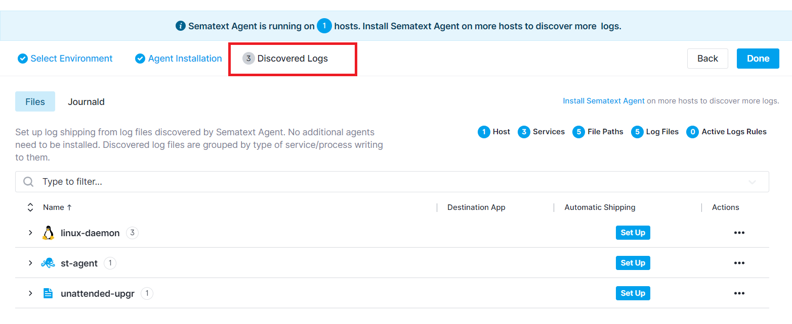

title: Sending Log Events to Sematext
description: Send new log events to Sematext using Sematext Agent, Elasticsearch API or syslog, and log shippers such as  Logstash, Fluentd, rsyslog, syslog-ng, Fluentbit and more

## Logs Discovery

The simplest - and the recommended way - to ship logs to Sematext is via the [Discovery](discovery/intro/) screen after the [initial setup](discovery/setup/). Setting up log shipping from there will be the easiest and will yield the best results, resulting in a the most suitable type of Logs App being created with the most useful pre-built dasboards and the most useful alert rules.

Follow these step-by-step instructions for setting up the [Sematext Agent](https://sematext.com/docs/agents/sematext-agent/) through the Logs App.

### Create Logs App

A Logs App is the space in Sematext that holds your logs.  You can have any number of Logs Apps in your account and each of them can have a different plan, retention, users who can access it, etc. 

#### Integration-specific Logs Apps

It is important to note that _most_ Logs Apps are "typed".  That is, most Logs Apps are built for a specific integration, for logs with some _specific_, known log format. For example, you can see an Nginx Logs App in a screenshot below. If you wanted to ship Nginx logs that is the Logs App you want to create.  Not only will that Logs App have a bunch of ready to use Nginx-specific reports and charts out of the box, but it will also come with a set of default alert rules that are applicable to monitoring Nginx logs.  Make use of this and save time by creating an appropriate Logs App.

#### Generic Logs App

If you need to ship logs whose "type" you don't see among the list of offered Logs Apps types, create a `Generic Logs App`.  This type of Logs App has log search, alerting, and all other capabilities, but has _general reports_ that work for _all_ types of logs regardless of their format.  You can later create additional reports, charts, etc. to customize things to your liking.

### Select Your Environment Type

After creating the Logs App, the environment selection screen for agent installation will be displayed.

Choose the environment in which you intend to install the Sematext Agent. The installation instructions specific to that environment will be displayed.
Follow the provided instructions to install the agent. Once installed, the Logs App will identify the host and display the discovered log sources within it.

### View Discovered Logs

Discovered Logs shows a list of log sources discovered within the host grouped by service type.

### Set Up Automatic Log Shipping

Click on the **Set Up** button next to the services from which you want to ship logs. This enables automatic log shipping for the selected services. For example, you can configure the system to send all log sources from Linux daemon services to Sematext Cloud as soon as they are discovered.

Congratulations! You have successfully configured automatic log shipping for logs discovered under Linux daemon services without any additional configuration.

### Shipping to the Same App from Additional Sources

If you want to ship logs from additional hosts and containers to the same Logs App, you can always navigate to the Ship Logs screen from the left Menu panel and repeat the steps to install the agent to another host.

Furthermore, at any time, you can navigate to the Discovery screen to view the log sources and services identified across your infrastructure, from all the containers and hosts where the [Sematext Agent](https://sematext.com/docs/agents/sematext-agent/) is installed. From this screen, you have the option to configure automatic log shipping or metrics without the need for any additional installations.

## Custom Integration Options

Alternatively, you can explore various custom integration options for shipping log events to Sematext. These include support for [Elasticsearch API](index-events-via-elasticsearch-api), [syslog-ng](syslog-ng), various programming languages, and popular log shippers such as [rsyslog](rsyslog), Logstash, Fluentd, and many many more. You can discover all supported custom integrations by accessing any Logs App, clicking 'Ship Logs' on the left menu panel, and navigating to the Custom Integrations tab.  We recommend you use this only if, for some reason, setting up log shipping from Discovery screen in Sematext Cloud UI doesn't work and our support is unable to help you.

For further insights, refer to [Logging Libraries vs Log Shippers](https://sematext.com/blog/logging-libraries-vs-log-shippers/).
