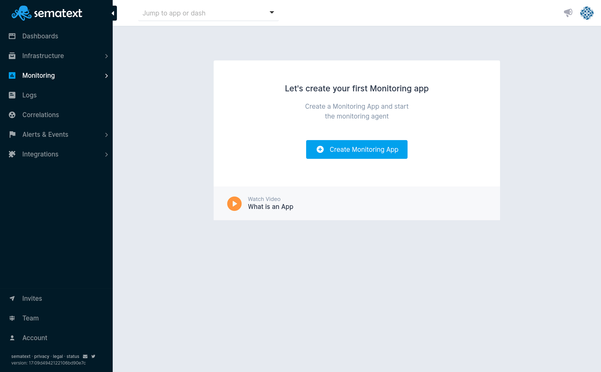
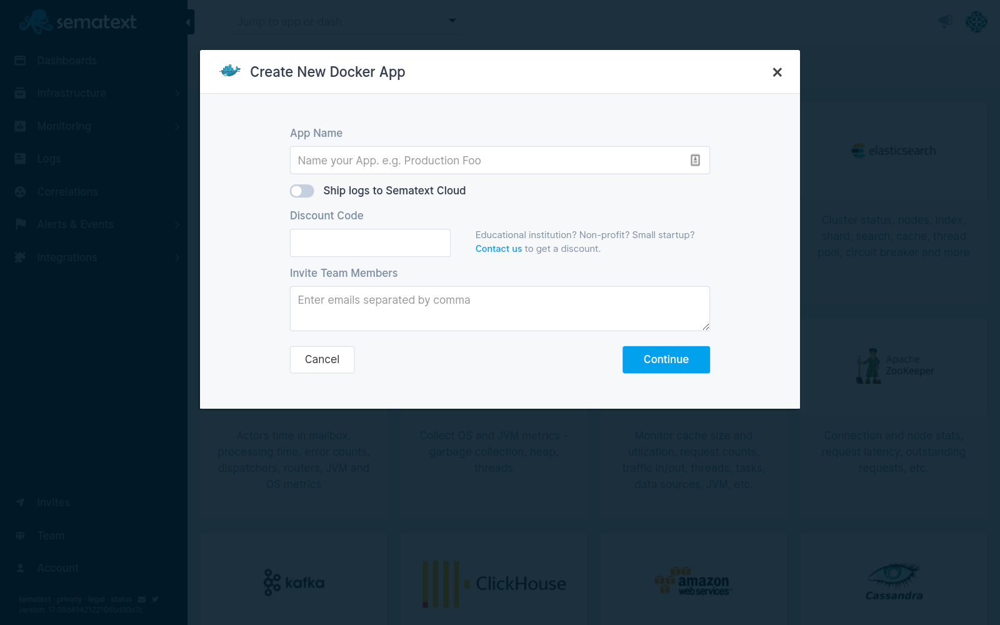

title: Sematext Monitoring Quick Start
description: Sematext Cloud is a modern monitoring, log management, transaction tracing, and real user monitoring system that includes over 40 monitoring integrations. It is a suite of products that combine high-quality logging experience with other monitoring and alerting devops tools helping fix IT production issues

After you get logged into Sematext Cloud at <https://apps.sematext.com> (or <https://apps.eu.sematext.com> if using Sematext Cloud Europe), the first step is to create a Monitoring App. An App is an independent namespace for your data.

For example, if you have a development and a production environment, it might make sense to have one App for each. You can create as many Apps as you want.

## Creating a Monitoring App

You create an App by pressing the **+ Create Monitoring App** button in the Monitoring tab.

Choose one of the 40 integrations.

Once clicking on your desired integration, add a name, and press **Continue**.

A sample of creating a Docker Monitoring App

This will immediately open up the Agent installation instructions. Follow the steps and data will start flowing in!

Every type of Integration has a dedicated Agent Installation Guide

Once you have data flowing you can **analyze metrics** by a number of context-aware filters, add **alerts** and **anomaly detection**, and **correlate metrics** with events and logs.

You can have any number of Monitoring Apps and each App can be shared
with different people, giving them different access roles. Each App has its own plan.
Some Apps can use the free plan, while others can use paid plans, thus enabling a lot of flexibility around cost management.

## Setting up Monitoring Agents

Metrics are shipped to Sematext Monitoring using Agents. To monitor your infrastructure you need to set up a **Sematext Monitoring Agent**. You can choose from:

  - [Sematext Agent](../agents/sematext-agent/), a lightweight, blazing
    fast Go-based Monitoring Agent with a tiny footprint for both
    infrastructure and containers. Also includes Java based App Agent that collects application metrics.

  - [Node.js-based App Agent](https://sematext.com/docs/agents/node-agent/), which can [monitor
    Apache](../integration/apache) and [Nginx](../integration/nginx)
    (including [Nginx Plus](../integration/nginxplus)).

  - Sematext Docker Agent (Deprecated), which can collect not
    only container and host metrics, but also container events and
    also logs, it can parse and structure out of the box.

The setup instructions for each of the agents are shown in the UI and you can also see them under individual [integrations](../integration).

Once the agent is set up metrics will start coming to Sematext
instantly. If you do not see performance charts 5 minutes after setting up the agent, have a
look at the [troubleshooting](./spm-faq) page.

## Monitoring App Layout

This guide will help you get started with our Monitoring App and discover reporting, monitoring, and other features and functionalities. Here's the default monitoring view and shown are the main application and system elements.

