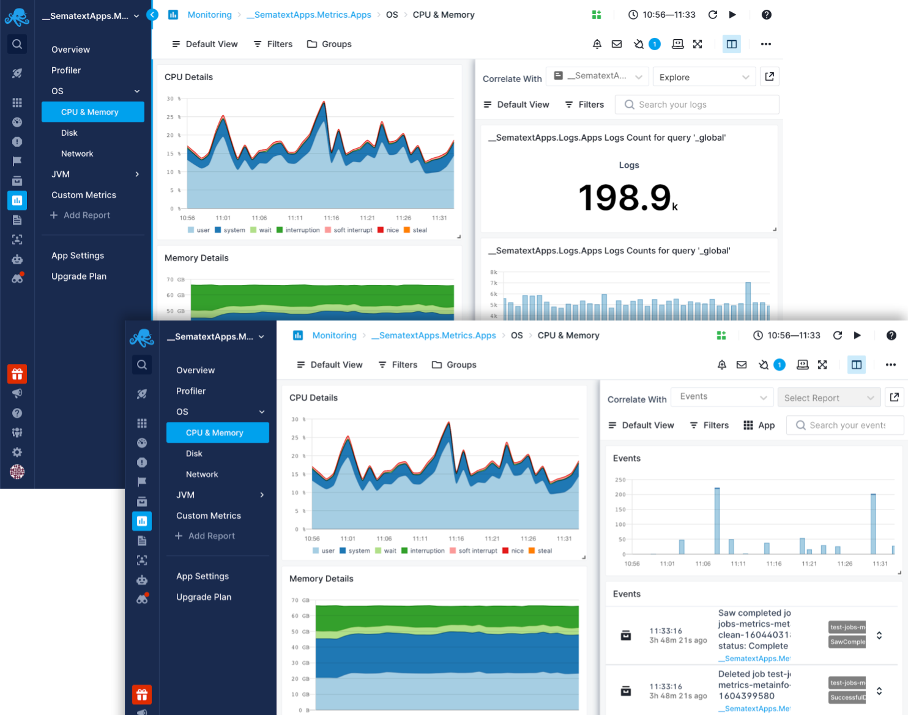

title: Sematext Monitoring Reports and Components
description: Sematext Cloud is a modern monitoring, log management, transaction tracing, and real user monitoring system that includes over 40 monitoring integrations. It is a suite of products that combine high-quality logging experience with other monitoring and alerting devops tools helping fix IT production issues

## Monitoring Report Menu

The **Monitoring Report Menu** is where the true power of Sematext Performance and Infrastructure Monitoring lies. This is where Observability comes to life. It lets you add additional components to a report, create alerts, connect apps and quickly filter or group data. You can also correlate monitoring data with your logs, events or experience data using **[split screen](./split-screen/)**.

 

### App State

If a **new component is added** or any existing **component is edited or removed**, the **Save and Reset buttons will appear** in the report menu and allow for changes to be saved or reset to the initial state.

 

If your browser is suddenly closed, and no changes were saved or reset, the App will preserve its initial state.

### Split Screen

Split screen gives you a single view for Metrics, Logs, and Events. This is a huge time saver to let you move from **Metrics spikes** to **drill down to Logs and Events** that caused them.

 

Combined with the **Metric Reports**, and with the help of a **charting hairline**, zoom and chart navigation tools, it is easy to see how using our **Monitoring and Logging tools in a single page** is a must-have for any DevOps team! Learn more about **[split screen](./split-screen/)**.

### Report Actions 

The icons to the right in the report menu provide:

- **Email Report** - There are Email and Subscription types available with time, frequency, and time range defined to send automated reports.

- **Full Screen Mode** - Entering full screen mode brings only that component into full-page view and removes all other. All charts have zoom, hairline, and time navigation tools with tooltips available for effective chart interaction and data analysis.

- **Monitor Installation** - You will need to install Sematext Agent so metrics are sent to your Monitoring App. Please refer to [Integrations](https://sematext.com/docs/integration/) to configure what you wish to monitor. 

By checking out the [Integrations documentation](https://sematext.com/docs/integration/) you can learn more about how to monitor various programming languages, operating systems, containers (Docker, Kubernetes, Mesos), Cloud IaaS / PaaS services, iOS, Android, AWS EC2, AWS S3, Log Management, and log shippers. There you will find detailed information on how to install and configure different agents required to start sending your logs and metrics data to Sematext Cloud.

### Report Settings

- **Report Actions** - Your customized monitoring report can be better described using meta name and description, and you can assign unique URL Alias to identify that report.

- **Legends Position** and **Extended Charts** features - Except in the **default Overview Report**, each report can have legends for better chart interaction. Extended charts are also displayed below and provide a comparative view about the longer time span relative to the time frame displayed in the main chart. Just like report legends, the extended view can be hidden and only the chart with X and Y values displayed.

## Components

Using custom components you can add **monitoring metrics time series**, **metric panel**, **markdown notes**, and create custom reports with rich data visualizations and chart tools to analyze your data.

Each component can also be added to a custom dashboard you define.

### Monitoring Components

Line, Area, Bar charts binned by metric creation date, bar chart binned by event creation date, table of events in reverse chronological order are available for your Monitoring App.

 

Use them together with out-of-the-box metrics reports and visualizations, generated when your Monitoring App is created, and you will go from metric spikes to your apps’ and servers’ logs in seconds and get to the root cause in minutes. 

### Monitoring Component Settings

Each Component can be added to a custom Dashboard, and you can organize reports from one or several applications, both Monitoring Apps as well as Logs Apps. Creating rich data and visualization reports based on various metrics and logs data has never been easier.

Here's an image of **Metrics Component** dropdown menu. You can edit the component metrics, add it to a custom Dashboard, create alerts, and much more.

