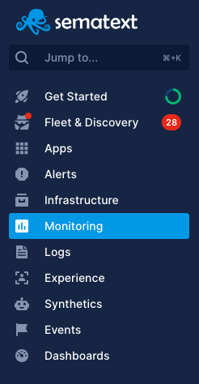

title: Sematext Monitoring App Settings
description: Sematext Cloud is a modern monitoring, log management, transaction tracing, and real user monitoring system that includes over 40 monitoring integrations. It is a suite of products that combine high-quality logging experience with other monitoring and alerting devops tools helping fix IT production issues

The Monitoring App view ([US](https://apps.sematext.com/ui/monitoring) or [EU](https://apps.eu.sematext.com/ui/monitoring)) allows for easy interaction between various App settings.

From the App Actions drop down menu, the horizontal elipsis icon (⋯) shows your App options and lets you open various App-specific functions:

  - [inviting others to your App](https://sematext.com/docs/team/app-guests/)
  - [alert rules](../alerts)
  - [changing your App's plan](https://sematext.com/pricing/#infrastructure)
  - [connecting Apps](https://sematext.com/docs/guide/connected-apps/)
  - [heartbeat alert creation](https://sematext.com/docs/alerts/creating-heartbeat-alerts/)
  - [App ownership transfer](https://sematext.com/docs/team/transfer-apps/)
  - [scheduled report emails](https://sematext.com/docs/guide/scheduled-reports/)

## Side Navigation

The persistent region on the left that can be collapsed, is used to easily switch across monitoring, log management, real user monitoring, and other user & team features. All side navigation tabs are selectable. If they have chevrons, it indicates that the top level section is collapsible and contains additional subitems. The subitems will let you explore all your Apps, or choose a particular App.

Side navigation top level sections for infrastructure and application performance monitoring, log management, and real user monitoring:

- [Fleet & Discovery](https://sematext.com/docs/fleet/)
- [Infrastructure](https://sematext.com/docs/monitoring/infrastructure/)
- [Monitoring](https://sematext.com/docs/monitoring/)
- [Logs](https://sematext.com/docs/logs/)
- [Synthetics](https://sematext.com/docs/synthetics/)
- [Experience](https://sematext.com/docs/experience/)
- [Alerts](https://sematext.com/docs/alerts/)
- [Events](https://sematext.com/docs/events/)
- [Dashboards](https://sematext.com/docs/dashboards/)

Side navigation sections for team features and settings:

- [Team](https://sematext.com/docs/team/)
- Notifications
- Settings

## Report Settings

Once you [create a Monitoring App](https://sematext.com/docs/monitoring/quick-start/#creating-a-monitoring-app), and start your Agent, it will have a set of default [reports and components](https://sematext.com/docs/monitoring/reports-and-components/). You can edit, clone and delete these reports or create new ones. You can also define [report variables](https://sematext.com/docs/dashboards/report-variables/) to dynamically fiter and group data in a report.

Based on what type of Monitoring Integration you chose, more reports get created by default. In this OpenSearch integration you can see three more reports are created by default.

