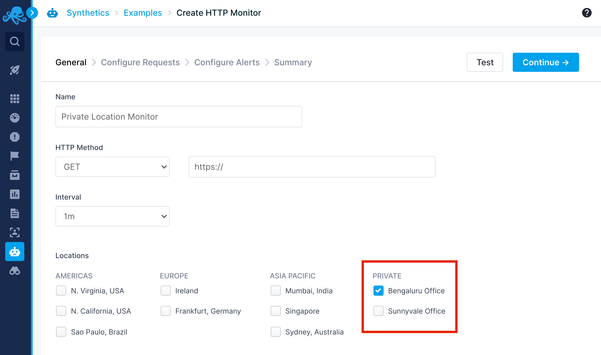

title: Private Locations
description: Private locations functionality allows you to monitor the APIs and webpages that are not accessible from the Internet such as your internal websites, private APIs, etc.

Private locations functionality allows you to run the synthetic tests from your private network. Some of the use cases for using private locations are:

* Monitor internal APIs or web applications that are not accessible from the Internet
* Compare the performance of your applications between the Internet & your private network
* Monitor your applications from specific locations that are not supported by Sematext

## Create Private Location

To create a private location, navigate to Synthetics -> Private Locations -> New Private Location. 

* **Name** - Unique name for the private location
* **Description** - A brief description of the location
* **City** - Select the city where the machine running the agent is physically located. If your city is not listed, select the nearest city. This is used to calculate latitude/longitude to plot the location in the map.

Each private location is assigned a unique token. You can disable or delete a location, when not in use.

## Install Private Agents

After creating the private location from UI, you need to install the agents on a machine in your private network. Private agents are deployed as Docker containers. There are two Docker images, one for HTTP monitor and another for Browser monitor.
You can deploy either the HTTP or Browser monitor or both. Follow the instructions in the UI to install private agents in your network.

If you have multiple private locations, you need to install agents individually in each location. Private agents use the HTTPS protocol to periodically fetch the monitors to run and send the result to Sematext Cloud. If you have a firewall configured in your network, you need to open a bidirectional HTTPS traffic for `synthetics-scheduler.sematext.com` and `synthetics-receiver.sematext.com` hosts. For the EU region, the hosts are `synthetics-scheduler.eu.sematext.com` and `synthetics-receiver.eu.sematext.com`.

## Using Private Locations

Once you create a private location from UI and install the agents, you can use it while creating the monitors or update existing monitors to run from the private location. Private location behaves exactly like public locations. 

