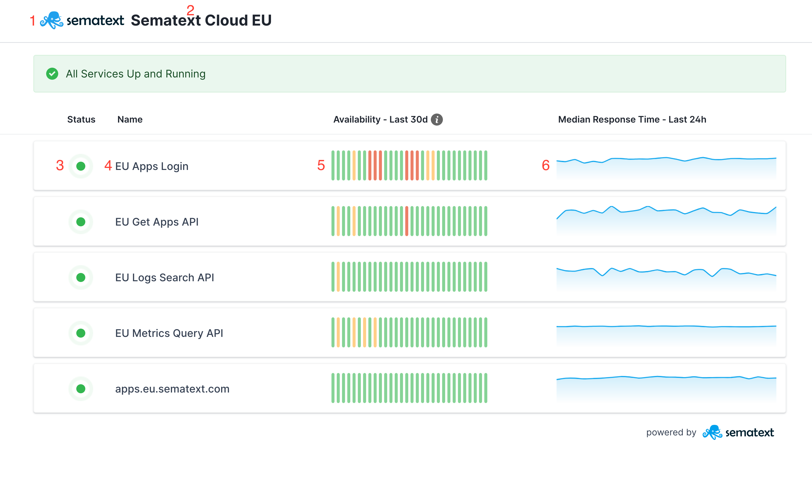

title: Status Pages
description: Communicate the status of your services to your customers using status pages

Using Sematext Synthetics you can create public status pages to share the status and response time of your services to your customers.

## Create Status Page

You can create multiple status pages under your account. Navigate to the `Synthetics -> Status Pages` screen to create a status page. 

The following fields are required to create a status page:

* **Monitors** - List of monitors to be included in the status page. All the active monitors from Apps for which the account has OWNER or ADMIN role can be included in the status page. A monitor can be included in multiple status pages.
* **Name** - Unique name for the status page.
* **Header Name** - Company name to be displayed in the status page header.
* **Header Logo** - URL of the company logo to be displayed in the status page header. An image with a height of 40px and white background is recommended.
* **Response Time Aggregation** - Aggregation to apply for Response Time chart. The response time is aggregated in 1 hour buckets.
* **Custom domain** - Optionally you can host the status page in your own custom domain.

Every status page will have a unique public URL of the format - `https://apps.sematext.com/ui/statuspages/<unique-token>`. You can use this URL to preview the status page before opening to the public.

Disabling the status page will block the public access for the status page.

## Status Page UI

1. **Header Logo**
2. **Header Name**
3. **Current Status**
4. **Monitor Name**
5. **Availability for Last 30 days**
6. **Response Time for Last 24h**
7. **Last Refresh Time**

The status page is auto-refreshed every 1 minute.
