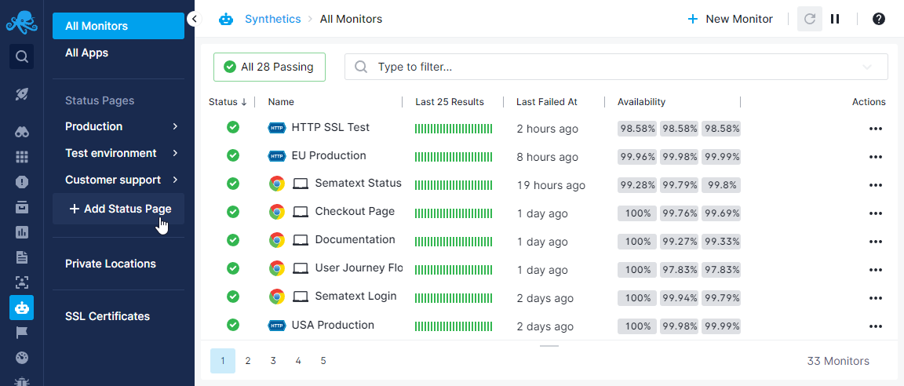
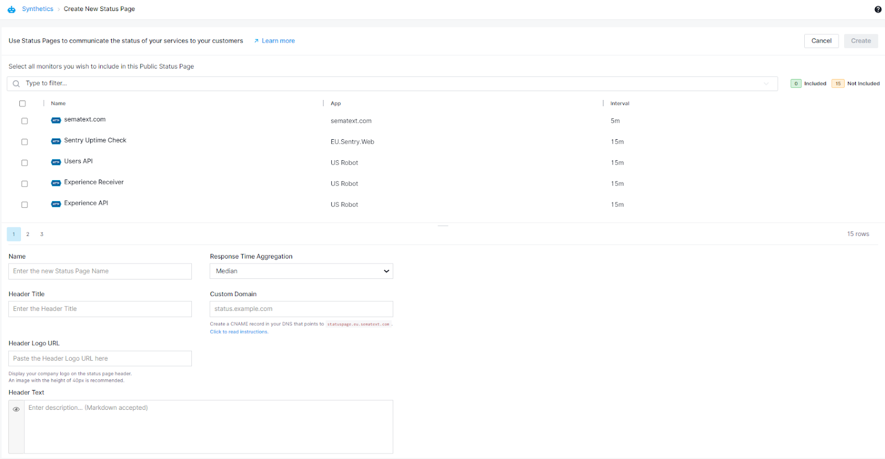
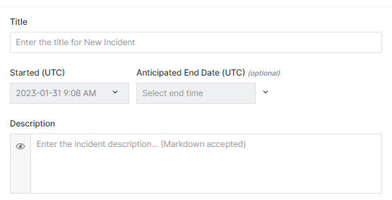
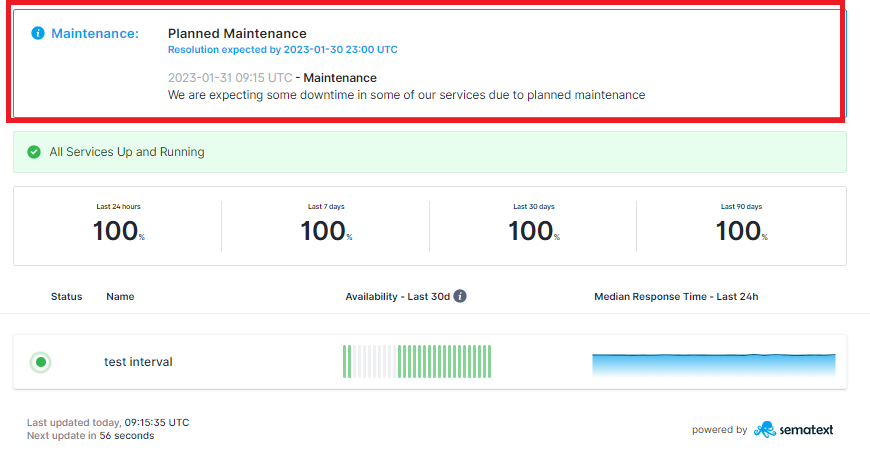
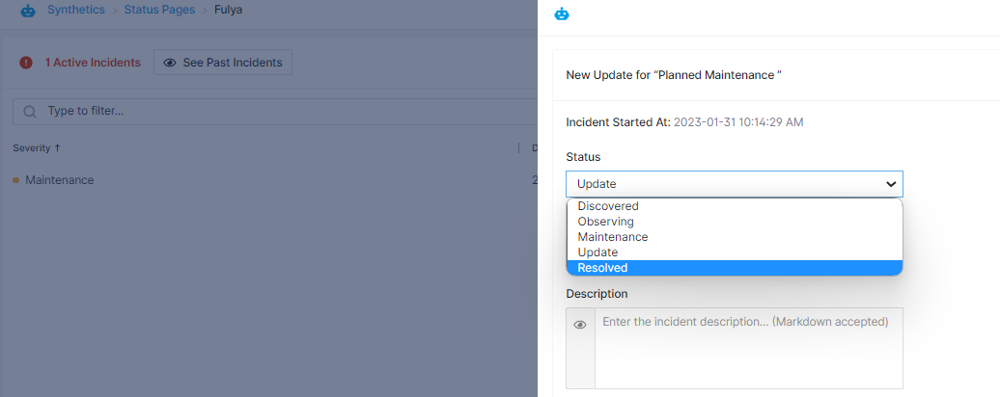

title: Status Pages
description: Communicate the status of your services to your customers using status pages

Using Sematext Synthetics you can create public and private status pages to share the status and response time of your services. Use the status pages to:

* Communicate the status of your services to your customers
* Share status updates with your customers during planned maintenance or outages
* Create a service status dashboard to share across internal teams

## Create Status Page

You can create multiple status pages under your account. To create a status page, simply go to **Synthetics** and press the **Add Status Page** button on the sidebar.

Doing so will show the form where you can customize the status page. 

The following fields are required to create a status page:

* **Monitors** - List of monitors to be included in the status page. All the active monitors from Apps for which you have the OWNER or ADMIN role can be included in the status page. The same monitor can be included in multiple status pages.
* **Name** - Unique name for the status page.
* **Header Title** - Company name to be displayed in the status page header.
* **Header Logo URL** - URL of the company logo to be displayed in the status page header. An image with a height of 40px and white background is recommended.
* **Response Time Aggregation** - Aggregation to apply for Response Time chart. The response time is aggregated in 1 hour buckets.
* **Custom Domain** - Optionally you can host the status page in your own custom domain.

Every status page will have a unique public URL in this format:

* `https://apps.sematext.com/ui/statuspages/<unique-token>`

You can use this URL to preview the status page before opening to the public. Disabling the status page will block the public access for the status page.

## Edit Status Pages

To edit a status page simply click on the **“...”** that appears when you hover over a status page name on the side bar. Then click on Edit from the menu.
All the monitors that are already added to the status page will be pre-selected. 
You can **filter included/not included** monitors by clicking on the buttons next to the search bar.

# Incidents

Incidents let you inform your users of planned maintenance, downtime, or any other issues your service is experiencing.

To create an incident simply click on a status page and then click on the **“+ New Incident”** button on the top right corner of the page.

You have the option to select between 3 different incident types:

* **Major Incident** - Incident that caused downtime or otherwise makes it impossible to use or access the service
* **Minor Incident** - Incident causing minor delays, longer response times or otherwise not affecting to use the service
* **Scheduled Maintenance** - Scheduled maintenance  usually involves some downtime.

Set the start and end date for an incident and enter title and description.

After you create an incident, when the current date and time falls between the incident start and end dates, the incident title and description will appear in your public status pages to inform your users. Thus allows you to pre-create and schedule incidents ahead of time, have them show up on the status page at a pre-determined time in the future, and have them automatically disappear.

You can resolve an incident at any time by navigating to the status page in Sematext Cloud, clicking on New Update and selecting the new status of the incident.

# Custom Domain Setup

To use a custom domain for your status page (e.g. `status.company.com`), you will need to:

 * enter the domain in the **Custom Domain** field
 * configure your DNS provider

To configure your DNS provider, add a CNAME record for `status.company.com`. The record should point to:

 * `statuspage.us.sematext.com` if your App is created in the Sematext Cloud US region
 * `statuspage.eu.sematext.com` if your App is created in the Sematext Cloud EU region

The status page should now be available at  `https://status.company.com`.

## Status Page UI

1. **Header Logo**
2. **Header Title**
3. **Current Status**
4. **Monitor Name**
5. **Availability for Last 30 days**
6. **Response Time for Last 24h**

The status page is auto-refreshed every 1 minute.
