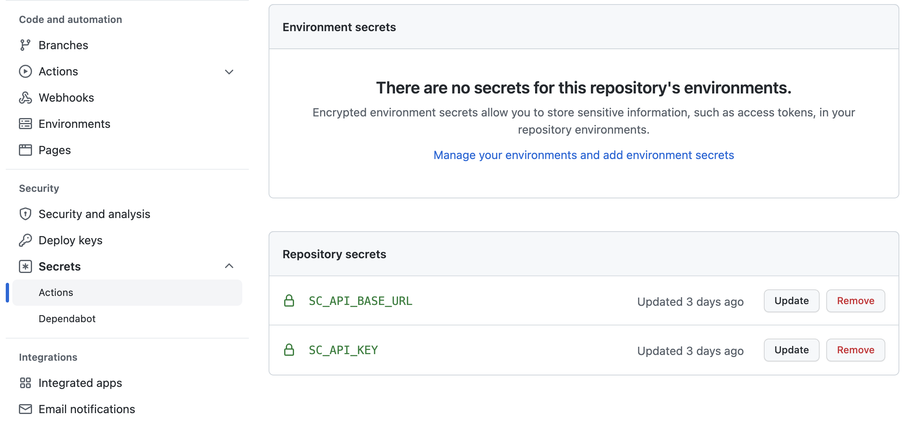
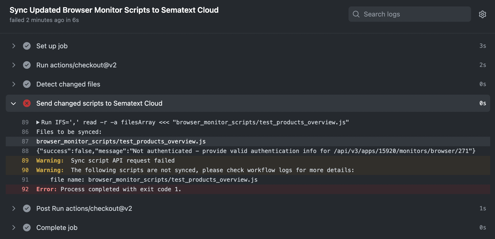
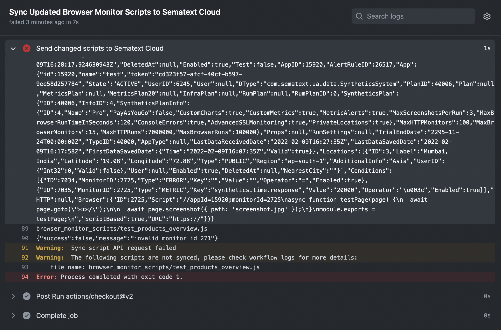
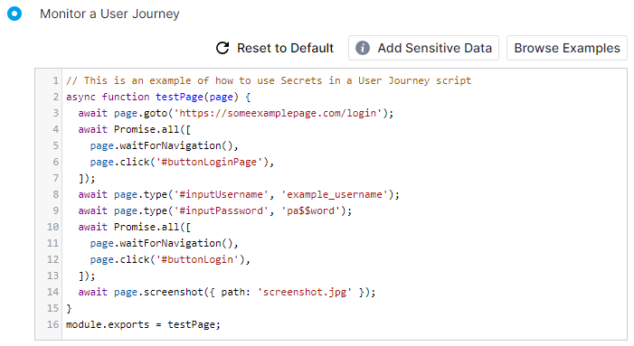
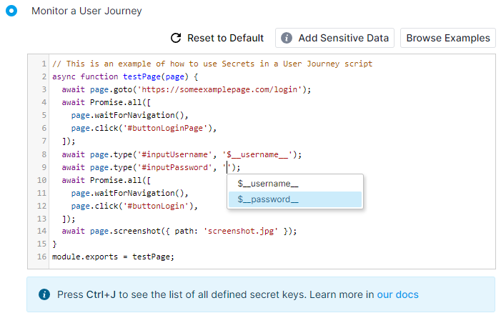
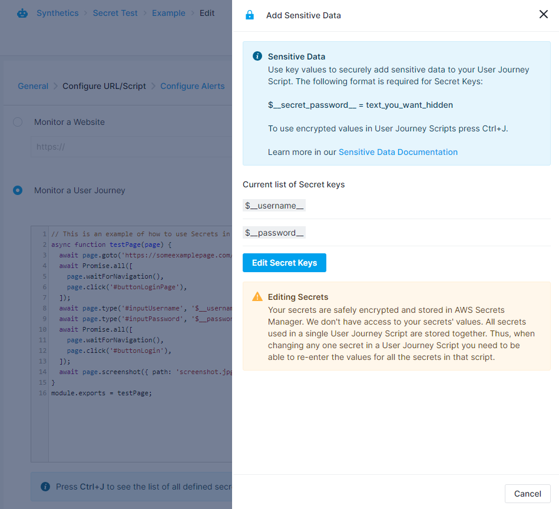

title: User Journey Scripts
description: User Journey Scripts for monitoring multi-page and multi-step user journeys

To monitor a single website, you can directly configure the URL of the website to be monitored. This can be accomplished with either [HTTP Monitor](./http-monitor.md) or [Browser Monitor](./browser-monitor.md). To monitor a user journey across multiple pages or perform actions on your website, you use a Browser monitor configured with a User Journey script that simulates user actions.

When you configure the URL of the website, the Browser monitor will load the URL in the Google Chrome browser and, among other things, take a screenshot of the website once the page load is complete.

The User Journey scripts are Node.js scripts that control a headless Chrome browser and use the [Google Puppeteer](https://github.com/puppeteer/puppeteer#puppeteer) framework to drive the browser. They can be up to 32 KB in size.  For every run, the monitor will invoke the `testScript()` method with the Puppeteer [Page](https://pptr.dev/next/api/puppeteer.page) object as a parameter. The script content should be inside the `testScript()` method. For more information on specific use cases, refer to the **Browse Examples** section while creating a Browser Monitor. 

Use the Node.js [assert](https://nodejs.org/api/assert.html) API to check if the values in the page match your requirements. If any assertion fails, the system declares the run as a failure. The **Logs** and **Script Error** tabs , shown in the **Run Details** page, contain information about the cause of the failed run.

Check out the [awesome-puppeteer](https://github.com/transitive-bullshit/awesome-puppeteer) GitHub repository for more examples and tips for writing puppeteer scripts.

## Sync User Journey scripts from GitHub to Sematext

One way to add User Journey scripts to Sematext is to do so directly, via the Sematext UI. You can simply type in the scripts or paste them in.  Once they are in Sematext, you can also edit them at any point in time.  Another way to get User Journey scripts into Sematext is by setting up synchronization with a GitHub repository where you have your scripts. This way you can manage them with GitHub, author and modify them with your preferred tools, benefit from version control, and automate their publishing to Sematext without doing any extra manual work, like typing or pasting them in.

### Setup GitHub Actions

To sync User Journey scripts, you will need to set up GitHub Actions in your GitHub repository. There are two available synchronization workflows. You can choose to use only one of them or you can use them both - they complement each other. The [sync_updated_scripts.yml](https://cdn.sematext.com/github-sync-scripts/sync_updated_scripts.yml) workflow detects updated script files and updates the [Browser Monitor’s](./browser-monitor.md)) scripts in Sematext Cloud. The  [sync_added_scripts.yml](https://cdn.sematext.com/github-sync-scripts/sync_added_scripts.yml) workflow detects any added scripts and creates a new Browser Monitor for each script added to your repository. The workflows will be executed every time you push new commits or merge a PR to your default branch.

Notes:
* These workflows don’t do anything with scripts you delete from your repository. In other words, if you delete a script from your repository the script will remain in Sematext until you explicitly remove it from there by yourself.

* The sync is unidirectional - syncing is only done from GitHub to Sematext.  This means that if you modify a User Journey script in Sematext, the changes will not be propagated to the GitHub repository. If you update the script in your repository then all the changes to that script that were made directly in Sematext will be overwritten.

* If your default branch is not `master` you will need to update the workflows with the name of your default branch.

To enable syncing of your User Journey scripts, you need to do the following:

1. Go to `https://github.com/{ORGANIZATION}/{YOUR_REPO_NAME}/settings/secrets/actions` and create two repository secrets: `SC_API_KEY` and `SC_API_BASE_URL`, as shown in the image below.

    

      - You should set your Sematext Cloud API key as the value for the `SC_API_KEY`. Your API key can be found at https://apps.sematext.com/ui/account/api for the US region, or alternatively at https://apps.eu.sematext.com/ui/account/api for the EU region. 
  
      - The value of `SC_API_BASE_URL` should be set to https://apps.sematext.com (US region) or https://apps.eu.sematext.com (EU region).

2. Add the `.github/workflows` directory inside the root directory of your repository and place the `sync_updated_scripts.yml` and `sync_added_scripts.yml` workflow files inside the newly created directory.


### Prepare User Journey scripts

Now that you’ve configured the workflows, it’s time to prepare the User Journey scripts for syncing:

1. All scripts must be located in a directory named `browser_monitor_scripts`.

2. For existing Browser Monitors the first line of the script must contain a special comment with the Sematext App ID and monitor ID(s). That is how the workflows know which monitors need to be updated. The ID(s) can be found in the browser address bar when you open the details for the particular Browser Monitor in Sematext. The URL will be in the following format: `https://apps.eu.sematext.com/ui/synthetics/{appID}/monitors/{monitorID}.` 
Here's an example: 

    ```
        //appId=398;monitorId=1238 

        or

        //appId=398;monitorId=1238,1240
    ```
    
    Any spaces are ignored, so feel free to add spaces for readability.

3. If you are adding a new script and want to automatically create a new Browser Monitor, the first line of the script must contain a special comment with only the App ID. If you are adding a new script and you specify monitor ID(s) as well then the corresponding monitor(s) will be updated with this script.
Example: `//appId=398`. The monitor will be created with the following values: 

      - **Monitor name** = name of the script file
      - **Interval** = 1h
      - **Location** = N. Virginia

Note that after the new monitor gets automatically created from such a script the `monitorID` will be automatically added to the comment in the script.  When that happens the author name displayed in the GitHub commit will be `SematextSyncBot`.
 
If you are using Sematext Cloud Europe then you’ll want to replace the default location.  You can do that by editing the workflow YML file(s).  Simply look for this:

```
body='{"name":"'$name'","interval":"1h","locations":[1],"scriptBased":'$scriptBased',"enabled":'$enabled',"script":"'$script_content'","isGitHubSync":'$isGitHubSync'}'
```

Replace `"locations":[1]` with `"locations":[2]` and the default location will be set to Ireland.

This is also where you may replace `1h` with another value you want to be used as the default monitor interval. Allowed values for the interval are `10m`, `15m`, `30m` and `1h`. Specifying any other value will cause the synchronization to fail.

### Troubleshooting syncing issues

If your sync workflow run fails, you can see which step caused the failure and review the logs to troubleshoot. In the example below we can see which scripts weren't synced and why the sync failed (the API key was not provided).

 

 You can learn more about monitoring and troubleshooting GitHub workflows [here](https://docs.github.com/en/actions/monitoring-and-troubleshooting-workflows).

 If either the `SC_API_KEY` or the `SC_API_BASE_URL` is incorrect, the synchronization will fail.  The results of each workflow execution run can be found at `https://github.com/{ORGANIZATION}/{REPO}/actions`. 

If either `AppID` or `MonitorIDs` is invalid the synchronization of the script with invalid IDs will fail.
When syncing multiple scripts only the script that contains invalid IDs will fail. The workflow run will be marked as failed even though some scripts were successfully synced, to raise awareness that some scripts weren't synced.

 

In the logs for that run there will be messages such as:

```
Warning: The following scripts are not synced, please check workflow logs for more details:
file name: browser_monitor_scripts/test_products_overview.js
```

The logs will also contain the Sematext API response indicating the sync failure reason:

```
{"success":false,"message":"invalid monitor id 271"}
```

## Storing your User Journey script credentials securely

Earlier on we mentioned that Browser monitors can be used to interact with a website. This interaction often includes logging in, so that one may access the features available only to registered users. Logging in is usually performed by passing certain credentials to a form on the page and then submitting it. Since these credentials must be supplied inside of the User Journey script, we understand that users might be concerned with their security. By using our **Add Sensitive Data** functionality, your credentials will be securely stored in the AWS Secrets Manager. That means they won't be visible in a plaintext format inside of scripts, instead being replaced by a placeholder value which you specify. These placeholders are replaced with the actual values only during the User Journey script's execution.

### Using Secrets

To showcase an example of where Secrets could be used, we'll use the User Journey script in the screenshot below.

 

As you can see, this User Journey script navigates to some page, fills in input fields with a username and a password, logs in and takes a screenshot. However, note that the credentials in this example are in their plaintext form. You can avoid having plaintext credentials stored in your scripts and instead substitute them with placeholders, while the actual credentials themselves are securely stored in the AWS Secrets Manager. To do this, you can click on the **Add Sensitive Data** button located right above the script editor. Upon doing so, you'll see the menu for adding sensitive data appear on the right side.

 

Here we can assign placeholder values which will be displayed instead of the actual credentials. Instead of our actual username, we'll use `$__username__` and we'll replace the password with `$__password__`. Note that these placeholders (or *Secret Keys*) must be in this format:  
- `$__exampleSecretKey__`

meaning that they must start with `$__` and end with `__`, and they may only contain alphanumeric characters and underscores. Once you're satisfied with the values you've defined, click the Save button in the menu's bottom right corner. You'll then see the keyboard shortcut tooltip below the script editor, which will let you quickly insert the placeholders you've defined into your script, as seen in the screenshot below.

 

If we select the `$__password__` placeholder from the tooltip, it will be inserted at the cursor's position, as seen in the image below.

 

Once you finish adding your sensitive data, keep in mind that the secret values you've filled in won't be accessible on Sematext Cloud anymore. They will only be used while executing your script, allowing you to define the credentials once and avoid having to worry about who has access to them. Because we can't access these secrets from Sematext Cloud, that will also mean that you'll have to input all your secret values if you decide to edit them. The only values we'll be able to display are the placeholders you've defined, so that you can conveniently edit your User Journey scripts and easily reference your credentials without having to edit them. An example of what the **Add Sensitive Data** menu will look like upon saving and then editing the monitor is shown in the screenshot below.

 
